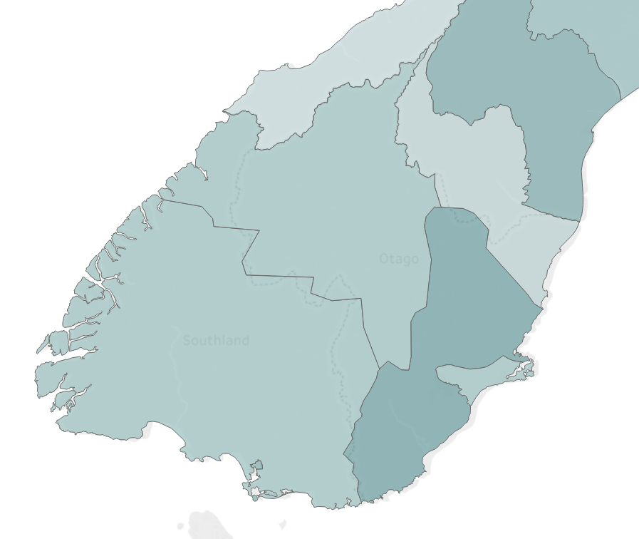

<a href="https://github.com/AndersonUyekita/AuroraEnergyApplication" class="github-corner" aria-label="View source on GitHub"><svg width="80" height="80" viewBox="0 0 250 250" style="fill:#FD6C6C; color:#fff; position: absolute; top: 0; border: 0; right: 0;" aria-hidden="true"><path d="M0,0 L115,115 L130,115 L142,142 L250,250 L250,0 Z"></path><path d="M128.3,109.0 C113.8,99.7 119.0,89.6 119.0,89.6 C122.0,82.7 120.5,78.6 120.5,78.6 C119.2,72.0 123.4,76.3 123.4,76.3 C127.3,80.9 125.5,87.3 125.5,87.3 C122.9,97.6 130.6,101.9 134.4,103.2" fill="currentColor" style="transform-origin: 130px 106px;" class="octo-arm"></path><path d="M115.0,115.0 C114.9,115.1 118.7,116.5 119.8,115.4 L133.7,101.6 C136.9,99.2 139.9,98.4 142.2,98.6 C133.8,88.0 127.5,74.4 143.8,58.0 C148.5,53.4 154.0,51.2 159.7,51.0 C160.3,49.4 163.2,43.6 171.4,40.1 C171.4,40.1 176.1,42.5 178.8,56.2 C183.1,58.6 187.2,61.8 190.9,65.4 C194.5,69.0 197.7,73.2 200.1,77.6 C213.8,80.2 216.3,84.9 216.3,84.9 C212.7,93.1 206.9,96.0 205.4,96.6 C205.1,102.4 203.0,107.8 198.3,112.5 C181.9,128.9 168.3,122.5 157.7,114.1 C157.9,116.9 156.7,120.9 152.7,124.9 L141.0,136.5 C139.8,137.7 141.6,141.9 141.8,141.8 Z" fill="currentColor" class="octo-body"></path></svg></a><style>.github-corner:hover .octo-arm{animation:octocat-wave 560ms ease-in-out}@keyframes octocat-wave{0%,100%{transform:rotate(0)}20%,60%{transform:rotate(-25deg)}40%,80%{transform:rotate(10deg)}}@media (max-width:500px){.github-corner:hover .octo-arm{animation:none}.github-corner .octo-arm{animation:octocat-wave 560ms ease-in-out}}</style>

[comment1]: # (1. Configuring the align to justify in the entirely document)

<style>
body {text-align: justify}
</style>

[comment2]: # (2. Configuring the MathJax to equation auto-numbering)

<script type="text/x-mathjax-config">
MathJax.Hub.Config({
                   TeX: { equationNumbers: { autoNumber: "AMS" } }
                   });
</script>

```{r setup-library,include=FALSE}
# 1. General Configuration ####
#
# Setup chunks options, workplace setup, libraries, and functions.

       ## 1.1. Chunks General Congiguration ####
knitr::opts_chunk$set(echo = FALSE,out.width="80%")

       ## 1.2. Setup the work directory ####
setwd("~")                          # Go to the Documents Directory
setwd("~/Workplace")                # Set the Workplace as work environment 
Sys.setlocale("LC_ALL","English")   # American standard

       ## 1.3. Libraries ####
library(readxl)
library(dplyr)
library(datasets)
library(ggplot2)
library(ggrepel)
library(grid)
library(ggfortify)
library(ggthemes)
library(kableExtra)
library(rmdformats)
library(prettydoc)
library(leaflet)
library(sp)
library(tidyr)
library(DT)
       
       ## 1.4. Functions ####
#source(file = "data_manipulation.R", local = FALSE)

```


```{r echo=FALSE,include=FALSE,message=FALSE}
db_raw <- readRDS(file = "~/Workplace/db_raw.rds")

source(file = "data_manipulation.R", local = FALSE)
source(file = "tablelizator.R", local = FALSE)


db_neat <- db_raw %>% filter(Section %in% "9c: Overhead lines and underground cables",
                             Category %in% "Total overhead length",
                             Subcategory %in% "Circuit length (km)",
                             Description %in% "Total overhead length") %>%
                                   select(EDB,Network,Year)

db_neat <- data_manipulation(x = db_raw, y = db_neat)

source(file = "db_consumer_group.R", local = FALSE)

db_consumer_group <- db_consumer_group(x = db_raw)

saveRDS(db_neat,"db_neat.rds")
```


# I. Introduction

This document aims to evaluate the Aurora Energy Network based on the disclosure data available on the Internet. Although, the availability of these general data, they require many manipulations to become workable. Despite the lack of specifics data to drive a deep study,  I will gather some information in a simple descriptive analysis in the [Chapter 2](#chapter2), and later in [Chapter 3](#chapter3) a cross analysis between all company facets. In [Chapter 4](#chapter4) I will show a benchmarking and a comparison among Aurora Energy and Similars Companies. Based on the previous chapters the [Chapter 5](#chapter5) will bundle the results into a global understanding. Finally, in [Chapter 6](#chapter6) the Conclusions. 

I encourage the reader to reproduce this document on your computer.  I made a great effort to comment every line to let this code understandable and reproducible. [Fork me on Github](https://github.com/AndersonUyekita/AuroraEnergyApplication).


# II. Sinopsis

Despite the fact, the report is no finished and will be continually updated over the next days,  this first release comes to show, very briefly, the outcomes from an initial study.


* <a href="https://rpubs.com/AndersonUyekita/QJ45141_dashboard" target="blank">The Aurora Energy Dashboard</a> purpose was to provide a data visualisation of the New Zealand Electricity Market (similar to [NZCC tableau](https://public.tableau.com/profile/commerce.commission.regulation#!/vizhome/Performanceaccessibilitytool-NewZealandelectricitydistributors/Highlevelratios)), furthermore, a complete tool to registry each step of the analysis.

* The Descriptive Analysis in [Chapter 2](#chapter2) was essential to a better understanding of the New Zealand Electricity Market, but there are plenty of typos and double entries, sometimes double entries with different values, which demand treatment and cross-validation with the other variables.


# III. Document Structure

In this report, you can use the table of content on your left side to navigate, it is easy to use, very straightforward, and show all content until the second sub-level of each chapter.

# 1. General Information {#chapter1}

In a collaborative mindset of the work environment, I need to give the credits to the person who has aided in this research directly and indirectly. For this reason, I put this section, to describe where I acquired the data, which software, and who developed or disclosure this on the web.

## 1.1. Data Sources

All data for this analysis was available on the internet.

* Electricity Distribution Services Input Methodologies Determination 2012 [@IM2018];

* Electricity distributors information disclosures [@NZCC1]

* [Aurora Energy Website](http://www.auroraenergy.co.nz/disclosures/)

* [GeoJSON file](https://exploratory.io/map)

Also, most of the features of this document are also Open Source and free for use.

## 1.2. Softwares

I performed this studies adopting the [R Language](https://en.wikipedia.org/wiki/R_(programming_language)) [@Rpaper], which was created by [Ross Ihaka](https://en.wikipedia.org/wiki/Ross_Ihaka) and [Robert Gentleman](https://en.wikipedia.org/wiki/Robert_Gentleman_(statistician)), both researchers of the University of Auckland in 1995.  So, I employed as work environment the RStudio IDE with the following versions:

* R Version 3.5.1 [@Rteam] ([Website](https://cran.r-project.org));

* RStudio Version 1.1.456 ([Website](https://www.rstudio.com)).

## 1.3. A briefly introduction about data

Unfortunately, the dataset provided by New Zealand Commerce Commission (NZCC) is not a [*tidy dataset*](http://garrettgman.github.io/tidying/) [@Grolemund], and for this reason, I have created a new version of the database so-called neat database.

One reason to make a great effort to registry all data modification is due to this document must be reproducible, reusable for later improvements implementation (with minors adjustments), and the most important is anyone can update it without much effort (time spent).

# 2. Descriptive Analysis {#chapter2}

In this chapter, I will show a straightforward statistical descriptive without the intention of deep understanding and what drive the results. I only want to know the big picture of the company, what is the trend and the overall rates. For this reason, this chapter is very long and exhaustively. You may want to waived this chapter to the next [chapter](#chapter3), which is richier in analysis.

## 2.1. Distribution Network in Otago

Aurora Energy is a Line company of New Zealand, located majority in Otago Regional and a minor part in Southland Regional. According to the 2018 Annual Report supplies energy to almost 90,000 homes[@AnnualReport2018], which represents more than 89,000 consumers in 6,683 lines kilometres. Geographically, the company share the Otago Regional electricity distribution with OtagoNet and for this reason has two networks: Central Otago and Dunedin. Figure 1, acqured at [@NZCCtableu], shows the concession area of Aurora Energy within Otago Regional and Southland Regional.

#### {.tabset}

##### Figure 1

<center></center>

##### Map


#### {.end}

For the sake of this report, I will name these two regions as: Dunedin Regional and Central Otago Regional.

Due to the outstanding quantity of information to manage and fit, I have created a *mind map* to this report. I will share the outcome of this mind map, which helped me so much.


From now,  the rest of chapter2 will be exclusively about descriptive statistics to produce an in-depth overview of Aurora Energy network, which will support better conclusions and analysis.

## 2.2. Network

This short chapter was to count the consumers' number, distributed energy, and losses.

### 2.2.1. Consumers

As shown in Table 1, both Regional has increased past these 6 years, but the Central Otago showed a higher growth rate (increase more than 10% in 6 years) as shown in Graphic 1. The majority of consumer was based in Dunedin Regional, which represents about 62% of the total consumer. It is also possible to see a increasing trend.


Based on it, the Table 1 represents the consumers of each Division.

The majority of consumer was located in Dunedin, about 62.58% which represent more than 55.000 consumer, and almost 33.000 consumer was settled in Central Otago. The trend in the last 5 year is the Central Otago increasing its participation on the total share, although Dunedin also increase its connnection number. The growth observed in these last 5 years was `r round(100*(88305-84875)/84875,2)`% in Otago Regional, but looking Central Otago separetaly its growth reach `r round(100*(32943-30237)/30237,2)`%. For this reason, the Central Otago could sature your power supply.

##### {.tabset}

###### Table 1 {#tb1}

```{r consumer-otago-regional,echo=FALSE}
## Creating Table with Aurora Energy Consumers.
spread(data = db_neat %>%                             #                     #
       filter(EDB %in% "Aurora Energy") %>%           # Subsetting a table  #
              select(Network,Year,a_lv_con),          #                     # Creating a table
       key = Network,                                                       #
       value = a_lv_con) %>%                                                #
       
       mutate(CentralOtago_p = 100*CentralOtago/All,  # Adding percentage columns
              Dunedin_p = 100*Dunedin/All) %>%        # 
                     
              select(Year,            #
                     CentralOtago,    #
                     CentralOtago_p,  # Re-ordering the columns
                     Dunedin,         #
                     Dunedin_p,       #
                     All) %>%         #

                     arrange(-Year) -> au_con       # Ordering by years (2017 to 2013)
       
                            # Plotting the table
                            kable(au_con,
                                  align = "c",  # Align the table and content to center 
                                   caption = "<h4>Consumers in Aurora Energy</h4>", # Table Title
                                   digits = 2,                                       # Round the number
                                   format.args = list(big.mark=","),                 # Thousand mark
                                   col.names = c("Year",               #
                                                 "Central Otago",      #
                                                 "[%]",                # Renaming the columns
                                                 "Dunedin",            #
                                                 "[%]",                #
                                                 "Total Consumers")) %>%         #

                                   # Adding style to look nice
                                   kable_styling(bootstrap_options = c("striped",     # Rows alterning color
                                                                       "hover")) %>%  # Responsive on mouse
                                          add_header_above(c(" " = 1,             #
                                                             "Central Otago" = 2, # Nest columns' header
                                                             "Dunedin" = 2,       # to a "parent"
                                                             " " = 1))            #
```

###### Graphic 1 {#gr1}

```{r graph-2-2-1-1-1uu,echo=FALSE}
## Graph network comparing
db_neat %>%   filter(EDB %in% "Aurora Energy") %>%
                     select(EDB,
                            Network,
                            Year,
                            Value = a_lv_con) %>%
       
                            ggplot(aes(x = Year,
                                       y = Value,
                                       fill = Network)) + 
                                   geom_bar(position = position_dodge(),
                                            stat = "identity") +
                                   scale_fill_brewer(palette = "Paired") +
                                   geom_smooth(method = lm,
                                                      se= FALSE,
                                                      color= "tomato") +
                                   labs(x = "[Year]",
                                        y = "[Consumers]",
                                        title = "Aurora Energy Consumers")
```

##### {.end}

**Conclusions:**

* The overall is a positive growth rate with Central Otago growing 1.95%/year (annualized rate) and Dunedin Regional 0.30%/year (annualized rate);
* In Graphic 1 is possible to see a slight positive trend line.
* The net change in Central Otago Regional was `r (33959-30237)` and Dunedin Regional was `r (55534 - 54557)`, this explains the increasing share in Central Otago Regional.

### 2.2.2. Total Energy Entering {#chapter222}

Total energy entering is calculated based on the Equation (1).

\begin{equation}
\small E_{entering} = E_{delivered,GXP} + E_{supplied,DR} - E_{exported,GXP} + E_{other,EDB}
\end{equation}


$\small
\begin{array}{l l}
     E_{entering}:          & \text{Total Energy Entering in Aurora Energy Network [MWh/year]} \\
     E_{delivered,GXP}:      & \text{Energy Delivered at Grid Exit Points [MWh/year]} \\
     E_{supplied,DR}:       & \text{Distributed Energy Supplied [MWh/year]} \\
     E_{exported,GXP}:      & \text{Energy Exported to GPXs [MWh/year]} \\
     E_{other,EDB}:         & \text{Net electricity supplied to (from) other EDBs [MWh/year]} \\
\end{array}$

#### {.tabset}

##### Table 2.1

```{r echo=FALSE}

db_neat %>%
       filter(EDB %in% "Aurora Energy") %>%
              select(Year,
                     Network,
                     "Energy Delivered at GXP [MWh/year]" = s_gxp_enr,
                     "Distributed Energy Supplied [MWh/year]" = s_dr_enr,
                     "Energy Exported to GPXs [MWh/year]" = s_exp_enr,
                     "Net electricity supplied to (from) other EDBs [MWh/year]" = s_oth_edb,
                     "Total Energy Entering [MWh/year]" = s_ent_enr) %>%
       
                     arrange(Network) %>%

# Plotting the table
kable(align = "c",  # Align the table and content to center 
       caption = "<h4>Total Energy Entering in Aurora Energy Network</h4>",    # Table Title
       format.args = list(big.mark=","),                            # Thousand mark
       digits = 0) %>%                                               # Round the number

      # Adding style to look nice
       kable_styling(bootstrap_options = c("striped",     # Rows alterning color
                     "hover")) %>%     # Responsive on mouse
       group_rows(group_label = "Central Otago", start_row = 7,end_row = 12, label_row_css = "background-color: grey; color: white;") %>%
       group_rows(group_label = "Dunedin", start_row = 13,end_row = 18, label_row_css = "background-color: grey; color: white;")
```

##### Table 2.2

```{r echo=FALSE}
## Total Energy Entering in Aurora Energy
spread(data = db_neat %>%                             #                     #
       filter(EDB %in% "Aurora Energy") %>%           # Subsetting a table  #
              select(Network,Year,s_ent_enr),         #                    # Creating a table
       key = Network,                                                       #
       value = s_ent_enr) %>%                                               #
       
       mutate(CentralOtago_p = 100*CentralOtago/All,  # Adding percentage columns
              Dunedin_p = 100*Dunedin/All) %>%        # 
                     
              select(Year,            #
                     CentralOtago,    #
                     CentralOtago_p,  # Re-ordering the columns
                     Dunedin,         #
                     Dunedin_p,       #
                     All) %>%         #

                     arrange(-Year) %>%  # Ordering by years (2017 to 2013)
       
                            # Plotting the table
                            kable(align = "c",  # Align the table and content to center 
                                   caption = "<h4>Total Energy Entering in Aurora Energy Network</h4>",    # Table Title
                                   digits = 2,                                               # Round the number
                                   col.names = c("Year",               #
                                                 "Central Otago [MWh/Year]",      #
                                                 "[%]",                # Renaming the columns
                                                 "Dunedin [MWh/Year]",            #
                                                 "[%]",                #
                                                 "Total Energy Entering [MWh/Year]")) %>%         #

                                   # Adding style to look nice
                                   kable_styling(bootstrap_options = c("striped",     # Rows alterning color
                                                                       "hover")) %>%  # Responsive on mouse
                                          add_header_above(c(" " = 1,             #
                                                             "Central Otago" = 2, # Nest columns' header
                                                             "Dunedin" = 2,       # to a "parent"
                                                             " " = 1))            #
```

##### Graphic 2.1

```{r echo=FALSE}
db_neat %>%
       filter(EDB %in% "Aurora Energy",
              !Network %in% "All") %>%
              select(Year,
                     Network,
                     s_ent_enr) %>%
       
                     arrange(Network) %>%

                            # Plotting graoh
                            ggplot(aes(x = Year,        # X axis data/variable
                                       y = s_ent_enr,   # Y axis variable
                                       fill = Network)) +   # Y variables Classification
                                   geom_bar(position = position_dodge(),   # Side by side bar
                                            stat = "identity") +
                                   scale_fill_brewer(palette = "Paired") + # Side by side bar
                                   geom_smooth(method = lm,        # LM = linear model
                                               se= FALSE,          # Do not show the standard errors
                                               color= "tomato") +  # LM Line color
                                   labs(x = "[Year]",   # X axis name
                                          y = "[MWh]",  # Y axis name
                                          title = "Total Energy Entering in Aurora Energy")  # Title

```

##### Graphic 2.2

```{r echo=FALSE}
db_neat %>%
       filter(EDB %in% "Aurora Energy",
              !Network %in% "All") %>%
              select(Year,
                     Network,
                     s_ent_enr) %>%
       
                     arrange(Network) %>%

                     # Plotting
                     ggplot(aes(x = Year,       # X axis variable
                                y = s_ent_enr,  # Y axis variable
                                fill = Network)) +         # Y variables Classification
                            geom_bar(position = "fill",    #
                                     stat = "identity") +  #
                            labs(x = "[Year]",  # X label name
                                 y = "[MWh]",   # Y label name
                                 title = "Total Energy Entering in Aurora Energy")  # Title Graph
```

#### {.end}

**Conclusions:**

* Although the global trend is positive the Total Energy Entering in Dunedin Regional is declining over the years. Oppositely, Otago Central has a growth rate of `r round(100*(419.38-318.38)/318.38,2)`% from 2013 to 2018, which is `r round((((419.38)/318.38)^(1/6)-1)*100,2)`% per year;
* As a result of this high increase in Otago Regional, the share in the Total Energy Entering has increased from 33.32% in 2013 to 39.28% in 2018;
* Table 2.1 shows the components share, it noticeable the Energy Delivered at GXP was the principal component, which represents `r round(100*1121.22/1400.39,2)`% in 2018, the other components keep almost steadily over the years.

### 2.2.3. Total Energy Delivered to ICPs

Total energy delivered is calculated based on the Equation (2).

\begin{equation}
\small E_{delivered,ICP} = E_{entering} - LOSS
\end{equation}


$\small
\begin{array}{l l}
     E_{delivered,ICP}:     & \text{Total energy delivered to ICPs [MWh/year]} \\
     E_{entering}:          & \text{Total Energy Entering in Aurora Energy Network [MWh/year]} \\
     LOSS:                  & \text{Losses [MWh/year]} \\
\end{array}$


#### {.tabset}

##### Table 3.1

```{r echo=FALSE}
db_neat %>%   filter(EDB %in% "Aurora Energy") %>%
       
                     select(Year,
                            Network,
                            s_ent_enr,
                            s_loss,
                            rev_con_tot_mwh) %>%
       
                            mutate(rev_con_tot_mwh = rev_con_tot_mwh/1000) %>%

                                   arrange(Network) %>%

# Plotting the table
kable(align = "c",  # Align the table and content to center 
       caption = "<h4>Total Energy Delivered to ICPs in Aurora Energy Network</h4>",    # Table Title
       col.names = c("Year",                           #
                     "Network",                        #
                     "Total Energy Entering [MWh]",    #
                     "Losses [MWh]",                   # Renaming the columns
                     "Total Energy Delivered [MWh]"),  #
       format.args = list(big.mark=","), # Thousand mark
       digits = 0) %>%  # Round the number

      # Adding style to look nice
       kable_styling(bootstrap_options = c("striped",     # Rows alterning color
                     "hover")) %>%     # Responsive on mouse
       group_rows(group_label = "Central Otago", start_row = 7,end_row = 12, label_row_css = "background-color: grey; color: white;") %>%
       group_rows(group_label = "Dunedin", start_row = 13,end_row = 18, label_row_css = "background-color: grey; color: white;")

gc(reset = TRUE)
```

##### Table 3.2

```{r,echo=FALSE}
## Total Losses
tablelizator( variable = "s_loss",
              company = "Aurora Energy",
              case = 2) %>%
                            # Plotting the table
                            kable(align = "c",  # Align the table and content to center 
                                   caption = "<h4>Losses</h4>",    # Table Title
                                   digits = 2,                                               # Round the number
                                   col.names = c("Year",               #
                                                 "[MWh]",      #
                                                 "[%]",                # Renaming the columns
                                                 "[MWh]",            #
                                                 "[%]",                #
                                                 "[MWh]")) %>%         #

                                   # Adding style to look nice
                                   kable_styling(bootstrap_options = c("striped",     # Rows alterning color
                                                                       "hover")) %>%  # Responsive on mouse
                                          add_header_above(c(" " = 1,             #
                                                             "Central Otago" = 2, # Nest columns' header
                                                             "Dunedin" = 2,       # to a "parent"
                                                             " " = 1))            #
```

##### Table 3.3

```{r echo=FALSE}
db_neat %>%
       filter(EDB %in% "Aurora Energy") %>% mutate(rev_con_tot_mwh = rev_con_tot_mwh/1000) %>%
       select(Network,
              Year,
              s_ent_enr,
              s_loss) %>%
       
       mutate(p_s_loss = 100*s_loss/s_ent_enr) -> temp

temp %>% filter(Network %in% "CentralOtago") %>%
              select(-Network) %>%
                     rename("Energy Entering [MWh]" = s_ent_enr,
                            "Losses [MWh]" = s_loss,
                            "[%]" = p_s_loss) -> temp1

temp %>% filter(Network %in% "Dunedin") %>% 
              select(-Network,-Year) %>%
                     rename("Energy Entering [MWh]" = s_ent_enr,
                            "Losses [MWh]" = s_loss,
                            "[%]" = p_s_loss) -> temp2

temp %>% filter(Network %in% "All") %>%
              select(-Network,-Year) %>%
                     rename("Energy Entering [MWh]" = s_ent_enr,
                            "Losses [MWh]" = s_loss,
                            "[%]" = p_s_loss) -> temp3

bind_cols(temp1,temp2,temp3) %>%

                            # Plotting the table
                            kable(align = "c",  # Align the table and content to center 
                                   caption = "<h4>Losses Comparison</h4>",    # Table Title
                                   digits = 2) %>%   # Round the number

                                   # Adding style to look nice
                                   kable_styling(bootstrap_options = c("striped",     # Rows alterning color
                                                                       "hover")) %>%  # Responsive on mouse
                                          add_header_above(c(" " = 1,             #
                                                             "Central Otago" = 3, # Nest columns' header
                                                             "Dunedin" = 3,       # to a "parent"
                                                             "Aurora Energy" = 3))  
```

##### Graphic 3.1

```{r echo=FALSE}
# Graphic
db_neat %>%   filter(EDB %in% "Aurora Energy") %>%
                     
                     select(Network,
                            Year,
                            "Losses" = s_loss,
                            "Entering Energy" = s_ent_enr) %>%
       
                            gather(Description,Value,3:4) %>%

                            # Plotting graoh
                            ggplot(aes(x = Year,        # X axis data/variable
                                       y = Value,   # Y axis variable
                                       fill = Description)) +   # Y variables Classification
                                   geom_bar(position = position_dodge(),   # Side by side bar
                                            stat = "identity") +
                                   scale_fill_brewer(palette = "Paired") + # Side by side bar
                                   labs(x = "[Year]",   # X axis name
                                          y = "[MWh]",  # Y axis name
                                          title = "Total Energy Entering and Loss Comparison") + # Title
                                   theme(legend.position = "bottom")
```

##### Graphic 3.2

```{r echo=FALSE}
# Graphic
db_neat %>%   filter(EDB %in% "Aurora Energy") %>%
                     
                     select(Network,
                            Year,
                            "Losses" = s_loss,
                            "Entering Energy" = s_ent_enr) %>%
       
                            gather(Description,Value,3:4) %>%

                            # Plotting graoh
                            ggplot(aes(x = Year,        # X axis data/variable
                                       y = Value,   # Y axis variable
                                       fill = Description)) +   # Y variables Classification
                                   geom_bar(position = position_dodge(),   # Side by side bar
                                            stat = "identity") +
                                   scale_fill_brewer(palette = "Paired") + # Side by side bar
                                   labs(x = "[Year]",   # X axis name
                                          y = "[MWh]",  # Y axis name
                                          title = "Total Energy Entering and Loss Comparison") + # Title
                                   facet_grid(. ~ Network) + 
                                   theme(legend.position = "bottom") +
                                   geom_smooth(method = lm, se = FALSE, color = "tomato")
```

##### Graphic 3.3

```{r echo=FALSE}
# Graphic
db_neat %>%   filter(EDB %in% "Aurora Energy") %>%
                     
                     select(Network,
                            Year,
                            "Losses" = s_loss,
                            "Entering Energy" = s_ent_enr) %>%
       
                            gather(Description,Value,3:4) %>%

                            # Plotting graoh
                            ggplot(aes(x = Year,        # X axis data/variable
                                       y = Value,   # Y axis variable
                                       fill = Description)) +   # Y variables Classification
                                   geom_bar(position = position_dodge(),   # Side by side bar
                                            stat = "identity") +
                                   scale_fill_brewer(palette = "Paired") + # Side by side bar
                                   labs(x = "[Year]",   # X axis name
                                          y = "[MWh]",  # Y axis name
                                          title = "Total Energy Entering and Loss Comparison") + # Title
                                   facet_grid(Description ~ Network,scales = "free") + 
                                   theme(legend.position = "bottom") +
                                   geom_smooth(method = lm, se = FALSE, color = "tomato")
```


#### {.end}

**Conclusions:**

* Central Otago has the highest losses, about 8.19% in 2018, supplying only 38.87% of the total energy delivered to ICPs, which is 508 MWh/year. While Dunedin Regional grant energy to more than 61% (799 MWh/year) with losses reaching 6.30%.

**Typos**

* Some problems was identified in 2014 and 2015.

#### 2.4.1.1. GXP Energy Delivered

The  GXP Energy Delivered is a component of [Total Energy Entering in Aurora Energy Network](#chapter222).

#### {.tabset}

##### Table 4

```{r echo=FALSE}
## Total Energy Supplied by GXP
tablelizator(variable = "s_gxp_enr",company = "Aurora Energy",case = 2) %>%

                            # Plotting the table
                            kable(align = "c",  # Align the table and content to center 
                                   caption = "<h4>GXP Energy Supplied by Network</h4>",    # Table Title
                                   digits = 2,                                               # Round the number
                                   col.names = c("Year",               #
                                                 "Central Otago [MWh]",      #
                                                 "[%]",                # Renaming the columns
                                                 "Dunedin [MWh]",            #
                                                 "[%]",                #
                                                 "Total [MWh]")) %>%         #

                                   # Adding style to look nice
                                   kable_styling(bootstrap_options = c("striped",     # Rows alterning color
                                                                       "hover")) %>%  # Responsive on mouse
                                          add_header_above(c(" " = 1,             #
                                                             "Central Otago" = 2, # Nest columns' header
                                                             "Dunedin" = 2,       # to a "parent"
                                                             " " = 1))            #
```

##### Graphic 4

```{r echo=FALSE}
db_neat %>%                                   #
       filter(EDB %in% "Aurora Energy",
              !Network %in% "All") %>%   # Subsetting a table
              select(Network,
                     Year,
                     s_gxp_enr) %>%
                     # Plotting
                     ggplot(aes(x = Year,       # X axis variable
                                y = s_gxp_enr,  # Y axis variable
                                fill = Network)) +         # Y variables Classification
                            geom_bar(position = "fill",    #
                                     stat = "identity") +  #
                            labs(x = "[Year]",  # X label name
                                 y = "[%]",   # Y label name
                                 title = "Total Energy Entering in Aurora Energy")  # Title Graph
```

#### {.end}

**Conclusions:**

* It is not visible any trend or disturbs.

* GXP Energy Delivered is the principal component and determines the trend. It is `r round(100*1121.22/1308.29,2)`% of Total energy delivered to ICPs. 

#### 2.4.1.2. Distributed Energy Delivered

It is also a component of [Total Energy Entering in Aurora Energy Network](#chapter222).

#### {.tabset}

##### Table 5

```{r,echo=FALSE}
## Total Energy Supplied by GXP
tablelizator(variable = "s_dr_enr",company = "Aurora Energy",case = 2) %>%

                            # Plotting the table
                            kable(align = "c",  # Align the table and content to center 
                                   caption = "<h4>Distributed Energy Supplied by Network</h4>",    # Table Title
                                   digits = 2,                                               # Round the number
                                   col.names = c("Year",               #
                                                 "Central Otago [MWh]",      #
                                                 "[%]",                # Renaming the columns
                                                 "Dunedin [MWh]",            #
                                                 "[%]",                #
                                                 "Total [MWh]")) %>%         #

                                   # Adding style to look nice
                                   kable_styling(bootstrap_options = c("striped",     # Rows alterning color
                                                                       "hover")) %>%  # Responsive on mouse
                                          add_header_above(c(" " = 1,             #
                                                             "Central Otago" = 2, # Nest columns' header
                                                             "Dunedin" = 2,       # to a "parent"
                                                             " " = 1))            #
```

##### Graphic 5

```{r echo=FALSE}
db_neat %>%                                       #
       filter(EDB %in% "Aurora Energy",           #
              !Network %in% "All") %>%            # filtering database
       
              select(Network,      #
                     Year,         # Subsetting
                     s_dr_enr) %>% #
       
                            # Plotting
                            ggplot(aes(x = Year,   # X Axis as Year
                                   y = s_dr_enr,      # Y Axis $
                                   fill = Network)) +
                            # Bar Plot
                            geom_bar(stat = "identity") +
                            labs(x = "[Years]",
                                 y = "[MWh]",
                                 title = "Distributed Energy Delivered")
```

#### {.end}

**Conclusions:**

* It is not visible any trend or disturbs.

#### 2.4.1.3. Exported Energy to GXPs

It is also a component of [Total Energy Entering in Aurora Energy Network](#chapter222).

#### {.tabset}

##### Table 6

```{r,echo=FALSE}
## Total Energy Exported to GXP
tablelizator(variable = "s_exp_enr",company = "Aurora Energy",case = 2) %>%

                            # Plotting the table
                            kable(align = "c",  # Align the table and content to center 
                                   caption = "<h4>Energy Exported to GPXs</h4>",    # Table Title
                                   digits = 2,                                               # Round the number
                                   format.args = list(big.mark=","),                            # Thousand mark
                                   col.names = c("Year",               #
                                                 "Central Otago [MWh]",      #
                                                 "[%]",                # Renaming the columns
                                                 "Dunedin [MWh]",            #
                                                 "[%]",                #
                                                 "Total [MWh]")) %>%         #

                                   # Adding style to look nice
                                   kable_styling(bootstrap_options = c("striped",     # Rows alterning color
                                                                       "hover")) %>%  # Responsive on mouse
                                          add_header_above(c(" " = 1,             #
                                                             "Central Otago" = 2, # Nest columns' header
                                                             "Dunedin" = 2,       # to a "parent"
                                                             " " = 1))            #
```

##### Graphic 6

```{r echo=FALSE}
db_neat %>%                                       #
       filter(EDB %in% "Aurora Energy",           #
              !Network %in% "All") %>%            # Subsetting a table
       
              select(Network,Year,s_exp_enr) %>%
       
                            # Plotting
                            ggplot(aes(x = Year,   # X Axis as Year
                                   y = s_exp_enr,      # Y Axis $
                                   fill = Network)) +
                            # Bar Plot
                            geom_bar(stat = "identity") +
                            labs(x = "[Years]",
                                 y = "[MWh]",
                                 title = "Exported Energy to GXPs")
```

#### {.end}

**Conclusions:**

* It is not visible any trend or disturbs.

## 2.3. Assets

This subchapter aims to summarize the quantity of all network and non-network assets in both areas of Aurora Energy.

### 2.2.1. Network Assets

In this subchapter, I will point out the quantity of each component which is related to the Network such as Length of LV Lines, Poles, Capacitor Banks, etc.

#### 2.2.1.1. Lines and Cable

The equation (3) shows the network length composition of Aurora Energy.

\begin{equation}
\small L_{TOTAL} = L_{CO} + L_{DU}
\end{equation}


$\small
\begin{array}{l l}
     L_{TOTAL}:       & \text{Total length (includes Overhead lines and Underground cables) in Aurora Energy Network [km]} \\
     L_{CO}:          & \text{Total length (includes Overhead lines and Underground cables) in Central Otago Regional [km]} \\
     L_{DU}:          & \text{Total length (includes Overhead lines and Underground cables) in Dunedin Regional [km]} \\
\end{array}$

Table 7 shows the length by Regional and Graphic 7 shows the trend.

##### {.tabset}

###### Table 7 {#tb7}

```{r table-aurora-network-km,echo=FALSE}
## Creating Table with Aurora Energy Overhead Lines
spread(data = db_neat %>%                             #                     #
       filter(EDB %in% "Aurora Energy") %>%           # Subsetting a table  #
              select(Network,Year,a_li),              #                     # Creating a table
       key = Network,                                                       #
       value = a_li) %>%                                                    #
       
       mutate(CentralOtago_p = 100*CentralOtago/All,  # Adding percentage columns
              Dunedin_p = 100*Dunedin/All) %>%        # 
                     
              select(Year,            #
                     CentralOtago,    #
                     CentralOtago_p,  # Re-ordering the columns
                     Dunedin,         #
                     Dunedin_p,       #
                     All) %>%         #

                     arrange(-Year) %>%  # Ordering by years (2017 to 2013)
       
                            # Plotting the table
                            kable(align = "c",  # Align the table and content to center 
                                   caption = "<h4>Network Length in each Regional</h4>", # Table Title
                                   digits = 0,                                           # Round the number
                                   format.args = list(big.mark=","),                      # Thousand mark
                                   col.names = c("Year",               #
                                                 "Central Otago [km]",      #
                                                 "[%]",                # Renaming the columns
                                                 "Dunedin [km]",            #
                                                 "[%]",                #
                                                 "Total [km]")) %>%         #

                                   # Adding style to look nice
                                   kable_styling(bootstrap_options = c("striped",     # Rows alterning color
                                                                       "hover")) %>%  # Responsive on mouse
                                          add_header_above(c(" " = 1,             #
                                                             "Central Otago" = 2, # Nest columns' header
                                                             "Dunedin" = 2,       # to a "parent"
                                                             " " = 1))            #
```

###### Graphic 7.1 {#gr7.1}

```{r graph-2-2-1-1-2,echo=FALSE}
## Graph network comparing
db_neat %>%   filter(EDB %in% "Aurora Energy") %>%
                     select(EDB,
                            Network,
                            Year,
                            Value = a_li) %>%
       
                            ggplot(aes(x = Year,
                                       y = Value,
                                       fill = Network)) + 
                                   geom_bar(position = position_dodge(),
                                            stat = "identity") +
                                   scale_fill_brewer(palette = "Paired") +
                                   geom_smooth(method = lm,
                                                      se= FALSE,
                                                      color= "tomato") +
                                   labs(x = "[Year]",
                                        y = "[km]",
                                        title = "Lines and Cables Length in Aurora Energy")
```

###### Graphic 7.2 {#gr2.2}

```{r graph-aurora-network,echo=FALSE}
## Graph to show the network length among Central Otago and Dunedin
db_neat %>%   filter(EDB %in% "Aurora Energy",  # Filtering the right company
                     !Network %in% "All") %>%   #

                     select(EDB,                 #
                            Network,             # Subsetting the neat data
                            Year,                #
                            Value = a_li) %>%    #
       
                            # Plotting
                            ggplot(aes(x= Year,     # Variable InDependent             
                                       y= Value,    # Variable Dependent
                                       fill= Network)) +   # Fill the bars with Network info
                                   geom_bar(stat = "identity",  # Default setting
                                            position = "fill") +
                                   labs(x = "[Years]",  # X axis label
                                        y = "[%]",      # Y axis label
                                        title = "Aurora Energy composition")   # Graph title
```

#####

**Conclusions:**

* By the Table 7 is possible to see Central Otago Regional has a longer network length than Dunedin Regional;
* It is necessary to point out the large investment in Dunedin Regional, which extended more than 400 kilometres in one year (about `r round(100*((2925/2511)-1),2)`%). Excluding this leap in network length in Dunedin, the trend line shows a steady growth rate.

#### A) Overhead Lines (OH)

The equation (4) shows the network length composition of Aurora Energy in respect of Overhead Lines and Underground Cables.

\begin{equation}
\small L_{OH,TOTAL} = L_{OH,CO} + L_{OH,DU}
\end{equation}


$\small
\begin{array}{l l}
     L_{OH,TOTAL}:       & \text{Total length Overhead lines in Aurora Energy [km]} \\
     L_{OH,CO}:          & \text{Total length Overhead lines in Central Otago Regional [km]} \\
     L_{OH,CU}:          & \text{Total length Overhead lines in Dunedin Regional [km]} \\
\end{array}$

Table 8 shows the Overhead Lines length in each Regional.

##### {.tabset}

###### Table 8 {#tb8}

```{r overhead,echo=FALSE}
## Creating Table with Aurora Energy Overhead Lines
spread(data = db_neat %>%                             #                     #
       filter(EDB %in% "Aurora Energy") %>%           # Subsetting a table  #
              select(Network,Year,a_li_oh),           #                     # Creating a table
       key = Network,                                                       #
       value = a_li_oh) %>%                                                 #
       
       mutate(CentralOtago_p = 100*CentralOtago/All,  # Adding percentage columns
              Dunedin_p = 100*Dunedin/All) %>%        # 
                     
              select(Year,            #
                     CentralOtago,    #
                     CentralOtago_p,  # Re-ordering the columns
                     Dunedin,         #
                     Dunedin_p,       #
                     All) %>%         #

                     arrange(-Year) %>%  # Ordering by years (2017 to 2013)
       
                            # Plotting the table
                            kable(align = "c",  # Align the table and content to center 
                                   caption = "<h4>Overhead Lines in Aurora Energy</h4>", # Table Title
                                   digits = 0,                                           # Round the number
                                   format.args = list(big.mark=","),                     # Thousand mark
                                   col.names = c("Year",               #
                                                 "Central Otago [km]",      #
                                                 "[%]",                # Renaming the columns
                                                 "Dunedin [km]",            #
                                                 "[%]",                #
                                                 "Total [km]")) %>%         #

                                   # Adding style to look nice
                                   kable_styling(bootstrap_options = c("striped",     # Rows alterning color
                                                                       "hover")) %>%  # Responsive on mouse
                                          add_header_above(c(" " = 1,             #
                                                             "Central Otago" = 2, # Nest columns' header
                                                             "Dunedin" = 2,       # to a "parent"
                                                             " " = 1))            #
```

###### Graphic 8 {#gr8}

```{r graph-2-2-1-1-2-a,echo=FALSE}
## Graph network comparing
db_neat %>%   filter(EDB %in% "Aurora Energy") %>%
                     select(EDB,
                            Network,
                            Year,
                            Value = a_li_oh) %>%
       
                            ggplot(aes(x = Year,
                                       y = Value,
                                       fill = Network)) + 
                                   geom_bar(position = position_dodge(),
                                            stat = "identity") +
                                   scale_fill_brewer(palette = "Paired") +
                                   labs(x = "[Year]",
                                        y = "[km]",
                                        title = "Overhead Lines in Aurora Energy")
```

##### {.end}

**Conclusions:**

* Until 2017, most of the overhead lines, about 56%, was in Central Otago Regional and the proportion was stable (Table 8). However, in 2018 the Overhead lines in Dunedin leap up around `r round(((2147/1748)-1)*100,1)`% comparing with Overhead lines length in 2017.

#### B) Underground Cables (UG)

The equation (5) shows the Underground cables length composition in Aurora Energy.

\begin{equation}
\small L_{UG,TOTAL} = L_{UG,CO} + L_{UG,DU}
\end{equation}


$\small
\begin{array}{l l}
     L_{UG,TOTAL}:       & \text{Total length Underground cables in Aurora Energy [km]} \\
     L_{UG,CO}:          & \text{Total length Underground cables in Central Otago Regional [km]} \\
     L_{UG,CU}:          & \text{Total length Underground cables in Dunedin Regional [km]} \\
\end{array}$


##### {.tabset}

###### Table 9 {#tb9}

```{r underground,echo=FALSE}
## Creating Table with Aurora Energy Underground Cables
spread(data = db_neat %>%                             #                     #
       filter(EDB %in% "Aurora Energy") %>%           # Subsetting a table  #
              select(Network,Year,a_li_ug),           #                     # Creating a table
       key = Network,                                                       #
       value = a_li_ug) %>%                                                 #
       
       mutate(CentralOtago_p = 100*CentralOtago/All,  # Adding percentage columns
              Dunedin_p = 100*Dunedin/All) %>%        # 
                     
              select(Year,            #
                     CentralOtago,    #
                     CentralOtago_p,  # Re-ordering the columns
                     Dunedin,         #
                     Dunedin_p,       #
                     All) %>%         #

                     arrange(-Year) %>%  # Ordering by years (2017 to 2013)
       
                            # Plotting the table
                            kable(align = "c",  # Align the table and content to center 
                                   caption = "<h4>Underground Cables in Aurora Energy</h4>", # Table Title
                                   digits = 0,                                              # Round the number
                                   format.args = list(big.mark=","),                        # Thousand mark

                                   col.names = c("Year",               #
                                                 "Central Otago [km]",      #
                                                 "[%]",                # Renaming the columns
                                                 "Dunedin [km]",            #
                                                 "[%]",                #
                                                 "Total [km]")) %>%         #

                                   # Adding style to look nice
                                   kable_styling(bootstrap_options = c("striped",     # Rows alterning color
                                                                       "hover")) %>%  # Responsive on mouse
                                          add_header_above(c(" " = 1,             #
                                                             "Central Otago" = 2, # Nest columns' header
                                                             "Dunedin" = 2,       # to a "parent"
                                                             " " = 1))            #
```

###### Graphic 9 {#gr9}

```{r graph-2-2-1-1-2-b,echo=FALSE}
## Graph network comparing
db_neat %>%   filter(EDB %in% "Aurora Energy") %>%
                     select(EDB,
                            Network,
                            Year,
                            Value = a_li_ug) %>%
       
                            ggplot(aes(x = Year,
                                       y = Value,
                                       fill = Network)) + 
                                   geom_bar(position = position_dodge(),
                                            stat = "identity") +
                                   scale_fill_brewer(palette = "Paired") +
                                   geom_smooth(method = lm,
                                                      se= FALSE,
                                                      color= "tomato") +
                                   labs(x = "[Year]",
                                        y = "[km]",
                                        title = "Underground Cables in Aurora Energy")
```

##### {.end}

**Conclusions:**

The Central Otago regional is in charge of 66% of the total length of Underground Cables. Over the last 6 year the growth rate in both Regional was almost the same:

* From 2013 to 2018 Central Otago grew by `r round(100*(1497-1077)/1077,1)`%, and;
* Dunedin in the same period grew by `r round(100*(778-561)/561,1)`%) as shown in the Graphic 4.

**Typos:**

In Table 4, I have found an inconsistency in the data provided in the @NZCC1, aggregating the columns Central Otago and Dunedin it is different from Total Columns.

#### C) OH and UG Comparison

The equation (6) shows the network length composition of Aurora Energy in respect of Overhead Lines and Underground Cables.

\begin{equation}
\small L_{TOTAL} = L_{OH} + L_{UG}
\end{equation}


$\small
\begin{array}{l l}
     L_{TOTAL}:       & \text{Total length (includes Overhead lines and Underground cables) in Aurora Energy Network [km]} \\
     L_{OH}:          & \text{Total length Overhead lines in Aurora Energy [km]} \\
     L_{UG}:          & \text{Total length Underground cables in Aurora Energy [km]} \\
\end{array}$

##### {.tabset}

###### Table 10 {#tb10}

```{r echo=FALSE}
db_neat %>%                               #                           #
       filter(EDB %in% "Aurora Energy",   # Filtering the dataset     #
              Network %in% "All") %>%    #                           # Subsetting the data frame
              select(Year,                                            #
                     a_li_oh,                                         #
                     a_li_ug,
                     a_li) %>%
                     mutate(p_a_li_oh = 100*a_li_oh/a_li,
                            p_a_li_ug = 100*a_li_ug/a_li) %>%
                            select(Year,a_li_oh,p_a_li_oh,a_li_ug,p_a_li_ug,a_li) %>%

                            # Plotting the table
                            kable(align = "c",  # Align the table and content to center 
                                   caption = "<h4>Overhead Lines and Underground Cables Comparison</h4>", # Table Title
                                   digits = 0,                                              # Round the number
                                   format.args = list(big.mark=","),                        # Thousand mark

                                   col.names = c("Year",               #
                                                 "Overhead Lines [km]",      #
                                                 "[%]",                # Renaming the columns
                                                 "Underground Cables [km]",            #
                                                 "[%]",                #
                                                 "Total [km]")) %>%         #

                                   # Adding style to look nice
                                   kable_styling(bootstrap_options = c("striped",     # Rows alterning color
                                                                       "hover")) %>%  # Responsive on mouse
                                          add_header_above(c(" " = 1,             #
                                                             "Overhead" = 2, # Nest columns' header
                                                             "Underground" = 2,       # to a "parent"
                                                             " " = 1))            #
```

###### Graphic 10 {#gr10}

```{r echo=FALSE}
# Subsetting the db_neat to filter and select the variables to plot the graph.
db_neat %>%                               #                           #
       filter(EDB %in% "Aurora Energy",   # Filtering the dataset     #
              !Network %in% "All") %>%    #                           # Subsetting the data frame
              select(Network,                                         #
                     Year,                                            #
                     a_li_oh,                                         #
                     a_li_ug) %>%                                     #
                     mutate(Value = a_li_oh + a_li_ug) %>% # Calculating the total
                            select(Network,Year,Value) %>% # Selecting the columns desires
       
                            # Plotting the graph
                            ggplot(aes(x = Year,         # Independent varialble
                                       y = Value)) +     # Dependent variable 
              
                                   # Defining the graph's style
                                   geom_bar(position = "fill",   # Side by side bars
                                          stat = "identity",     # Deafult setting
                                          width = 0.5,           # Bar's Width
                                          aes(fill = Network))+  # Fill the bars with the Network percentage

                                   labs(x="[years]",  # X axis label
                                        y="[%]",     # Y axis label
                                        title="Overhead and Underground Lines comparison in Aurora Energy") # Graph title
```

##### {.end}

**Conclusions:**

There is a trend to migrate from Overhead Lines to Underground Cables or to opt to use Underground Cables. The Underground Cables growth rate is `r round(100*(6683-5543)/5543,2)`% in 6 years (`r round((((6683)/5543)^(1/6)-1)*100,2)`% per year).


#### D) Rural, Urban and Remoted OH

The Equation (7) shows the composition of Overhead Lines aggregating Rural, Urban and Remote Overhead Lines.

\begin{equation}
\small L_{OH,TOTAL} = L_{OH,RURAL} + L_{OH,URBAN} + L_{OH,remote}
\end{equation}


$\small
\begin{array}{l l}
     L_{OH,TOTAL}:          & \text{Total length Overhead lines in Aurora Energy [km]} \\
     L_{OH,RURAL}:          & \text{Total length Rural Overhead lines in Aurora Energy [km]} \\
     L_{OH,URBAN}:          & \text{Total length Urban Overhead lines in Aurora Energy [km]} \\
     L_{OH,remote}:         & \text{Total length in Remoted or Rugged Areas [km]} \\
\end{array}$


##### {.tabset}

###### Table 11.1

```{r,echo=FALSE}
# Subsetting the db_neat to create a table of Rural Length Network in Aurora Energy (Only in Overhead Lines)
# Creating a table to the HV Lines in Aurora
spread(data = db_neat %>%                             #                     #
       filter(EDB %in% "Aurora Energy") %>%           # Subsetting a table  #
              select(Network,Year,a_li_ru),           #                     # Creating a table
       key = Network,                                                       #
       value = a_li_ru) %>%                                                 #
       
       mutate(CentralOtago_p = 100*CentralOtago/All,  # Adding percentage columns
              Dunedin_p = 100*Dunedin/All) %>%        # 
                     
              select(Year,            #
                     CentralOtago,    #
                     CentralOtago_p,  # Re-ordering the columns
                     Dunedin,         #
                     Dunedin_p,       #
                     All) %>%         #

                     arrange(-Year) %>%  # Ordering by years (2017 to 2013)
       
                            # Plotting the table
                            kable(align = "c",  # Align the table and content to center 
                                   caption = "<h4>Rural Lines in Aurora Energy</h4>",       # Table Title
                                   digits = 2,                                               # Round the number
                                   format.args = list(big.mark=","),                        # Thousand mark
                                   col.names = c("Year",               #
                                                 "Central Otago [km]",      #
                                                 "[%]",                # Renaming the columns
                                                 "Dunedin [km]",            #
                                                 "[%]",                #
                                                 "Total [km]")) %>%         #

                                   # Adding style to look nice
                                   kable_styling(bootstrap_options = c("striped",     # Rows alterning color
                                                                       "hover")) %>%  # Responsive on mouse
                                          add_header_above(c(" " = 1,             #
                                                             "Central Otago" = 2,  # Nest columns' header
                                                             "Dunedin" = 2,       # to a "parent"
                                                             " " = 1))            #
```

###### Table 11.2

```{r,echo=FALSE}
## Comparing a specific variable with the global variable.
bind_cols     (spread(data = db_neat %>%                                   #
                     filter(EDB %in% "Aurora Energy") %>%   # Filtering    #
                            select(Network,  #                             # Creating table 1
                                   Year,     # Selecting                   #
                                   a_li_ru), #                             # Specific
                     key = Network,                                        #
                     a_li_ru),                                             #
                     
              spread(data = db_neat %>%                     # Filtering    #
                     filter(EDB %in% "Aurora Energy") %>%                  #
                            select(Network,  #                             # Creating table 2
                                   Year,     # Selecting                   #
                                   a_li_oh), #                             # Global
                     key = Network,                                        #
                     a_li_oh) %>%                                          #
                     
                     select(CentralOtago_t = CentralOtago,      #
                            Dunedin_t=Dunedin,                  # Selecting columns
                            All_t=All)) %>%                     # from table 1 and 2
       
       mutate(CentralOtago_p = 100*CentralOtago/CentralOtago_t,  #
              Dunedin_p = 100*Dunedin/Dunedin_t,                 # Creating the proportion columns
              All_p = 100*All/All_t) %>%                         #
              
              select(Year,            #
                     CentralOtago,    #
                     CentralOtago_t,  #
                     CentralOtago_p,  #
                     Dunedin,         # Rearranging the columns order
                     Dunedin_t,       #
                     Dunedin_p,       #
                     All,             #
                     All_t,           #
                     All_p) %>%       #
                     
                     arrange(-Year) %>% # Re-ordering the rows.

                            # Plotting the table
                            kable(align = "c",  # Align the table and content to center 
                                   caption = "<h4>Rural Line Length in comparison with Overhead Lines</h4>", # Table Title
                                   format.args = list(big.mark=","),                        # Thousand mark
                                   digits = 2, # Round the number
                                   col.names = c("Year",               #
                                                 "Rural [km]",         #
                                                 "Overhead [km]",      #
                                                 "[%]",                # Renaming the columns
                                                 "Rural [km]",         #
                                                 "Overhead [km]",      #
                                                 "[%]",                #
                                                 "Rural [km]",         #
                                                 "Total Overhead [km]", #
                                                 "[%]")) %>%             #

                                   # Adding style to look nice
                                   kable_styling(bootstrap_options = c("striped",     # Rows alterning color
                                                                       "hover")) %>%  # Responsive on mouse
                                          add_header_above(c(" " = 1,                 #
                                                             "Central Otago" = 3,      # Nest columns' header
                                                             "Dunedin" = 3,            # to a "parent"
                                                             "Otago Regional" = 3))    #
```

###### Table 11.3

```{r,echo=FALSE}
spread(data = db_neat %>%                             #                     #
       filter(EDB %in% "Aurora Energy") %>%           # Subsetting a table  #
              select(Network,Year,a_li_ur),           #                     # Creating a table
       key = Network,                                                       #
       value = a_li_ur) %>%                                                 #
       
       mutate(CentralOtago_p = 100*CentralOtago/All,  # Adding percentage columns
              Dunedin_p = 100*Dunedin/All) %>%        # 
                     
              select(Year,            #
                     CentralOtago,    #
                     CentralOtago_p,  # Re-ordering the columns
                     Dunedin,         #
                     Dunedin_p,       #
                     All) %>%         #

                     arrange(-Year) %>%  # Ordering by years (2017 to 2013)
       
                            # Plotting the table
                            kable(align = "c",  # Align the table and content to center 
                                   caption = "<h4>Urban Lines in Aurora Network</h4>",       # Table Title
                                   digits = 2,                                               # Round the number
                                   format.args = list(big.mark=","),                        # Thousand mark
                                   col.names = c("Year",               #
                                                 "Central Otago [km]",      #
                                                 "[%]",                # Renaming the columns
                                                 "Dunedin [km]",            #
                                                 "[%]",                #
                                                 "Total [km]")) %>%         #

                                   # Adding style to look nice
                                   kable_styling(bootstrap_options = c("striped",     # Rows alterning color
                                                                       "hover")) %>%  # Responsive on mouse
                                          add_header_above(c(" " = 1,             #
                                                             "Central Otago" = 2,  # Nest columns' header
                                                             "Dunedin" = 2,       # to a "parent"
                                                             " " = 1))            #
```

###### Table 11.4

```{r,echo=FALSE}
## Comparing a specific variable with the global variable.
bind_cols     (spread(data = db_neat %>%                                   #
                     filter(EDB %in% "Aurora Energy") %>%   # Filtering    #
                            select(Network,  #                             # Creating table 1
                                   Year,     # Selecting                   #
                                   a_li_ur), #                             # Specific
                     key = Network,                                        #
                     a_li_ur),                                             #
                     
              spread(data = db_neat %>%                     # Filtering    #
                     filter(EDB %in% "Aurora Energy") %>%                  #
                            select(Network,  #                             # Creating table 2
                                   Year,     # Selecting                   #
                                   a_li_oh), #                             # Global
                     key = Network,                                        #
                     a_li_oh) %>%                                          #
                     
                     select(CentralOtago_t = CentralOtago,      #
                            Dunedin_t=Dunedin,                  # Selecting columns
                            All_t=All)) %>%                     # from table 1 and 2
       
       mutate(CentralOtago_p = 100*CentralOtago/CentralOtago_t,  #
              Dunedin_p = 100*Dunedin/Dunedin_t,                 # Creating the proportion columns
              All_p = 100*All/All_t) %>%                         #
              
              select(Year,            #
                     CentralOtago,    #
                     CentralOtago_t,  #
                     CentralOtago_p,  #
                     Dunedin,         # Rearranging the columns order
                     Dunedin_t,       #
                     Dunedin_p,       #
                     All,             #
                     All_t,           #
                     All_p) %>%       #
                     
                     arrange(-Year) %>% # Re-ordering the rows.

                            # Plotting the table
                            kable(align = "c",  # Align the table and content to center 
                                   caption = "<h4>Urban Line Length comparison with Overhead Lines</h4>", # Table Title
                                   digits = 2, # Round the number
                                   format.args = list(big.mark=","),      # Thousand mark
                                   col.names = c("Year",               #
                                                 "Urban [km]",         #
                                                 "Overhead [km]", #
                                                 "[%]",                # Renaming the columns
                                                 "Urban [km]",         #
                                                 "Overhead [km]",      #
                                                 "[%]",                #
                                                 "Urban [km]",         #
                                                 "Total Overhead [km]",#
                                                 "[%]")) %>%             #

                                   # Adding style to look nice
                                   kable_styling(bootstrap_options = c("striped",     # Rows alterning color
                                                                       "hover")) %>%  # Responsive on mouse
                                          add_header_above(c(" " = 1,                 #
                                                             "Central Otago" = 3,      # Nest columns' header
                                                             "Dunedin" = 3,            # to a "parent"
                                                             "Otago Regional" = 3))    #
```

###### Table 11.5

```{r,echo=FALSE}

spread(data = db_neat %>%                             #                     #
       filter(EDB %in% "Aurora Energy") %>%           # Subsetting a table  #
              select(Network,Year,a_li_rrr),           #                    # Creating a table
       key = Network,                                                       #
       value = a_li_rrr) %>%                                                #
       
       mutate(CentralOtago_p = 100*CentralOtago/All,  # Adding percentage columns
              Dunedin_p = 100*Dunedin/All) %>%        # 
                     
              select(Year,            #
                     CentralOtago,    #
                     CentralOtago_p,  # Re-ordering the columns
                     Dunedin,         #
                     Dunedin_p,       #
                     All) %>%         #

                     arrange(-Year) %>%  # Ordering by years (2017 to 2013)
       
                            # Plotting the table
                            kable(align = "c",  # Align the table and content to center 
                                   caption = "<h4>Remote and/or Rugged Lines in Aurora Network</h4>", # Table Title
                                   digits = 2,            # Round the number
                                   format.args = list(big.mark=","),                        # Thousand mark
                                   col.names = c("Year",               #
                                                 "Central Otago [km]",      #
                                                 "[%]",                # Renaming the columns
                                                 "Dunedin [km]",            #
                                                 "[%]",                #
                                                 "Total [km]")) %>%         #

                                   # Adding style to look nice
                                   kable_styling(bootstrap_options = c("striped",     # Rows alterning color
                                                                       "hover")) %>%  # Responsive on mouse
                                          add_header_above(c(" " = 1,             #
                                                             "Central Otago" = 2,  # Nest columns' header
                                                             "Dunedin" = 2,       # to a "parent"
                                                             " " = 1))            #

```

###### Table 11.6

```{r,echo=FALSE}
## Comparing a specific variable with the global variable.
bind_cols     (spread(data = db_neat %>%                                   #
                     filter(EDB %in% "Aurora Energy") %>%   # Filtering    #
                            select(Network,  #                             # Creating table 1
                                   Year,     # Selecting                   #
                                   a_li_rrr),#                             # Specific
                     key = Network,                                        #
                     a_li_rrr),                                            #
                     
              spread(data = db_neat %>%                     # Filtering    #
                     filter(EDB %in% "Aurora Energy") %>%                  #
                            select(Network,  #                             # Creating table 2
                                   Year,     # Selecting                   #
                                   a_li_oh), #                             # Global
                     key = Network,                                        #
                     a_li_oh) %>%                                          #
                     
                     select(CentralOtago_t = CentralOtago,      #
                            Dunedin_t=Dunedin,                  # Selecting columns
                            All_t=All)) %>%                     # from table 1 and 2
       
       mutate(CentralOtago_p = 100*CentralOtago/CentralOtago_t,  #
              Dunedin_p = 100*Dunedin/Dunedin_t,                 # Creating the proportion columns
              All_p = 100*All/All_t) %>%                         #
              
              select(Year,            #
                     CentralOtago,    #
                     CentralOtago_t,  #
                     CentralOtago_p,  #
                     Dunedin,         # Rearranging the columns order
                     Dunedin_t,       #
                     Dunedin_p,       #
                     All,             #
                     All_t,           #
                     All_p) %>%       #
                     
                     arrange(-Year) %>% # Re-ordering the rows.

                            # Plotting the table
                            kable(align = "c",  # Align the table and content to center 
                                   caption = "<h4>Remote and/or Rugged Overhead Lines Comparison</h4>", # Table Title
                                   digits = 2, # Round the number
                                   format.args = list(big.mark=","),                        # Thousand mark
                                   col.names = c("Year",               #
                                                 "Urban [km]",         #
                                                 "Overhead [km]", #
                                                 "[%]",                # Renaming the columns
                                                 "Urban [km]",         #
                                                 "Overhead [km]",      #
                                                 "[%]",                #
                                                 "Urban [km]",         #
                                                 "Total Overhead [km]",#
                                                 "[%]")) %>%             #

                                   # Adding style to look nice
                                   kable_styling(bootstrap_options = c("striped",     # Rows alterning color
                                                                       "hover")) %>%  # Responsive on mouse
                                          add_header_above(c(" " = 1,                 #
                                                             "Central Otago" = 3,      # Nest columns' header
                                                             "Dunedin" = 3,            # to a "parent"
                                                             "Otago Regional" = 3))    #


```

##### {.end}

**Conclusions:**

* Most of the Overhead Lines in Central Otago Regional is in Rural areas (85% in 2018), whereas the Rural Overhead line in Dunedin Regional represents only 35.6%.

* In an opposed way, the Dunedin Regional has 85% of the Urban network using Overhead lines, whereas in Otago Central Regional only 10.84% of the Urban network is Overhead lines.

#### 2.2.1.2. Tree Management

Table 12 shows the length with Tree Management in each Regional.

##### {.tabset}

###### Table 12.1

```{r ,echo=FALSE}
# Creating a table to the Tree Management Length in Aurora
spread(data = db_neat %>%                             #                     #
       filter(EDB %in% "Aurora Energy") %>%           # Subsetting a table  #
              select(Network,Year,a_li_tree),         #                     # Creating a table
       key = Network,                                                       #
       value = a_li_tree) %>%                                               #
       
       mutate(CentralOtago_p = 100*CentralOtago/All,  # Adding percentage columns
              Dunedin_p = 100*Dunedin/All) %>%        # 
                     
              select(Year,            #
                     CentralOtago,    #
                     CentralOtago_p,  # Re-ordering the columns
                     Dunedin,         #
                     Dunedin_p,       #
                     All) %>%         #

                     arrange(-Year) %>%  # Ordering by years (2017 to 2013)
       
                            # Plotting the table
                            kable(align = "c",  # Align the table and content to center 
                                   caption = "<h4>Tree Management Length in Aurora</h4>", # Table Title
                                   digits = 2,                                            # Round the number
                                   format.args = list(big.mark=","),                        # Thousand mark
                                   col.names = c("Year",               #
                                                 "Central Otago",      #
                                                 "[%]",                # Renaming the columns
                                                 "Dunedin",            #
                                                 "[%]",                #
                                                 "Total")) %>%         #

                                   # Adding style to look nice
                                   kable_styling(bootstrap_options = c("striped",     # Rows alterning color
                                                                       "hover")) %>%  # Responsive on mouse
                                          add_header_above(c(" " = 1,             #
                                                             "Central Otago" = 2, # Nest columns' header
                                                             "Dunedin" = 2,       # to a "parent"
                                                             " " = 1))            #
```

###### Table 12.2

```{r ,echo=FALSE}
## Comparing a specific variable with the global variable.
bind_cols     (spread(data = db_neat %>%                                   #
                     filter(EDB %in% "Aurora Energy") %>%   # Filtering    #
                            select(Network,  #                             # Creating table 1
                                   Year,     # Selecting                   #
                                   a_li_tree), #                             # Specific
                     key = Network,                                        #
                     a_li_tree),                                             #
                     
              spread(data = db_neat %>%                     # Filtering    #
                     filter(EDB %in% "Aurora Energy") %>%                  #
                            select(Network,  #                             # Creating table 2
                                   Year,     # Selecting                   #
                                   a_li),    #                             # Global
                     key = Network,                                        #
                     a_li) %>%                                             #
                     
                     select(CentralOtago_t = CentralOtago,      #
                            Dunedin_t=Dunedin,                  # Selecting columns
                            All_t=All)) %>%                     # from table 1 and 2
       
       mutate(CentralOtago_p = 100*CentralOtago/CentralOtago_t,  #
              Dunedin_p = 100*Dunedin/Dunedin_t,                 # Creating the proportion columns
              All_p = 100*All/All_t) %>%                         #
              
              select(Year,            #
                     CentralOtago,    #
                     CentralOtago_t,  #
                     CentralOtago_p,  #
                     Dunedin,         # Rearranging the columns order
                     Dunedin_t,       #
                     Dunedin_p,       #
                     All,             #
                     All_t,           #
                     All_p) %>%       #
                     
                     arrange(-Year) %>% # Re-ordering the rows.

                            # Plotting the table
                            kable(align = "c",  # Align the table and content to center 
                                   caption = "<h4>Tree Management and Total Length Network Comparison</h4>", # Table Title
                                   digits = 2, # Round the number
                                   format.args = list(big.mark=","),      # Thousand mark
                                   col.names = c("Year",               #
                                                 "Street [km]",        #
                                                 "Subtotal [km]",      #
                                                 "[%]",                # Renaming the columns
                                                 "Street [km]",        #
                                                 "Subtotal [km]",      #
                                                 "[%]",                #
                                                 "Street [km]",        #
                                                 "Total Network [km]", #
                                                 "%")) %>%             #

                                   # Adding style to look nice
                                   kable_styling(bootstrap_options = c("striped",     # Rows alterning color
                                                                       "hover")) %>%  # Responsive on mouse
                                          add_header_above(c(" " = 1,             #
                                                             "Central Otago" = 3, # Nest columns' header
                                                             "Dunedin" = 3,       # to a "parent"
                                                             "Total" = 3))        #
```

###### Table 12.3

```{r ,echo=FALSE}
## Comparing a specific variable with the global variable.
bind_cols     (spread(data = db_neat %>%                                   #
                     filter(EDB %in% "Aurora Energy") %>%   # Filtering    #
                            select(Network,  #                             # Creating table 1
                                   Year,     # Selecting                   #
                                   a_li_tree), #                             # Specific
                     key = Network,                                        #
                     a_li_tree),                                             #
                     
              spread(data = db_neat %>%                     # Filtering    #
                     filter(EDB %in% "Aurora Energy") %>%                  #
                            select(Network,  #                             # Creating table 2
                                   Year,     # Selecting                   #
                                   a_li_oh),    #                             # Global
                     key = Network,                                        #
                     a_li_oh) %>%                                             #
                     
                     select(CentralOtago_t = CentralOtago,      #
                            Dunedin_t=Dunedin,                  # Selecting columns
                            All_t=All)) %>%                     # from table 1 and 2
       
       mutate(CentralOtago_p = 100*CentralOtago/CentralOtago_t,  #
              Dunedin_p = 100*Dunedin/Dunedin_t,                 # Creating the proportion columns
              All_p = 100*All/All_t) %>%                         #
              
              select(Year,            #
                     CentralOtago,    #
                     CentralOtago_t,  #
                     CentralOtago_p,  #
                     Dunedin,         # Rearranging the columns order
                     Dunedin_t,       #
                     Dunedin_p,       #
                     All,             #
                     All_t,           #
                     All_p) %>%       #
                     
                     arrange(-Year) %>% # Re-ordering the rows.

                            # Plotting the table
                            kable(align = "c",  # Align the table and content to center 
                                   caption = "<h4>Tree Management and Overhead Lines Comparison</h4>", # Table Title
                                   digits = 2, # Round the number
                                   format.args = list(big.mark=","),           # Thousand mark
                                   col.names = c("Year",               #
                                                 "Street [km]",        #
                                                 "Subtotal [km]",      #
                                                 "[%]",                # Renaming the columns
                                                 "Street [km]",        #
                                                 "Subtotal [km]",      #
                                                 "[%]",                #
                                                 "Street [km]",        #
                                                 "Total Network [km]", #
                                                 "%")) %>%             #

                                   # Adding style to look nice
                                   kable_styling(bootstrap_options = c("striped",     # Rows alterning color
                                                                       "hover")) %>%  # Responsive on mouse
                                          add_header_above(c(" " = 1,             #
                                                             "Central Otago" = 3, # Nest columns' header
                                                             "Dunedin" = 3,       # to a "parent"
                                                             "Total" = 3))        #
```

###### Table 12.4

```{r ,echo=FALSE}
## Comparing a specific variable with the global variable.
bind_cols     (spread(data = db_neat %>%                                   #
                     filter(EDB %in% "Aurora Energy") %>%   # Filtering    #
                            select(Network,  #                             # Creating table 1
                                   Year,     # Selecting                   #
                                   a_li_tree), #                             # Specific
                     key = Network,                                        #
                     a_li_tree),                                             #
                     
              spread(data = db_neat %>%                     # Filtering    #
                     filter(EDB %in% "Aurora Energy") %>%                  #
                            select(Network,  #                             # Creating table 2
                                   Year,     # Selecting                   #
                                   a_li_ru),    #                             # Global
                     key = Network,                                        #
                     a_li_ru) %>%                                             #
                     
                     select(CentralOtago_t = CentralOtago,      #
                            Dunedin_t=Dunedin,                  # Selecting columns
                            All_t=All)) %>%                     # from table 1 and 2
       
       mutate(CentralOtago_p = 100*CentralOtago/CentralOtago_t,  #
              Dunedin_p = 100*Dunedin/Dunedin_t,                 # Creating the proportion columns
              All_p = 100*All/All_t) %>%                         #
              
              select(Year,            #
                     CentralOtago,    #
                     CentralOtago_t,  #
                     CentralOtago_p,  #
                     Dunedin,         # Rearranging the columns order
                     Dunedin_t,       #
                     Dunedin_p,       #
                     All,             #
                     All_t,           #
                     All_p) %>%       #
                     
                     arrange(-Year) %>% # Re-ordering the rows.

                            # Plotting the table
                            kable(align = "c",  # Align the table and content to center 
                                   caption = "<h4>Tree Management and Overhead Lines Comparison</h4>", # Table Title
                                   digits = 2, # Round the number
                                   format.args = list(big.mark=","),       # Thousand mark
                                   col.names = c("Year",               #
                                                 "Street [km]",        #
                                                 "Subtotal [km]",      #
                                                 "[%]",                # Renaming the columns
                                                 "Street [km]",        #
                                                 "Subtotal [km]",      #
                                                 "[%]",                #
                                                 "Street [km]",        #
                                                 "Total Network [km]", #
                                                 "%")) %>%             #

                                   # Adding style to look nice
                                   kable_styling(bootstrap_options = c("striped",     # Rows alterning color
                                                                       "hover")) %>%  # Responsive on mouse
                                          add_header_above(c(" " = 1,             #
                                                             "Central Otago" = 3, # Nest columns' header
                                                             "Dunedin" = 3,       # to a "parent"
                                                             "Total" = 3))        #
```

###### Graphic 12.1

```{r ,echo=FALSE}
# Subsetting the db_neat to filter and select the variables to plot the graph.

db_neat %>%                               #                           #
       filter(EDB %in% "Aurora Energy",   # Filtering the dataset     #
              !Network %in% "All") %>%    #                           # Subsetting the data frame
              select(Network,                                         #
                     Year,                                            #
                     Value = a_li_tree) %>%                           #

                     # plotting the graph
                     ggplot(aes(x = Year,         # Independent varialble
                                y = Value,        # Dependent variable
                                fill=Network)) +  # 
       
                            # Defining the graph's style
                            geom_bar(position = position_dodge(),  # Side by side bars
                                     stat = "identity") +          # default setting
       
                            scale_fill_brewer(palette= "Paired") + # 
       
                                   # Estimating
                                   geom_smooth(method= lm,           # Method: Linear Model
                                                 se = FALSE,         # Standard Erros
                                                 color= "tomato") +  # Line color
                            labs(x="[years]"
                                 ,y="[km]",
                                 title="Tree Management in Aurora Energy")
```

###### Graphic 12.2

```{r ,echo=FALSE}
# Subsetting the db_neat to filter and select the variables to plot the graph.

db_neat %>%                               #                           #
       filter(EDB %in% "Aurora Energy",   # Filtering the dataset     #
              !Network %in% "All",        #                           #
              Year < 2018) %>%           #                           # Subsetting the data frame
              select(Network,                                         #
                     Year,                                            #
                     Value = a_li_tree) %>%                           #

                     # plotting the graph
                     ggplot(aes(x = Year,         # Independent varialble
                                y = Value,        # Dependent variable
                                fill=Network)) +  # 
       
                            # Defining the graph's style
                            geom_bar(position = position_dodge(),  # Side by side bars
                                     stat = "identity") +          # default setting
       
                            scale_fill_brewer(palette= "Paired") + # 
       
                                   # Estimating
                                   geom_smooth(method= lm,           # Method: Linear Model
                                                 se = FALSE,         # Standard Erros
                                                 color= "tomato") +  # Line color
                            labs(x="[years]"
                                 ,y="[km]",
                                 title="Tree Management in Aurora Energy")
```


##### {.end}

**Conclusions:**

* Until 2017, there was a positive trend, which increases the tree management length over the years, but in 2018 the length spike from 240 kilometres to 3281 kilometres. It could be an outcome of a new method to determinate the tree management areas.

**Typos:**

I have found out this variable divided into two parts, which demanded two filters to compound this table.

* 2013 and 2014: Section -> 9c: Overhead lines and underground cables, Categgory -> Total overhead length, Sub-category -> Circuit length (km), Description -> Overhead circuit requiring vegetation management

* 2015, 2016 and 2017: Section -> Overhead lines and underground cables, Category -> Overhead circuit requiring vegetation management, Subcategoryv -> "Circuit length (km)

#### 2.2.1.3. Coastline and Geothermal

Network length within 10 kilometres from Coastline or Geothermal.

##### {.tabset}

###### Table 13.1

```{r ,echo=FALSE}
# Creating a table to the Coastline and Geothermal Areas in Aurora
spread(data = db_neat %>%                             #                     #
       filter(EDB %in% "Aurora Energy") %>%           # Subsetting a table  #
              select(Network,Year,a_li_coge),         #                     # Creating a table
       key = Network,                                                       #
       value = a_li_coge) %>%                                               #
       
       mutate(CentralOtago_p = 100*CentralOtago/All,  # Adding percentage columns
              Dunedin_p = 100*Dunedin/All) %>%        # 
                     
              select(Year,            #
                     CentralOtago,    #
                     CentralOtago_p,  # Re-ordering the columns
                     Dunedin,         #
                     Dunedin_p,       #
                     All) %>%         #

                     arrange(-Year) %>%  # Ordering by years (2017 to 2013)
       
                            # Plotting the table
                            kable(align = "c",  # Align the table and content to center 
                                   caption = "<h4>Coastline and Geothermal Area Length in Aurora</h4>", # Table Title
                                   digits = 2,                                            # Round the number
                                   format.args = list(big.mark=","),                        # Thousand mark
                                   col.names = c("Year",               #
                                                 "Central Otago",      #
                                                 "[%]",                # Renaming the columns
                                                 "Dunedin",            #
                                                 "[%]",                #
                                                 "Total")) %>%         #

                                   # Adding style to look nice
                                   kable_styling(bootstrap_options = c("striped",     # Rows alterning color
                                                                       "hover"),      # Responsive on mouse
                                                 position = "float_right") %>%        # Align on right
                                          add_header_above(c(" " = 1,             #
                                                             "Central Otago" = 2, # Nest columns' header
                                                             "Dunedin" = 2,       # to a "parent"
                                                             " " = 1))            #
```

###### Table 13.2

```{r ,echo=FALSE}
# Creating a table to the Coastline and Geothermal Areas in Aurora
bind_cols(db_neat %>%                                       #
       filter(EDB %in% "Aurora Energy",           #
              Network %in% "Dunedin") %>%   # Subsetting a table
              select(Year,Network,du_a_li_coge = a_li_coge),                   #

db_neat %>%                                       #
       filter(EDB %in% "Aurora Energy",           #
              Network %in% "All") %>%   # Subsetting a table
              select(all_a_li_coge = a_li_coge),                   #

db_neat %>%                                       #
       filter(EDB %in% "Aurora Energy",           #
              Network %in% "Dunedin") %>%   # Subsetting a table
              select(du_a_li = a_li),                   #

db_neat %>%                                       #
       filter(EDB %in% "Aurora Energy",           #
              Network %in% "All") %>%             # Subsetting a table
              select(all_a_li = a_li)) %>%        #

       mutate(p_du = 100*du_a_li_coge/du_a_li,
              p_all = 100*all_a_li_coge/all_a_li) %>%        # 
                     
              select(Year,            #
                     du_a_li_coge,    #
                     du_a_li,  # Re-ordering the columns
                     p_du,         #
                     all_a_li_coge,
                     all_a_li,
                     p_all) %>%        #

                     arrange(-Year) %>%  # Ordering by years (2017 to 2013)
       
                            # Plotting the table
                            kable(align = "c",  # Align the table and content to center 
                                   caption = "<h4>Coastline and Geothermal Area Length in Aurora</h4>", # Table Title
                                   digits = 2,                                            # Round the number
                                   format.args = list(big.mark=","),                        # Thousand mark
                                   col.names = c("Year",                           # 1.
                                                 "Coastline and Geothermal [km]",  # 2.
                                                 "Length[km]",                     # 3. Renaming the columns
                                                 "[%]",                            # 4.
                                                 "Coastline and Geothermal [km]",  # 5.
                                                 "Length[km]",                     # 6.
                                                 "[%]")) %>%                       # 7.

                                   # Adding style to look nice
                                   kable_styling(bootstrap_options = c("striped",     # Rows alterning color
                                                                       "hover"),      # Responsive on mouse
                                                 position = "float_right") %>%        # Align on right
                                          add_header_above(c(" " = 1,             #
                                                             "Dunedin" = 3, # Nest columns' header
                                                             "Aurora Energy" = 3))       # to a "parent"
```

###### Graphic 13

```{r echo=FALSE}
db_neat %>%   select(EDB,
                     Network,
                     Year,
                     a_li_coge) %>% 
                     filter(EDB %in% "Aurora Energy",
                            Network %in% "Dunedin") %>%
                            ggplot(aes(x = Year,
                                       y = a_li_coge)) +
                                   geom_bar(stat = "identity",
                                            fill = "tomato") +
                                   labs(x = "Year",
                                        y = "[km]",
                                        title = "Coastline and Geothermal Areas") +
                                   coord_flip()
```

##### {.end}

**Conclusions:**

* The Dunedin Regional is a small parcel of the concession area, but concentrates most the load in a small strip of land, more than 78% of the network length was within 10 kilometres from the coastline.

#### 2.2.1.4. Low Voltage (LV)

The Equation (8) shows the LV Network length composition of Aurora Energy.

\begin{equation}
\small L_{LV,TOTAL} = L_{LV,OH} + L_{LV,UG}
\end{equation}


$\small
\begin{array}{l l}
     L_{LV,TOTAL}:       & \text{Total LV length in Aurora Energy Network [km]} \\
     L_{LV,OH}:          & \text{Total length of LV OH in Central Otago Regional [km]} \\
     L_{LV,UG}:          & \text{Total length of LV UG in Dunedin Regional [km]} \\
\end{array}$

Table 14.1 is about the LV OH Lines and Table 14.2 about LV UG Cables.

##### {.tabset}

###### Table 14.1

```{r,echo=FALSE}
# Creating a table of LV Lines in Aurora

spread(data = db_neat %>%                             #                     #
       filter(EDB %in% "Aurora Energy") %>%           # Subsetting a table  #
              select(Network,Year,a_lv_li),           #                     # Creating a table
       key = Network,                                                       #
       value = a_lv_li) %>%                                                 #
       
       mutate(CentralOtago_p = 100*CentralOtago/All,  # Adding percentage columns
              Dunedin_p = 100*Dunedin/All) %>%        # 
                     
              select(Year,            #
                     CentralOtago,    #
                     CentralOtago_p,  # Re-ordering the columns
                     Dunedin,         #
                     Dunedin_p,       #
                     All) %>%         #

                     arrange(-Year) %>%  # Ordering by years (2017 to 2013)
       
                            # Plotting the table
                            kable(align = "c",  # Align the table and content to center 
                                   caption = "<h4>LV Lines in Aurora Network</h4>",       # Table Title
                                   digits = 2,                                            # Round the number
                                   format.args = list(big.mark=","),                        # Thousand mark
                                   col.names = c("Year",               #
                                                 "Central Otago",      #
                                                 "[%]",                # Renaming the columns
                                                 "Dunedin",            #
                                                 "[%]",                #
                                                 "Total")) %>%         #

                                   # Adding style to look nice
                                   kable_styling(bootstrap_options = c("striped",     # Rows alterning color
                                                                       "hover")) %>%  # Responsive on mouse
                                          add_header_above(c(" " = 1,             #
                                                             "Central Otago" = 2,  # Nest columns' header
                                                             "Dunedin" = 2,       # to a "parent"
                                                             " " = 1))
```

###### Table 14.2

```{r,echo=FALSE}
# Creating a table of LV Cable in Aurora

spread(data = db_neat %>%                             #                     #
       filter(EDB %in% "Aurora Energy") %>%           # Subsetting a table  #
              select(Network,Year,a_lv_cb),           #                     # Creating a table
       key = Network,                                                       #
       value = a_lv_cb) %>%                                                 #
       
       mutate(CentralOtago_p = 100*CentralOtago/All,  # Adding percentage columns
              Dunedin_p = 100*Dunedin/All) %>%        # 
                     
              select(Year,            #
                     CentralOtago,    #
                     CentralOtago_p,  # Re-ordering the columns
                     Dunedin,         #
                     Dunedin_p,       #
                     All) %>%         #

                     arrange(-Year) %>%  # Ordering by years (2017 to 2013)
       
                            # Plotting the table
                            kable(align = "c",  # Align the table and content to center 
                                   caption = "<h4>LV Cables in Aurora Network</h4>",      # Table Title
                                   digits = 2,                                            # Round the number
                                   format.args = list(big.mark=","),                        # Thousand mark
                                   col.names = c("Year",               #
                                                 "Central Otago",      #
                                                 "[%]",                # Renaming the columns
                                                 "Dunedin",            #
                                                 "[%]",                #
                                                 "Total")) %>%         #

                                   # Adding style to look nice
                                   kable_styling(bootstrap_options = c("striped",     # Rows alterning color
                                                                       "hover")) %>%  # Responsive on mouse
                                          add_header_above(c(" " = 1,             #
                                                             "Central Otago" = 2,  # Nest columns' header
                                                             "Dunedin" = 2,       # to a "parent"
                                                             " " = 1))
```

##### {.end}

**Conclusions:**

* LV Cables in Central Otago and Dunedin has been increasing over the years;
* The LV UG has 70.85% of the total length in Central Otago Regional.


#### 2.2.1.5 LV OH/UG Street Lighting

Although Delta managed the street lighting maintenance in Dunedin City, Dunedin Regional has 154 kilometres in Street Lighting lines, and Otago Central Regional has 71 kilometres.

Table 15.1 and 15.2 shows the small participation in total network length.

##### {.tabset}

###### Table 15.1

```{r echo=FALSE}
# Creating Table with Street Lines in Aurora
spread(data = db_neat %>%                             #                     #
       filter(EDB %in% "Aurora Energy") %>%           # Subsetting a table  #
              select(Network,Year,a_li_st),           #                     # Creating a table
       key = Network,                                                       #
       value = a_li_st) %>%                                                 #
       
       mutate(CentralOtago_p = 100*CentralOtago/All,  # Adding percentage columns
              Dunedin_p = 100*Dunedin/All) %>%        # 
                     
              select(Year,            #
                     CentralOtago,    #
                     CentralOtago_p,  # Re-ordering the columns
                     Dunedin,         #
                     Dunedin_p,       #
                     All) %>%         #

                     arrange(-Year) %>%  # Ordering by years (2017 to 2013)
       
                            # Plotting the table
                            kable(align = "c",  # Align the table and content to center 
                                   caption = "<h4>Table 1b - Street Lighting Line Length by Network</h4>", # Table Title
                                   digits = 2,                                                             # Round the number
                                   format.args = list(big.mark=","),                        # Thousand mark
                                   col.names = c("Year",               #
                                                 "Central Otago [km]",      #
                                                 "[%]",                # Renaming the columns
                                                 "Dunedin [km]",            #
                                                 "[%]",                #
                                                 "Total [km]")) %>%         #

                                   # Adding style to look nice
                                   kable_styling(bootstrap_options = c("striped",     # Rows alterning color
                                                                       "hover")) %>%  # Responsive on mouse
                                          add_header_above(c(" " = 1,             #
                                                             "Central Otago" = 2, # Nest columns' header
                                                             "Dunedin" = 2,       # to a "parent"
                                                             " " = 1))            #
```

###### Table 15.2

```{r ,echo=FALSE}
## Comparing a specific variable with the global variable.
bind_cols     (spread(data = db_neat %>%                                   #
                     filter(EDB %in% "Aurora Energy") %>%   # Filtering    #
                            select(Network,  #                             # Creating table 1
                                   Year,     # Selecting                   #
                                   a_li_st), #                             # Specific
                     key = Network,                                        #
                     a_li_st),                                             #
                     
              spread(data = db_neat %>%                     # Filtering    #
                     filter(EDB %in% "Aurora Energy") %>%                  #
                            select(Network,  #                             # Creating table 2
                                   Year,     # Selecting                   #
                                   a_lv_tot),    #                             # Global
                     key = Network,                                        #
                     a_lv_tot) %>%                                             #
                     
                     select(CentralOtago_t = CentralOtago,      #
                            Dunedin_t=Dunedin,                  # Selecting columns
                            All_t=All)) %>%                     # from table 1 and 2
       
       mutate(CentralOtago_p = 100*CentralOtago/CentralOtago_t,  #
              Dunedin_p = 100*Dunedin/Dunedin_t,                 # Creating the proportion columns
              All_p = 100*All/All_t) %>%                         #
              
              select(Year,            #
                     CentralOtago,    #
                     CentralOtago_t,  #
                     CentralOtago_p,  #
                     Dunedin,         # Rearranging the columns order
                     Dunedin_t,       #
                     Dunedin_p,       #
                     All,             #
                     All_t,           #
                     All_p) %>%       #
                     
                     arrange(-Year) %>% # Re-ordering the rows.

                            # Plotting the table
                            kable(align = "c",  # Align the table and content to center 
                                   caption = "<h4>Street Lighting Line Length by Network</h4>", # Table Title
                                   digits = 2, # Round the number
                                   format.args = list(big.mark=","),                        # Thousand mark
                                   col.names = c("Year",               #
                                                 "Street [km]",        #
                                                 "Subtotal [km]",      #
                                                 "[%]",                # Renaming the columns
                                                 "Street [km]",        #
                                                 "Subtotal [km]",      #
                                                 "[%]",                #
                                                 "Street [km]",        #
                                                 "Total Network [km]", #
                                                 "%")) %>%             #

                                   # Adding style to look nice
                                   kable_styling(bootstrap_options = c("striped",     # Rows alterning color
                                                                       "hover")) %>%  # Responsive on mouse
                                          add_header_above(c(" " = 1,             #
                                                             "Central Otago" = 3, # Nest columns' header
                                                             "Dunedin" = 3,       # to a "parent"
                                                             "Total" = 3))        #
```

###### Graphic 15

```{r gp_li_st,echo=FALSE}
# Subsetting the db_neat to filter and select the variables to plot the graph.
db_neat %>%                               #                           #
       filter(EDB %in% "Aurora Energy",   # Filtering the dataset     #
              !Network %in% "All") %>%    #                           # Subsetting the data frame
              select(Network,                                         #
                     Year,                                            #
                     Value = a_li_st) %>%                             #

                     # plotting the graph
                     ggplot(aes(x = Year,         # Independent varialble
                                y = Value,        # Dependent variable
                                fill=Network)) +  # 
       
                            # Defining the graph's style
                            geom_bar(position = position_dodge(),  # Side by side bars
                                     stat = "identity") +          # default setting
       
                            scale_fill_brewer(palette= "Paired") + # 

                            labs(x="[years]",  # X axis label
                                 y="[km]",     # Y axis label
                                 title="Street Lighting Length in Aurora Energy") # Graph title
```


##### {.end}

**Conclusions:**

* Suddenly, LV Street lighting has increased from 221 kilometres in 2017 to 710 kilometres. It is necessary more info to take any conclusion.

#### 2.2.1.6. High Voltage Subtransmission

The Equation (9) shows the HV Subtransmission Length composition of Aurora Energy.

\begin{equation}
\small L_{SUB,TOTAL} = L_{SUB,Lines} + L_{SUB,cables}
\end{equation}


$\small
\begin{array}{l l}
     L_{SUB,TOTAL}:          & \text{Total Length of HV Subtransmission [km]} \\
     L_{SUB,lines}:          & \text{Lines Length of HV Subtransmission [km]} \\
     L_{SUB,cables}:         & \text{Cable Length of HV Subtransmission [km]} \\
\end{array}$

##### {.tabset}

###### Table 16.1

```{r echo=FALSE}
bind_cols(db_neat %>% filter(EDB %in% "Aurora Energy",
                   Network %in% "All") %>%
              select(Year,
                     Network,
                     a_wp = a_hv_sb_li_tot),
       
db_neat %>% filter(EDB %in% "Aurora Energy",
                   Network %in% "All") %>%
              select(a_cp = a_hv_sb_cb_tot) ) %>%
       mutate(a_pole_tot = a_wp + a_cp,
              p_a_wp = 100*a_wp/a_pole_tot,
              p_a_cp = 100*a_cp/a_pole_tot) %>%
       
       select(Year,a_wp,p_a_wp,a_cp,p_a_cp,a_pole_tot) %>%

                                   # Plotting the table
                            kable(align = "c",  # Align the table and content to center 
                                   caption = "<h4>HV Subtransmission in Aurora Network</h4>",        # Table Title
                                   digits = 2,                                               # Round the number
                                   format.args = list(big.mark=","),                        # Thousand mark
                                   col.names = c("Year",               #
                                                 "HV Subtransmission Lines [km]",      #
                                                 "[%]",                # Renaming the columns
                                                 "HV Subtransmission Cables [km]",            #
                                                 "[%]",                #
                                                 "Total HV Subtransmission [km]")) %>%         #

                                   # Adding style to look nice
                                   kable_styling(bootstrap_options = c("striped",     # Rows alterning color
                                                                       "hover"))      # Responsive on mouse
```

###### Graphic 16.1

```{r echo=FALSE}
bind_rows(
db_neat %>% filter(EDB %in% "Aurora Energy",
                   Network %in% "All") %>%
              select(Year,
                     Network,
                     Value = a_hv_sb_li_tot) %>% mutate(Description = "HV - Subtransmission Line"),

db_neat %>% filter(EDB %in% "Aurora Energy",
                   Network %in% "All") %>%
              select(Year,
                     Network,
                     Value = a_hv_sb_cb_tot) %>% mutate(Description = "HV - Subtransmission Cable")) %>%

                     # plotting the graph
                     ggplot(aes(x = Year,         # Independent varialble
                                y = Value,        # Dependent variable
                                fill=Description)) +  # 
       
                            # Defining the graph's style
                            geom_bar(position = position_dodge(),  # Side by side bars
                                     stat = "identity") +          # default setting
                            geom_smooth(method = lm,
                                        se= FALSE,
                                        color= "tomato") +
       
                            scale_fill_brewer(palette= "Paired") + # 

                            labs(x="[years]",  # X axis label
                                 y="[Poles]",     # Y axis label
                                 title="Poles in Aurora Energy") # Graph title

```

###### Table 16.2

```{r echo=FALSE}
# Creating Table with Street Lines in Aurora
spread(data = db_neat %>%                             #                     #
       filter(EDB %in% "Aurora Energy") %>%           # Subsetting a table  #
              select(Network,Year,a_hv_sb_tot ),           #                     # Creating a table
       key = Network,                                                       #
       value = a_hv_sb_tot ) %>%                                                 #
       
       mutate(CentralOtago_p = 100*CentralOtago/All,  # Adding percentage columns
              Dunedin_p = 100*Dunedin/All) %>%        # 
                     
              select(Year,            #
                     CentralOtago,    #
                     CentralOtago_p,  # Re-ordering the columns
                     Dunedin,         #
                     Dunedin_p,       #
                     All) %>%         #

                     arrange(-Year) %>%  # Ordering by years (2017 to 2013)
       
                            # Plotting the table
                            kable(align = "c",  # Align the table and content to center 
                                   caption = "<h4>HV Subtransmission Length by Regional</h4>", # Table Title
                                   digits = 2,                                                             # Round the number
                                   format.args = list(big.mark=","),                        # Thousand mark
                                   col.names = c("Year",               #
                                                 "Central Otago [km]",      #
                                                 "[%]",                # Renaming the columns
                                                 "Dunedin [km]",            #
                                                 "[%]",                #
                                                 "Total [km]")) %>%         #

                                   # Adding style to look nice
                                   kable_styling(bootstrap_options = c("striped",     # Rows alterning color
                                                                       "hover")) %>%  # Responsive on mouse
                                          add_header_above(c(" " = 1,             #
                                                             "Central Otago" = 2, # Nest columns' header
                                                             "Dunedin" = 2,       # to a "parent"
                                                             " " = 1))            #
```

###### Graphic 16.2

```{r ,echo=FALSE}
# Subsetting the db_neat to filter and select the variables to plot the graph.
db_neat %>%                               #                           #
       filter(EDB %in% "Aurora Energy",   # Filtering the dataset     #
              !Network %in% "All") %>%    #                           # Subsetting the data frame
              select(Network,                                         #
                     Year,                                            #
                     Value = a_hv_sb_tot) %>%                             #

                     # plotting the graph
                     ggplot(aes(x = Year,         # Independent varialble
                                y = Value,        # Dependent variable
                                fill=Network)) +  # 
       
                            # Defining the graph's style
                            geom_bar(position = position_dodge(),  # Side by side bars
                                     stat = "identity") +          # default setting
       
                            scale_fill_brewer(palette= "Paired") + # 

                            labs(x="[years]",  # X axis label
                                 y="[km]",     # Y axis label
                                 title="HV Subtransmission Length in Aurora Energy") # Graph title
```

##### {.end}

**Conclusions:**

* High concentration of Subtransmission using Lines, almost 85% of the total;
* There is no evidence of a trend.

#### A. HV Subtransmission Lines

Table 17.1 shows the share of HV Subtransmission Lines in Otago Central Regional and Dunedin Regional, and Table 17.2 shows the share of HV Subtransmission Lines in Total HV Subtransmission Length for each Regional.

##### {.tabset}

###### Table 17.1

```{r echo=FALSE}
# Creating Table with Street Lines in Aurora
spread(data = db_neat %>%                             #                     #
       filter(EDB %in% "Aurora Energy") %>%           # Subsetting a table  #
              select(Network,Year,a_hv_sb_li_tot),           #                     # Creating a table
       key = Network,                                                       #
       value = a_hv_sb_li_tot) %>%                                                 #
       
       mutate(CentralOtago_p = 100*CentralOtago/All,  # Adding percentage columns
              Dunedin_p = 100*Dunedin/All) %>%        # 
                     
              select(Year,            #
                     CentralOtago,    #
                     CentralOtago_p,  # Re-ordering the columns
                     Dunedin,         #
                     Dunedin_p,       #
                     All) %>%         #

                     arrange(-Year) %>%  # Ordering by years (2017 to 2013)
       
                            # Plotting the table
                            kable(align = "c",  # Align the table and content to center 
                                   caption = "<h4>HV Subtransmission Line in Aurora Energy</h4>", # Table Title
                                   digits = 2,                                                             # Round the number
                                   format.args = list(big.mark=","),                        # Thousand mark
                                   col.names = c("Year",               #
                                                 "HV Sub. Lines [km]",      #
                                                 "[%]",                # Renaming the columns
                                                 "HV Sub. Lines [km]",            #
                                                 "[%]",                #
                                                 "Total HV Sub. Lines [km]")) %>%         #

                                   # Adding style to look nice
                                   kable_styling(bootstrap_options = c("striped",     # Rows alterning color
                                                                       "hover")) %>%  # Responsive on mouse
                                          add_header_above(c(" " = 1,             #
                                                             "Central Otago" = 2, # Nest columns' header
                                                             "Dunedin" = 2,       # to a "parent"
                                                             " " = 1))            #
```

###### Graphic 17

```{r ,echo=FALSE}
# Subsetting the db_neat to filter and select the variables to plot the graph.
db_neat %>%                               #                           #
       filter(EDB %in% "Aurora Energy",   # Filtering the dataset     #
              !Network %in% "All") %>%    #                           # Subsetting the data frame
              select(Network,                                         #
                     Year,                                            #
                     Value = a_hv_sb_li_tot) %>%                             #

                     # plotting the graph
                     ggplot(aes(x = Year,         # Independent varialble
                                y = Value,        # Dependent variable
                                fill=Network)) +  # 
       
                            # Defining the graph's style
                            geom_bar(position = position_dodge(),  # Side by side bars
                                     stat = "identity") +          # default setting
       
                            scale_fill_brewer(palette= "Paired") + # 

                            labs(x="[years]",  # X axis label
                                 y="[km]",     # Y axis label
                                 title="HV Subtransmission Line in Aurora Energy") # Graph title
```

###### Table 17.2

```{r ,echo=FALSE}
## Comparing a specific variable with the global variable.
bind_cols     (spread(data = db_neat %>%                                   #
                     filter(EDB %in% "Aurora Energy") %>%   # Filtering    #
                            select(Network,  #                             # Creating table 1
                                   Year,     # Selecting                   #
                                   a_hv_sb_li_tot), #                             # Specific
                     key = Network,                                        #
                     a_hv_sb_li_tot),                                             #
                     
              spread(data = db_neat %>%                     # Filtering    #
                     filter(EDB %in% "Aurora Energy") %>%                  #
                            select(Network,  #                             # Creating table 2
                                   Year,     # Selecting                   #
                                   a_hv_sb_tot),    #                             # Global
                     key = Network,                                        #
                     a_hv_sb_tot) %>%                                             #
                     
                     select(CentralOtago_t = CentralOtago,      #
                            Dunedin_t=Dunedin,                  # Selecting columns
                            All_t=All)) %>%                     # from table 1 and 2
       
       mutate(CentralOtago_p = 100*CentralOtago/CentralOtago_t,  #
              Dunedin_p = 100*Dunedin/Dunedin_t,                 # Creating the proportion columns
              All_p = 100*All/All_t) %>%                         #
              
              select(Year,            #
                     CentralOtago,    #
                     CentralOtago_t,  #
                     CentralOtago_p,  #
                     Dunedin,         # Rearranging the columns order
                     Dunedin_t,       #
                     Dunedin_p,       #
                     All,             #
                     All_t,           #
                     All_p) %>%       #
                     
                     arrange(-Year) %>% # Re-ordering the rows.

                            # Plotting the table
                            kable(align = "c",  # Align the table and content to center 
                                   caption = "<h4>HV Subtransmission Line in Total HV Subtransmission</h4>", # Table Title
                                   digits = 2, # Round the number
                                   format.args = list(big.mark=","),                        # Thousand mark
                                   col.names = c("Year",               #
                                                 "HV Sub. Lines [km]",        #
                                                 "Subtotal [km]",      #
                                                 "[%]",                # Renaming the columns
                                                 "HV Sub. Lines [km]",        #
                                                 "Subtotal [km]",      #
                                                 "[%]",                #
                                                 "HV Sub [km]",        #
                                                 "Total Sub. Lines [km]", #
                                                 "%")) %>%             #

                                   # Adding style to look nice
                                   kable_styling(bootstrap_options = c("striped",     # Rows alterning color
                                                                       "hover")) %>%  # Responsive on mouse
                                          add_header_above(c(" " = 1,             #
                                                             "Central Otago" = 3, # Nest columns' header
                                                             "Dunedin" = 3,       # to a "parent"
                                                             "Total" = 3))        #
```

##### {.end}

**Conclusions:**

* Based on Table 17.1 most length of HV Subtransmission Libes was in Central Otago, about 72%.
* 95% of Total HV Subtransmission in Central Otago was made by Lines.

#### B. HV Subtransmission Cables

Table 18.1 shows the share of HV Subtransmission Cables in Otago Central Regional and Dunedin Regional, and Table 18.2 shows the share of HV Subtransmission Cables in Total HV Subtransmission Length for each Regional.

##### {.tabset}

###### Table 18.1

```{r echo=FALSE}
# Creating Table with Street Lines in Aurora
spread(data = db_neat %>%                             #                     #
       filter(EDB %in% "Aurora Energy") %>%           # Subsetting a table  #
              select(Network,Year,a_hv_sb_cb_tot),           #                     # Creating a table
       key = Network,                                                       #
       value = a_hv_sb_cb_tot) %>%                                                 #
       
       mutate(CentralOtago_p = 100*CentralOtago/All,  # Adding percentage columns
              Dunedin_p = 100*Dunedin/All) %>%        # 
                     
              select(Year,            #
                     CentralOtago,    #
                     CentralOtago_p,  # Re-ordering the columns
                     Dunedin,         #
                     Dunedin_p,       #
                     All) %>%         #

                     arrange(-Year) %>%  # Ordering by years (2017 to 2013)
       
                            # Plotting the table
                            kable(align = "c",  # Align the table and content to center 
                                   caption = "<h4>HV Subtransmission Cables in Aurora Energy</h4>", # Table Title
                                   digits = 2,                                                             # Round the number
                                   format.args = list(big.mark=","),                        # Thousand mark
                                   col.names = c("Year",               #
                                                 "Central Otago [km]",      #
                                                 "[%]",                # Renaming the columns
                                                 "Dunedin [km]",            #
                                                 "[%]",                #
                                                 "Total [km]")) %>%         #

                                   # Adding style to look nice
                                   kable_styling(bootstrap_options = c("striped",     # Rows alterning color
                                                                       "hover")) %>%  # Responsive on mouse
                                          add_header_above(c(" " = 1,             #
                                                             "Central Otago" = 2, # Nest columns' header
                                                             "Dunedin" = 2,       # to a "parent"
                                                             " " = 1))            #
```

###### Graphic 18

```{r ,echo=FALSE}
# Subsetting the db_neat to filter and select the variables to plot the graph.
db_neat %>%                               #                           #
       filter(EDB %in% "Aurora Energy",   # Filtering the dataset     #
              !Network %in% "All") %>%    #                           # Subsetting the data frame
              select(Network,                                         #
                     Year,                                            #
                     Value = a_hv_sb_li_tot) %>%                             #

                     # plotting the graph
                     ggplot(aes(x = Year,         # Independent varialble
                                y = Value,        # Dependent variable
                                fill=Network)) +  # 
       
                            # Defining the graph's style
                            geom_bar(position = position_dodge(),  # Side by side bars
                                     stat = "identity") +          # default setting
       
                            scale_fill_brewer(palette= "Paired") + # 

                            labs(x="[years]",  # X axis label
                                 y="[km]",     # Y axis label
                                 title="HV Subtransmission Cable in Aurora Energy") # Graph title
```

###### Table 18.2

```{r ,echo=FALSE}
## Comparing a specific variable with the global variable.
bind_cols     (spread(data = db_neat %>%                                   #
                     filter(EDB %in% "Aurora Energy") %>%   # Filtering    #
                            select(Network,  #                             # Creating table 1
                                   Year,     # Selecting                   #
                                   a_hv_sb_cb_tot), #                             # Specific
                     key = Network,                                        #
                     a_hv_sb_cb_tot),                                             #
                     
              spread(data = db_neat %>%                     # Filtering    #
                     filter(EDB %in% "Aurora Energy") %>%                  #
                            select(Network,  #                             # Creating table 2
                                   Year,     # Selecting                   #
                                   a_hv_sb_tot),    #                             # Global
                     key = Network,                                        #
                     a_hv_sb_tot) %>%                                             #
                     
                     select(CentralOtago_t = CentralOtago,      #
                            Dunedin_t=Dunedin,                  # Selecting columns
                            All_t=All)) %>%                     # from table 1 and 2
       
       mutate(CentralOtago_p = 100*CentralOtago/CentralOtago_t,  #
              Dunedin_p = 100*Dunedin/Dunedin_t,                 # Creating the proportion columns
              All_p = 100*All/All_t) %>%                         #
              
              select(Year,            #
                     CentralOtago,    #
                     CentralOtago_t,  #
                     CentralOtago_p,  #
                     Dunedin,         # Rearranging the columns order
                     Dunedin_t,       #
                     Dunedin_p,       #
                     All,             #
                     All_t,           #
                     All_p) %>%       #
                     
                     arrange(-Year) %>% # Re-ordering the rows.

                            # Plotting the table
                            kable(align = "c",  # Align the table and content to center 
                                   caption = "<h4>HV Subtransmission Cable Comparison</h4>", # Table Title
                                   digits = 2, # Round the number
                                   format.args = list(big.mark=","),                        # Thousand mark
                                   col.names = c("Year",               #
                                                 "HV Sub. Cable [km]",        #
                                                 "Subtotal [km]",      #
                                                 "[%]",                # Renaming the columns
                                                 "HV Sub. Cable [km]",        #
                                                 "Subtotal [km]",      #
                                                 "[%]",                #
                                                 "HV Sub. Cable [km]",        #
                                                 "Total HV Sub. Cable [km]", #
                                                 "%")) %>%             #

                                   # Adding style to look nice
                                   kable_styling(bootstrap_options = c("striped",     # Rows alterning color
                                                                       "hover")) %>%  # Responsive on mouse
                                          add_header_above(c(" " = 1,             #
                                                             "Central Otago" = 3, # Nest columns' header
                                                             "Dunedin" = 3,       # to a "parent"
                                                             "Total" = 3))        #
```

##### {.end}

**Conclusions:**

* It is the inverse of HV Subtransmission Lines. The predominance of HV Subtransmission Cables in Dunedin (almost 82%), which is about 93% of the Total HV Subtransmission Length.

#### 2.2.1.7. High Voltage Lines

Central Otago Regional has 68% of the total length of HV Lines, which is 1,573 kilometres.

##### {.tabset}

###### Table 19

```{r,echo=FALSE}
# Creating a table to the HV Lines in Aurora
spread(data = db_neat %>%                             #                     #
       filter(EDB %in% "Aurora Energy") %>%           # Subsetting a table  #
              select(Network,Year,a_hv_li),           #                     # Creating a table
       key = Network,                                                       #
       value = a_hv_li) %>%                                                 #
       
       mutate(CentralOtago_p = 100*CentralOtago/All,  # Adding percentage columns
              Dunedin_p = 100*Dunedin/All) %>%        # 
                     
              select(Year,            #
                     CentralOtago,    #
                     CentralOtago_p,  # Re-ordering the columns
                     Dunedin,         #
                     Dunedin_p,       #
                     All) %>%         #

                     arrange(-Year) %>%  # Ordering by years (2017 to 2013)
       
                            # Plotting the table
                            kable(align = "c",  # Align the table and content to center 
                                   caption = "<h4>HV Lines in Aurora Network in Aurora</h4>", # Table Title
                                   digits = 2,                                            # Round the number
                                   format.args = list(big.mark=","),                        # Thousand mark
                                   col.names = c("Year",               #
                                                 "Central Otago",      #
                                                 "[%]",                # Renaming the columns
                                                 "Dunedin",            #
                                                 "[%]",                #
                                                 "Total")) %>%         #

                                   # Adding style to look nice
                                   kable_styling(bootstrap_options = c("striped",     # Rows alterning color
                                                                       "hover")) %>%  # Responsive on mouse
                                          add_header_above(c(" " = 1,             #
                                                             "Central Otago" = 2,  # Nest columns' header
                                                             "Dunedin" = 2,       # to a "parent"
                                                             " " = 1))            #
```

###### Graphic 19

```{r ,echo=FALSE}
# Subsetting the db_neat to filter and select the variables to plot the graph.
db_neat %>%                               #                           #
       filter(EDB %in% "Aurora Energy",   # Filtering the dataset     #
              !Network %in% "All") %>%    #                           # Subsetting the data frame
              select(Network,                                         #
                     Year,                                            #
                     Value = a_hv_li) %>%                             #

                     # plotting the graph
                     ggplot(aes(x = Year,         # Independent varialble
                                y = Value,        # Dependent variable
                                fill=Network)) +  # 
       
                            # Defining the graph's style
                            geom_bar(position = position_dodge(),  # Side by side bars
                                     stat = "identity") +          # default setting
                            geom_smooth(method = lm,
                                        se= FALSE,
                                        color= "tomato") +
       
                            scale_fill_brewer(palette= "Paired") + # 

                            labs(x="[years]",  # X axis label
                                 y="[km]",     # Y axis label
                                 title="High Voltage Lines") # Graph title
```

##### {.end}

**Conclusion:**

* The length stayed almost constant during the last 6 years.

#### 2.2.1.8. Poles

\begin{equation}
\small POLE_{total} = POLE_{wood} + POLE_{concrete} + POLE_{other}
\end{equation}


$\small
\begin{array}{l l}
     POLE_{total}:          & \text{Total poles quantity} \\
     POLE_{wood}:           & \text{Quantity of Wood Poles} \\
     POLE_{concrete}:       & \text{Quantity of Concrete Poles} \\
     POLE_{other}:          & \text{Other types Quantity of Poles} \\
\end{array}$

To create the Table 17, I have excluded the Other type of Poles due to the minor relevance to the global results.

##### {.tabset}

###### Table 20

```{r echo=FALSE}
bind_cols(db_neat %>% filter(EDB %in% "Aurora Energy",
                   Network %in% "All") %>%
              select(Year,
                     Network,
                     a_wp),
       
db_neat %>% filter(EDB %in% "Aurora Energy",
                   Network %in% "All") %>%
              select(a_cp) ) %>%
       mutate(a_pole_tot = a_wp + a_cp,
              p_a_wp = 100*a_wp/a_pole_tot,
              p_a_cp = 100*a_cp/a_pole_tot) %>%
       
       select(Year,a_wp,p_a_wp,a_cp,p_a_cp,a_pole_tot) %>%

                                   # Plotting the table
                            kable(align = "c",  # Align the table and content to center 
                                   caption = "<h4>Poles in Aurora Network</h4>",        # Table Title
                                   digits = 2,                                               # Round the number
                                   format.args = list(big.mark=","),                        # Thousand mark
                                   col.names = c("Year",               #
                                                 "Wood Poles",      #
                                                 "[%]",                # Renaming the columns
                                                 "Concrete Poles",            #
                                                 "[%]",                #
                                                 "Total")) %>%         #

                                   # Adding style to look nice
                                   kable_styling(bootstrap_options = c("striped",     # Rows alterning color
                                                                       "hover"))      # Responsive on mouse
```

###### Graphic 20

```{r echo=FALSE}
bind_rows(
db_neat %>% filter(EDB %in% "Aurora Energy",
                   Network %in% "All") %>%
              select(Year,
                     Network,
                     Value = a_wp) %>% mutate(Description = "Wood Pole"),

db_neat %>% filter(EDB %in% "Aurora Energy",
                   Network %in% "All") %>%
              select(Year,
                     Network,
                     Value = a_cp) %>% mutate(Description = "Concrete Pole")) %>%

                     # plotting the graph
                     ggplot(aes(x = Year,         # Independent varialble
                                y = Value,        # Dependent variable
                                fill=Description)) +  # 
       
                            # Defining the graph's style
                            geom_bar(position = position_dodge(),  # Side by side bars
                                     stat = "identity") +          # default setting
                            geom_smooth(method = lm,
                                        se= FALSE,
                                        color= "tomato") +
       
                            scale_fill_brewer(palette= "Paired") + # 

                            labs(x="[years]",  # X axis label
                                 y="[Poles]",     # Y axis label
                                 title="Poles in Aurora Energy") # Graph title

```

##### {.end}

**Conclusions:**

* There are two trends, decreasing wood pole and increasing the concrete pole, which were complementary because the total quantity of Pole stays constant;
* Although the total network length has increased, the quantity of pole stayed almost constant.

#### A) Wood Poles, Concrete Poles

Table 21 shows the share of Wood Poles in each Regional.

##### {.tabset}

###### Table 21

```{r,echo=FALSE}
## Wood Pole
spread(data = db_neat %>%                             #                     #
       filter(EDB %in% "Aurora Energy") %>%           # Subsetting a table  #
              select(Network,Year,a_wp),              #                     # Creating a table
       key = Network,                                                       #
       value = a_wp) %>%                                                    #
       
       mutate(CentralOtago_p = 100*CentralOtago/All,  # Adding percentage columns
              Dunedin_p = 100*Dunedin/All) %>%        # 
                     
              select(Year,            #
                     CentralOtago,    #
                     CentralOtago_p,  # Re-ordering the columns
                     Dunedin,         #
                     Dunedin_p,       #
                     All) %>%         #

                     arrange(-Year) %>%  # Ordering by years (2017 to 2013)
       
                            # Plotting the table
                            kable(align = "c",  # Align the table and content to center 
                                   caption = "<h4>Wood Poles in Aurora Network</h4>",        # Table Title
                                   digits = 2,                                               # Round the number
                                   format.args = list(big.mark=","),                        # Thousand mark
                                   col.names = c("Year",               #
                                                 "Central Otago",      #
                                                 "[%]",                # Renaming the columns
                                                 "Dunedin",            #
                                                 "[%]",                #
                                                 "Total")) %>%         #

                                   # Adding style to look nice
                                   kable_styling(bootstrap_options = c("striped",     # Rows alterning color
                                                                       "hover")) %>%  # Responsive on mouse
                                          add_header_above(c(" " = 1,             #
                                                             "Central Otago" = 2, # Nest columns' header
                                                             "Dunedin" = 2,       # to a "parent"
                                                             " " = 1))            #
```

###### Graphic 21.1

```{r,echo=FALSE}

## Wood Poles

# The same problem of the SAIDI/SAIFI causes.
# Due to of variables number I will save this in a separated dataset.

type_desc <- db_raw %>% 
              filter(Section %in% "9b: Asset Age Profile",
                     Subcategory %in% "Wood poles",
                     !Description %in% c("Data accuracy (1-4)","Items at end of year (quantity)","Total assets at year end")) %>%
                            count(Description)

type_desc$Description <- gsub(pattern = "Number of assets at disclosure year end by installation date - ",replacement = "",x = type_desc$Description,ignore.case = FALSE)

rm(type_desc)

db_wp <- db_raw %>% 
       filter(Section %in% "9b: Asset Age Profile",
              Subcategory %in% "Wood poles",
              !Description %in% c("Data accuracy (1-4)","Items at end of year (quantity)","Total assets at year end"))

## Graphs                 

gp_a_db_wp <- db_wp %>% select(EDB,Network,Description,Year,Value) %>% 
                                   filter(EDB %in% "Aurora Energy", Year %in% "2017", !Network %in% "All")

ggplot(gp_a_db_wp, aes(x=Description , y= Value, fill= Network)) +
       geom_bar(stat= "identity", width = .6) +
       coord_flip() +
       labs(title="Wood Poles") +
       theme_tufte() + # Tufte theme from ggfortify
       theme(plot.title = element_text(hjust = .5),
       axis.ticks = element_blank()) + # Centre plot title
       scale_fill_brewer(palette = "Dark2") # Color palette

gp_a_db_wp <- gp_a_db_wp %>%
              filter(Description %in% c(1990:2020))

ggplot(gp_a_db_wp, aes(x=Description , y= Value, fill= Network)) +
       geom_bar(stat= "identity", width = .6) +
       coord_flip() +
       labs(title="Wood Poles") +
       theme_tufte() + # Tufte theme from ggfortify
       theme(plot.title = element_text(hjust = .5),
             axis.ticks = element_blank()) + # Centre plot title
       scale_fill_brewer(palette = "Dark2") # Color palette
```

###### Graphic 21.2

```{r echo=FALSE}
db_neat %>%                                #
       filter(EDB %in% "Aurora Energy",    #
              !Network %in% "All") %>%     # Subsetting a table
              select(Network,
                     Year,
                     Value = a_wp) %>%

                     # plotting the graph
                     ggplot(aes(x = Year,         # Independent varialble
                                y = Value,        # Dependent variable
                                fill=Network)) +  # 
       
                            # Defining the graph's style
                            geom_bar(position = position_dodge(),  # Side by side bars
                                     stat = "identity") +          # default setting
                            geom_smooth(method = lm,
                                        se= FALSE,
                                        color= "tomato") +
       
                            scale_fill_brewer(palette= "Paired") + # 

                            labs(x="[years]",  # X axis label
                                 y="[Poles]",     # Y axis label
                                 title="Wood Poles") # Graph title

```

##### {.end}

**Conclusions:**

* Both Regional has the Wood Pole number decreasing with the same pace.

#### B. Concrete Poles and Steel Structure

Table 22 shows the share of Concrete Poles in each Regional.

##### {.tabset}

###### Table 22

```{r ,echo=FALSE}
## Concrete Pole
spread(data = db_neat %>%                             #                     #
       filter(EDB %in% "Aurora Energy") %>%           # Subsetting a table  #
              select(Network,Year,a_cp),              #                     # Creating a table
       key = Network,                                                       #
       value = a_cp) %>%                                                    #
       
       mutate(CentralOtago_p = 100*CentralOtago/All,  # Adding percentage columns
              Dunedin_p = 100*Dunedin/All) %>%        # 
                     
              select(Year,            #
                     CentralOtago,    #
                     CentralOtago_p,  # Re-ordering the columns
                     Dunedin,         #
                     Dunedin_p,       #
                     All) %>%         #

                     arrange(-Year) %>%  # Ordering by years (2017 to 2013)
       
                            # Plotting the table
                            kable(align = "c",  # Align the table and content to center 
                                   caption = "<h4>Concrete Poles in Aurora Network</h4>",    # Table Title
                                   digits = 2,                                               # Round the number
                                   format.args = list(big.mark=","),                        # Thousand mark
                                   col.names = c("Year",               #
                                                 "Central Otago",      #
                                                 "[%]",                # Renaming the columns
                                                 "Dunedin",            #
                                                 "[%]",                #
                                                 "Total")) %>%         #

                                   # Adding style to look nice
                                   kable_styling(bootstrap_options = c("striped",     # Rows alterning color
                                                                       "hover")) %>%  # Responsive on mouse
                                          add_header_above(c(" " = 1,             #
                                                             "Central Otago" = 2, # Nest columns' header
                                                             "Dunedin" = 2,       # to a "parent"
                                                             " " = 1))            #
```

###### Graphic 22.1

```{r,echo=FALSE}

## Concrete Poles

# The same problem of the SAIDI/SAIFI causes.
# Due to of variables number I will save this in a separated dataset.

type_desc <- db_raw %>% 
       filter(Section %in% "9b: Asset Age Profile",
              Subcategory %in% "Concrete poles / steel structure",
              !Description %in% c("Data accuracy (1-4)","Items at end of year (quantity)","Total assets at year end")) %>%
       count(Description)

type_desc$Description <- gsub(pattern = "Number of assets at disclosure year end by installation date - ",replacement = "",x = type_desc$Description,ignore.case = FALSE)


db_cp <- db_raw %>% 
       filter(Section %in% "9b: Asset Age Profile",
              Subcategory %in% "Concrete poles / steel structure",
              !Description %in% c("Data accuracy (1-4)","Items at end of year (quantity)","Total assets at year end"))

rm(type_desc)

## Graphs                 

gp_a_db_cp <- db_cp %>% select(EDB,Network,Description,Year,Value) %>% 
       filter(EDB %in% "Aurora Energy", Year %in% "2017", !Network %in% "All")

ggplot(gp_a_db_cp, aes(x=Description , y= Value, fill= Network)) +
       geom_bar(stat= "identity", width = .6) +
       coord_flip() +
       labs(title="Wood Poles") +
       theme_tufte() + # Tufte theme from ggfortify
       theme(plot.title = element_text(hjust = .5),
             axis.ticks = element_blank()) + # Centre plot title
       scale_fill_brewer(palette = "Dark2") # Color palette

gp_a_db_cp <- gp_a_db_cp %>%
       filter(Description %in% c(1990:2020))

ggplot(gp_a_db_cp, aes(x=Description , y= Value, fill= Network)) +
       geom_bar(stat= "identity", width = .6) +
       coord_flip() +
       labs(title="Wood Poles") +
       theme_tufte() + # Tufte theme from ggfortify
       theme(plot.title = element_text(hjust = .5),
             axis.ticks = element_blank()) + # Centre plot title
       scale_fill_brewer(palette = "Dark2") # Color palette
```

###### Graphic 22.2

```{r echo=FALSE}
db_neat %>%                                #
       filter(EDB %in% "Aurora Energy",    #
              !Network %in% "All") %>%     # Subsetting a table
              select(Network,
                     Year,
                     Value = a_cp) %>%

                     # plotting the graph
                     ggplot(aes(x = Year,         # Independent varialble
                                y = Value,        # Dependent variable
                                fill=Network)) +  # 
       
                            # Defining the graph's style
                            geom_bar(position = position_dodge(),  # Side by side bars
                                     stat = "identity") +          # default setting
                            geom_smooth(method = lm,
                                        se= FALSE,
                                        color= "tomato") +
       
                            scale_fill_brewer(palette= "Paired") + # 

                            labs(x="[years]",  # X axis label
                                 y="[Poles]",     # Y axis label
                                 title="Concrete Poles") # Graph title

```

##### {.end}

**Conclusions:**

* In opposite of Wood Poles, the Concrete Pole has been increasing over the year. It looks like to be replacing the olds wood pole by new concrete poles.

#### C. Other Poles

Since 2015 there is nothing registered as other type of poles, for this reason, I will omit this variable in my report.

#### 2.2.1.9. Equipment

In this subchapter, I will investigate the number of equipment on the network such as Capacitor Banks, Voltage Regulators, and Switches.

#### A. Capacitor Banks and Voltage Regulator

Table 23.1 and 23.2 shows the number of capacitor banks and voltage regulator in Aurora Energy.

##### {.tabset}

###### Table 23.1

```{r ,echo=FALSE}
## Quantity of Capacitor Banks
spread(data = db_neat %>%                             #                     #
       filter(EDB %in% "Aurora Energy") %>%           # Subsetting a table  #
              select(Network,Year,a_bc),              #                     # Creating a table
       key = Network,                                                       #
       value = a_bc) %>%                                                    #
       
       mutate(CentralOtago_p = 100*CentralOtago/All,  # Adding percentage columns
              Dunedin_p = 100*Dunedin/All) %>%        # 
                     
              select(Year,            #
                     CentralOtago,    #
                     CentralOtago_p,  # Re-ordering the columns
                     Dunedin,         #
                     Dunedin_p,       #
                     All) %>%         #

                     arrange(-Year) %>%  # Ordering by years (2017 to 2013)
       
                            # Plotting the table
                            kable(align = "c",  # Align the table and content to center 
                                   caption = "<h4>Capacitor Banks in Aurora Network</h4>",    # Table Title
                                   digits = 2,                                               # Round the number
                                   col.names = c("Year",               #
                                                 "Central Otago",      #
                                                 "[%]",                # Renaming the columns
                                                 "Dunedin",            #
                                                 "[%]",                #
                                                 "Total")) %>%         #

                                   # Adding style to look nice
                                   kable_styling(bootstrap_options = c("striped",     # Rows alterning color
                                                                       "hover")) %>%  # Responsive on mouse
                                          add_header_above(c(" " = 1,             #
                                                             "Central Otago" = 2, # Nest columns' header
                                                             "Dunedin" = 2,       # to a "parent"
                                                             " " = 1))            #
```

###### Table 23.2

```{r ,echo=FALSE}
## Quantity of Voltage Regulator
spread(data = db_neat %>%                             #                     #
       filter(EDB %in% "Aurora Energy") %>%           # Subsetting a table  #
              select(Network,Year,a_vr),              #                     # Creating a table
       key = Network,                                                       #
       value = a_vr) %>%                                                    #
       
       mutate(CentralOtago_p = 100*CentralOtago/All,  # Adding percentage columns
              Dunedin_p = 100*Dunedin/All) %>%        # 
                     
              select(Year,            #
                     CentralOtago,    #
                     CentralOtago_p,  # Re-ordering the columns
                     Dunedin,         #
                     Dunedin_p,       #
                     All) %>%         #

                     arrange(-Year) %>%  # Ordering by years (2017 to 2013)
       
                            # Plotting the table
                            kable(align = "c",  # Align the table and content to center 
                                   caption = "<h4>Voltage Regulator in Aurora Network</h4>",    # Table Title
                                   digits = 2,                                               # Round the number
                                   col.names = c("Year",               #
                                                 "Central Otago",      #
                                                 "[%]",                # Renaming the columns
                                                 "Dunedin",            #
                                                 "[%]",                #
                                                 "Total")) %>%         #

                                   # Adding style to look nice
                                   kable_styling(bootstrap_options = c("striped",     # Rows alterning color
                                                                       "hover")) %>%  # Responsive on mouse
                                          add_header_above(c(" " = 1,             #
                                                             "Central Otago" = 2, # Nest columns' header
                                                             "Dunedin" = 2,       # to a "parent"
                                                             " " = 1))            #
```

##### {.end}

**Conclusions:**

* There are only three Capacitor Banks installed along the Aurora Energy Network. This equipment is suitable to decrease the losses and could help the company to attend the Regulator Standards;
* From 2017 to 2018 there was a decrease of 10 Voltage Regulator in Dunedin Regional. This equipment is adequate to raise the voltage in the final of the feeder but has a drawback increasing the current upstream (it means: increasing losses).

#### B. Zone substation

Table 24.1 shows the quantity of Zone Substations Switchgear in each Regional, Table 24.2 shows the quantity of Zone Substation Buildings in each Regional, and Table 24.3 shows the quantity of Zone Substation Transformer in each Regional.

##### {.tabset}

###### Table 24.1

```{r ,echo=FALSE}
## Quantity of Switchgears
spread(data = db_neat %>%                             #                     #
       filter(EDB %in% "Aurora Energy") %>%           # Subsetting a table  #
              select(Network,Year,a_zon_swt),              #                     # Creating a table
       key = Network,                                                       #
       value = a_zon_swt) %>%                                                    #
       
       mutate(CentralOtago_p = 100*CentralOtago/All,  # Adding percentage columns
              Dunedin_p = 100*Dunedin/All) %>%        # 
                     
              select(Year,            #
                     CentralOtago,    #
                     CentralOtago_p,  # Re-ordering the columns
                     Dunedin,         #
                     Dunedin_p,       #
                     All) %>%         #

                     arrange(-Year) %>%  # Ordering by years (2017 to 2013)
       
                            # Plotting the table
                            kable(align = "c",  # Align the table and content to center 
                                   caption = "<h4>Zone substation switchgear in Aurora Network</h4>",    # Table Title
                                   digits = 2,                                               # Round the number
                                   format.args = list(big.mark=","),                        # Thousand mark
                                   col.names = c("Year",               #
                                                 "Central Otago",      #
                                                 "[%]",                # Renaming the columns
                                                 "Dunedin",            #
                                                 "[%]",                #
                                                 "Total")) %>%         #

                                   # Adding style to look nice
                                   kable_styling(bootstrap_options = c("striped",     # Rows alterning color
                                                                       "hover")) %>%  # Responsive on mouse
                                          add_header_above(c(" " = 1,             #
                                                             "Central Otago" = 2, # Nest columns' header
                                                             "Dunedin" = 2,       # to a "parent"
                                                             " " = 1))            #
```

###### Graphic 24.1

```{r echo=FALSE}
db_neat %>%                                #
       filter(EDB %in% "Aurora Energy",    #
              !Network %in% "All") %>%     # Subsetting a table
              select(Network,
                     Year,
                     Value = a_zon_swt) %>%

                     # plotting the graph
                     ggplot(aes(x = Year,         # Independent varialble
                                y = Value,        # Dependent variable
                                fill=Network)) +  # 
       
                            # Defining the graph's style
                            geom_bar(position = position_dodge(),  # Side by side bars
                                     stat = "identity") +          # default setting
                            geom_smooth(method = lm,
                                        se= FALSE,
                                        color= "tomato") +
       
                            scale_fill_brewer(palette= "Paired") + # 

                            labs(x="[years]",  # X axis label
                                 y="[Quantity]",     # Y axis label
                                 title="Zone substation switchgear in Aurora Network") # Graph title
```

###### Table 24.2

```{r ,echo=FALSE}
## Quantity of Switchgears
spread(data = db_neat %>%                             #                     #
       filter(EDB %in% "Aurora Energy") %>%           # Subsetting a table  #
              select(Network,Year,a_hv_zon),              #                     # Creating a table
       key = Network,                                                       #
       value = a_hv_zon) %>%                                                    #
       
       mutate(CentralOtago_p = 100*CentralOtago/All,  # Adding percentage columns
              Dunedin_p = 100*Dunedin/All) %>%        # 
                     
              select(Year,            #
                     CentralOtago,    #
                     CentralOtago_p,  # Re-ordering the columns
                     Dunedin,         #
                     Dunedin_p,       #
                     All) %>%         #

                     arrange(-Year) %>%  # Ordering by years (2017 to 2013)
       
                            # Plotting the table
                            kable(align = "c",  # Align the table and content to center 
                                   caption = "<h4>Zone substation Buildings in Aurora Network</h4>",    # Table Title
                                   digits = 2,                                               # Round the number
                                   format.args = list(big.mark=","),                        # Thousand mark
                                   col.names = c("Year",               #
                                                 "Central Otago",      #
                                                 "[%]",                # Renaming the columns
                                                 "Dunedin",            #
                                                 "[%]",                #
                                                 "Total")) %>%         #

                                   # Adding style to look nice
                                   kable_styling(bootstrap_options = c("striped",     # Rows alterning color
                                                                       "hover")) %>%  # Responsive on mouse
                                          add_header_above(c(" " = 1,             #
                                                             "Central Otago" = 2, # Nest columns' header
                                                             "Dunedin" = 2,       # to a "parent"
                                                             " " = 1))            #
```

###### Graphic 24.2

```{r echo=FALSE}
db_neat %>%                                #
       filter(EDB %in% "Aurora Energy",    #
              !Network %in% "All") %>%     # Subsetting a table
              select(Network,
                     Year,
                     Value = a_hv_zon) %>%

                     # plotting the graph
                     ggplot(aes(x = Year,         # Independent varialble
                                y = Value,        # Dependent variable
                                fill=Network)) +  # 
       
                            # Defining the graph's style
                            geom_bar(position = position_dodge(),  # Side by side bars
                                     stat = "identity") +          # default setting
                            geom_smooth(method = lm,
                                        se= FALSE,
                                        color= "tomato") +
       
                            scale_fill_brewer(palette= "Paired") + # 

                            labs(x="[years]",  # X axis label
                                 y="[Quantity]",     # Y axis label
                                 title="Zone substation Buildings in Aurora Network") # Graph title
```

###### Table 24.3

```{r ,echo=FALSE}
## Quantity of Switchgears
spread(data = db_neat %>%                             #                     #
       filter(EDB %in% "Aurora Energy") %>%           # Subsetting a table  #
              select(Network,Year,a_hv_trafo),              #                     # Creating a table
       key = Network,                                                       #
       value = a_hv_trafo) %>%                                                    #
       
       mutate(CentralOtago_p = 100*CentralOtago/All,  # Adding percentage columns
              Dunedin_p = 100*Dunedin/All) %>%        # 
                     
              select(Year,            #
                     CentralOtago,    #
                     CentralOtago_p,  # Re-ordering the columns
                     Dunedin,         #
                     Dunedin_p,       #
                     All) %>%         #

                     arrange(-Year) %>%  # Ordering by years (2017 to 2013)
       
                            # Plotting the table
                            kable(align = "c",  # Align the table and content to center 
                                   caption = "<h4>Zone Substation Transformer in Aurora Network</h4>",    # Table Title
                                   digits = 2,                                               # Round the number
                                   format.args = list(big.mark=","),                        # Thousand mark
                                   col.names = c("Year",               #
                                                 "Central Otago",      #
                                                 "[%]",                # Renaming the columns
                                                 "Dunedin",            #
                                                 "[%]",                #
                                                 "Total")) %>%         #

                                   # Adding style to look nice
                                   kable_styling(bootstrap_options = c("striped",     # Rows alterning color
                                                                       "hover")) %>%  # Responsive on mouse
                                          add_header_above(c(" " = 1,             #
                                                             "Central Otago" = 2, # Nest columns' header
                                                             "Dunedin" = 2,       # to a "parent"
                                                             " " = 1))            #
```

###### Graphic 24.3

```{r echo=FALSE}
db_neat %>%                                #
       filter(EDB %in% "Aurora Energy",    #
              !Network %in% "All") %>%     # Subsetting a table
              select(Network,
                     Year,
                     Value = a_hv_trafo) %>%

                     # plotting the graph
                     ggplot(aes(x = Year,         # Independent varialble
                                y = Value,        # Dependent variable
                                fill=Network)) +  # 
       
                            # Defining the graph's style
                            geom_bar(position = position_dodge(),  # Side by side bars
                                     stat = "identity") +          # default setting
                            geom_smooth(method = lm,
                                        se= FALSE,
                                        color= "tomato") +
       
                            scale_fill_brewer(palette= "Paired") + # 

                            labs(x="[years]",  # X axis label
                                 y="[Quantity]",     # Y axis label
                                 title="Zone Substation Transformer in Aurora Network") # Graph title
```

##### {.end}


**Conclusions:**

* Although the quantity of Zone Substation Transformers was similar (52.35% in Dunedin Regional), Zone Substation Switchgear and Zone Substation Building have higher shares in Dunedin Regional (59% and 60%);
* Probably Substations located in Central Otago has more feeders.

#### C. Load Control

Both types of equipment in this subchapter were used to Load Control.

* Table 25.2 shows Relays used to Load Control.
* Table 25.1 shows the number of Centralised Plant.

##### {.tabset}

###### Table 25.1

```{r ,echo=FALSE}
## Quantity of Switchgears
spread(data = db_neat %>%                             #                     #
       filter(EDB %in% "Aurora Energy") %>%           # Subsetting a table  #
              select(Network,Year,a_ld_cen_plant),              #                     # Creating a table
       key = Network,                                                       #
       value = a_ld_cen_plant) %>%                                                    #
       
       mutate(CentralOtago_p = 100*CentralOtago/All,  # Adding percentage columns
              Dunedin_p = 100*Dunedin/All) %>%        # 
                     
              select(Year,            #
                     CentralOtago,    #
                     CentralOtago_p,  # Re-ordering the columns
                     Dunedin,         #
                     Dunedin_p,       #
                     All) %>%         #

                     arrange(-Year) %>%  # Ordering by years (2017 to 2013)
       
                            # Plotting the table
                            kable(align = "c",  # Align the table and content to center 
                                   caption = "<h4>Centralised plant in Aurora Network</h4>",    # Table Title
                                   digits = 2,                                               # Round the number
                                   format.args = list(big.mark=","),                        # Thousand mark
                                   col.names = c("Year",               #
                                                 "Central Otago",      #
                                                 "[%]",                # Renaming the columns
                                                 "Dunedin",            #
                                                 "[%]",                #
                                                 "Total")) %>%         #

                                   # Adding style to look nice
                                   kable_styling(bootstrap_options = c("striped",     # Rows alterning color
                                                                       "hover")) %>%  # Responsive on mouse
                                          add_header_above(c(" " = 1,             #
                                                             "Central Otago" = 2, # Nest columns' header
                                                             "Dunedin" = 2,       # to a "parent"
                                                             " " = 1))            #
```

###### Graphic 25.1

```{r echo=FALSE}
db_neat %>%                                #
       filter(EDB %in% "Aurora Energy",    #
              !Network %in% "All") %>%     # Subsetting a table
              select(Network,
                     Year,
                     Value = a_ld_cen_plant) %>%

                     # plotting the graph
                     ggplot(aes(x = Year,         # Independent varialble
                                y = Value,        # Dependent variable
                                fill=Network)) +  # 
       
                            # Defining the graph's style
                            geom_bar(position = position_dodge(),  # Side by side bars
                                     stat = "identity") +          # default setting
                            geom_smooth(method = lm,
                                        se= FALSE,
                                        color= "tomato") +
       
                            scale_fill_brewer(palette= "Paired") + # 

                            labs(x="[years]",  # X axis label
                                 y="[Quantity]",     # Y axis label
                                 title="Centralised Plant in Aurora Network") # Graph title
```

###### Table 25.2

```{r ,echo=FALSE}
## Quantity of Switchgears
spread(data = db_neat %>%                             #                     #
       filter(EDB %in% "Aurora Energy") %>%           # Subsetting a table  #
              select(Network,Year,a_ld_rel),              #                     # Creating a table
       key = Network,                                                       #
       value = a_ld_rel) %>%                                                    #
       
       mutate(CentralOtago_p = 100*CentralOtago/All,  # Adding percentage columns
              Dunedin_p = 100*Dunedin/All) %>%        # 
                     
              select(Year,            #
                     CentralOtago,    #
                     CentralOtago_p,  # Re-ordering the columns
                     Dunedin,         #
                     Dunedin_p,       #
                     All) %>%         #

                     arrange(-Year) %>%  # Ordering by years (2017 to 2013)
       
                            # Plotting the table
                            kable(align = "c",  # Align the table and content to center 
                                   caption = "<h4>Load Control - Relays in Aurora Network</h4>",    # Table Title
                                   digits = 2,                                               # Round the number
                                   format.args = list(big.mark=","),                        # Thousand mark
                                   col.names = c("Year",               #
                                                 "Central Otago",      #
                                                 "[%]",                # Renaming the columns
                                                 "Dunedin",            #
                                                 "[%]",                #
                                                 "Total")) %>%         #

                                   # Adding style to look nice
                                   kable_styling(bootstrap_options = c("striped",     # Rows alterning color
                                                                       "hover")) %>%  # Responsive on mouse
                                          add_header_above(c(" " = 1,             #
                                                             "Central Otago" = 2, # Nest columns' header
                                                             "Dunedin" = 2,       # to a "parent"
                                                             " " = 1))            #
```

###### Graphic 25.2

```{r echo=FALSE}
db_neat %>%                                #
       filter(EDB %in% "Aurora Energy",    #
              !Network %in% "All") %>%     # Subsetting a table
              select(Network,
                     Year,
                     Value = a_ld_rel) %>%

                     # plotting the graph
                     ggplot(aes(x = Year,         # Independent varialble
                                y = Value,        # Dependent variable
                                fill=Network)) +  # 
       
                            # Defining the graph's style
                            geom_bar(position = position_dodge(),  # Side by side bars
                                     stat = "identity") +          # default setting
                            geom_smooth(method = lm,
                                        se= FALSE,
                                        color= "tomato") +
       
                            scale_fill_brewer(palette= "Paired") + # 

                            labs(x="[years]",  # X axis label
                                 y="[Quantity]",     # Y axis label
                                 title="Load Control - Relays in Aurora Network") # Graph title
```

##### {.end}

**Conclusions:**

* Everything stayed unaltered.

#### D. Protection

Table 26 shows the number of Relays (applied to protection) over the Aurora Energy Network.

##### {.tabset}

###### Table 26

```{r ,echo=FALSE}
## Quantity of Switchgears
spread(data = db_neat %>%                             #                     #
       filter(EDB %in% "Aurora Energy") %>%           # Subsetting a table  #
              select(Network,Year,a_prot_rel),              #                     # Creating a table
       key = Network,                                                       #
       value = a_prot_rel) %>%                                                    #
       
       mutate(CentralOtago_p = 100*CentralOtago/All,  # Adding percentage columns
              Dunedin_p = 100*Dunedin/All) %>%        # 
                     
              select(Year,            #
                     CentralOtago,    #
                     CentralOtago_p,  # Re-ordering the columns
                     Dunedin,         #
                     Dunedin_p,       #
                     All) %>%         #

                     arrange(-Year) %>%  # Ordering by years (2017 to 2013)
       
                            # Plotting the table
                            kable(align = "c",  # Align the table and content to center 
                                   caption = "<h4>Protection relays (electromechanical, solid state and numeric) in Aurora Energy</h4>",    # Table Title
                                   digits = 2,                                               # Round the number
                                   format.args = list(big.mark=","),                        # Thousand mark
                                   col.names = c("Year",               #
                                                 "Central Otago",      #
                                                 "[%]",                # Renaming the columns
                                                 "Dunedin",            #
                                                 "[%]",                #
                                                 "Total")) %>%         #

                                   # Adding style to look nice
                                   kable_styling(bootstrap_options = c("striped",     # Rows alterning color
                                                                       "hover")) %>%  # Responsive on mouse
                                          add_header_above(c(" " = 1,             #
                                                             "Central Otago" = 2, # Nest columns' header
                                                             "Dunedin" = 2,       # to a "parent"
                                                             " " = 1))            #
```

###### Graphic 26

```{r echo=FALSE}
db_neat %>%                                #
       filter(EDB %in% "Aurora Energy",    #
              !Network %in% "All") %>%     # Subsetting a table
              select(Network,
                     Year,
                     Value = a_prot_rel) %>%

                     # plotting the graph
                     ggplot(aes(x = Year,         # Independent varialble
                                y = Value,        # Dependent variable
                                fill=Network)) +  # 
       
                            # Defining the graph's style
                            geom_bar(position = position_dodge(),  # Side by side bars
                                     stat = "identity") +          # default setting
                            geom_smooth(method = lm,
                                        se= FALSE,
                                        color= "tomato") +
       
                            scale_fill_brewer(palette= "Paired") + # 

                            labs(x="[years]",  # X axis label
                                 y="[Quantity]",     # Y axis label
                                 title="Protection relays (electromechanical, solid state and numeric) in Aurora Network") # Graph title
```

##### {.end}

**Conclusions:**

* In 2018 the number of Relays leaps up from 476 in 2017 to 1,071 in 2018.  Until 2017, the share was 63% in Dunedin Regional and 37% in Central Otago Regional.

#### E. SCADA and Communications

Table 27 shows the number of SCADA and communications equipment operating as a single system.

##### {.tabset}

###### Table 27

```{r ,echo=FALSE}
## Quantity of Switchgears
spread(data = db_neat %>%                             #                     #
       filter(EDB %in% "Aurora Energy") %>%           # Subsetting a table  #
              select(Network,Year,a_scada),              #                     # Creating a table
       key = Network,                                                       #
       value = a_scada) %>%                                                    #
       
       mutate(CentralOtago_p = 100*CentralOtago/All,  # Adding percentage columns
              Dunedin_p = 100*Dunedin/All) %>%        # 
                     
              select(Year,            #
                     CentralOtago,    #
                     CentralOtago_p,  # Re-ordering the columns
                     Dunedin,         #
                     Dunedin_p,       #
                     All) %>%         #

                     arrange(-Year) %>%  # Ordering by years (2017 to 2013)
       
                            # Plotting the table
                            kable(align = "c",  # Align the table and content to center 
                                   caption = "<h4>SCADA and communications equipment operating as a single system in Aurora Energy</h4>",    # Table Title
                                   digits = 2,                                               # Round the number
                                   col.names = c("Year",               #
                                                 "Central Otago",      #
                                                 "[%]",                # Renaming the columns
                                                 "Dunedin",            #
                                                 "[%]",                #
                                                 "Total")) %>%         #

                                   # Adding style to look nice
                                   kable_styling(bootstrap_options = c("striped",     # Rows alterning color
                                                                       "hover")) %>%  # Responsive on mouse
                                          add_header_above(c(" " = 1,             #
                                                             "Central Otago" = 2, # Nest columns' header
                                                             "Dunedin" = 2,       # to a "parent"
                                                             " " = 1))            #
```

###### Graphic 27

```{r echo=FALSE}
db_neat %>%                                #
       filter(EDB %in% "Aurora Energy",    #
              !Network %in% "All") %>%     # Subsetting a table
              select(Network,
                     Year,
                     Value = a_scada) %>%

                     # plotting the graph
                     ggplot(aes(x = Year,         # Independent varialble
                                y = Value,        # Dependent variable
                                fill=Network)) +  # 
       
                            # Defining the graph's style
                            geom_bar(position = position_dodge(),  # Side by side bars
                                     stat = "identity") +          # default setting
                            geom_smooth(method = lm,
                                        se= FALSE,
                                        color= "tomato") +
       
                            scale_fill_brewer(palette= "Paired") + # 

                            labs(x="[years]",  # X axis label
                                 y="[Quantity]",     # Y axis label
                                 title="SCADA and communications equipment operating as a single system in Aurora Network") # Graph title
```

##### {.end}

**Conclusions:**

* Lack of information to create a satisfactory conclusion. There are many kinds of equipment which could fit as SCADA.

### 2.2.2. Non-network Assets

This sub-chapter was idealized to registry all non-network assets. Unfortunately, I did not find any number of non-network asset in the document provided by the New Zealand Commerce Commission.

## 2.4. Realiability

This section was divided into 4 parts:

* Interruptions;
       * Interruptions rate;
       * SAIDI/SAIFI;
       * Cause;
* Interruptions Planned;
       * Interruptions rate;
       * SAIDI/SAIFI;
       * Cause;
* Interruptions Unplanned;
       * Interruptions rate;
       * SAIDI/SAIFI;
       * Cause;
* Consumers' Restoration;
       * Less tahnthan 3 hours;
       * More than 3 hours.

### 2.4.1. Interruptions

The Equation (11) shows the Interruptions in Aurora Energy.

\begin{equation}
\small INT_{TOTAL} = INT_{planned} + INT_{unplanned}
\end{equation}


$\small
\begin{array}{l l}
     INT_{TOTAL}:        & \text{Number of Interrutions in Aurora Energy Network} \\
     INT_{planned}:      & \text{Number of Planned Interruptions} \\
     INT_{unplanned}:    & \text{Number of Unplanned Interruptions} \\
\end{array}$

The Table 28.1 shows the number of interruptions in each Regional and the total, and the Table 28.2 show the interruptions rate.

#### {.tabset}

##### Table 28.1

```{r,echo=FALSE}
## Total Interruptions in Aurora Energy
spread(data = db_neat %>%                             #                     #
       filter(EDB %in% "Aurora Energy") %>%           # Subsetting a table  #
              select(Network,Year,r_i_tot),           #                     # Creating a table
       key = Network,                                                       #
       value = r_i_tot) %>%                                                 #
       
       mutate(CentralOtago_p = 100*CentralOtago/All,  # Adding percentage columns
              Dunedin_p = 100*Dunedin/All) %>%        # 
                     
              select(Year,            #
                     CentralOtago,    #
                     CentralOtago_p,  # Re-ordering the columns
                     Dunedin,         #
                     Dunedin_p,       #
                     All) %>%         #

                     arrange(-Year) %>%  # Ordering by years (2017 to 2013)
       
                            # Plotting the table
                            kable(align = "c",  # Align the table and content to center 
                                   caption = "<h4>Interruptions in each Regional</h4>",    # Table Title
                                   digits = 2,                                               # Round the number
                                   format.args = list(big.mark=","),                        # Thousand mark
                                   col.names = c("Year",               #
                                                 "Interruptions",      #
                                                 "[%]",                # Renaming the columns
                                                 "Interruptions",            #
                                                 "[%]",                #
                                                 "Total Interruptions")) %>%         #

                                   # Adding style to look nice
                                   kable_styling(bootstrap_options = c("striped",     # Rows alterning color
                                                                       "hover")) %>%  # Responsive on mouse
                                          add_header_above(c(" " = 1,             #
                                                             "Central Otago" = 2, # Nest columns' header
                                                             "Dunedin" = 2,       # to a "parent"
                                                             " " = 1))            #
gc(reset = TRUE)
```

###### Graphic 28

```{r echo=FALSE}
db_neat %>%                                #
       filter(EDB %in% "Aurora Energy",    #
              !Network %in% "All") %>%     # Subsetting a table
              select(Network,
                     Year,
                     Value = r_i_tot) %>%

                     # plotting the graph
                     ggplot(aes(x = Year,         # Independent varialble
                                y = Value,        # Dependent variable
                                fill=Network)) +  # 
       
                            # Defining the graph's style
                            geom_bar(position = position_dodge(),  # Side by side bars
                                     stat = "identity") +          # default setting
                            geom_smooth(method = lm,
                                        se= FALSE,
                                        color= "tomato") +
       
                            scale_fill_brewer(palette= "Paired") + # 

                            labs(x="[years]",  # X axis label
                                 y="[Interruptions]",     # Y axis label
                                 title="Total Interruptions in Aurora Network") # Graph title
```

###### Table 28.2

```{r,echo=FALSE}
## Total Interruptions Rate in Aurora Energy

# Temporaly variable
temp <- spread(data = db_neat %>%      
              filter(EDB %in% "Aurora Energy") %>%    
                     select(Network,Year,a_li),
              key = Network,
              value = a_li)

# Creating the table
spread(data = db_neat %>%                             #                     #
       filter(EDB %in% "Aurora Energy") %>%           # Subsetting a table  #
              select(Network,Year,r_i_tot),           #                     # Creating a table
       key = Network,                                                       #
       value = r_i_tot) %>%                                                 #
       
       mutate(co_a_li = temp$CentralOtago,
              du_a_li = temp$Dunedin,
              all_a_li = temp$All,
              CentralOtago_p = 100*CentralOtago/co_a_li,  # Adding percentage columns
              Dunedin_p = 100*Dunedin/du_a_li,            #
              All_p = 100*All/all_a_li) %>%               # 
                     
              select(Year,            #
                     CentralOtago,    #
                     co_a_li,         #
                     CentralOtago_p,  # Re-ordering the columns
                     Dunedin,         #
                     du_a_li,         #
                     Dunedin_p,       #
                     All,             #
                     all_a_li,        #
                     All_p) %>%       #

                     arrange(-Year) %>%  # Ordering by years (2017 to 2013)
       
                            # Plotting the table
                            kable(align = "c",  # Align the table and content to center 
                                   caption = "<h4>Interruptions rate in Aurora Energy</h4>",    # Table Title
                                   digits = 2,                                              # Round the number
                                   format.args = list(big.mark=","),                        # Thousand mark
                                   col.names = c("Year",               #
                                                 "Int.",      #
                                                 "[km]",               # Renaming the columns
                                                 "[Int./km]",          #
                                                 "Int.",      #
                                                 "[km]",               #
                                                 "[Int./km]",          #
                                                 "Int.",      #
                                                 "[km]",               #
                                                 "[Int./km]")) %>%     #

                                   # Adding style to look nice
                                   kable_styling(bootstrap_options = c("striped",          # Rows alterning color
                                                                       "hover")) %>%       # Responsive on mouse
                                          add_header_above(c(" " = 1,               #
                                                             "Central Otago" = 3,   # Nest columns' header
                                                             "Dunedin" = 3,         # to a "parent"
                                                             "Aurora Energy" = 3))  #
# Removing the temporaly variable
rm(temp)
```

##### {.end}

**Conclusions:**

* Although, the number of interruptions has been increasing since 2013, in 2018 the interruptions leap over `r round(((1528/703)-1)*100,2)`%.

#### 2.4.1.1. Global SAIDI and SAIFI

I estimated the percentage using a weighted average based on consumers number of each Regional, as shown in Equation (12). This same equation is used to calculate the Total SAIFI.

\begin{equation}
\small SAIDI_{TOTAL} = SAIDI_{CO}\cdot\frac{CON_{CO}}{CON_{TOTAL}} + SAIDI_{DU}\cdot\frac{CON_{DU}}{CON_{TOTAL}}
\end{equation}


$\small
\begin{array}{l l}
SAIDI_{TOTAL}:         & \text{Number of Interrutions in Aurora Energy Network} \\
SAIDI_{CO}:            & \text{Number of Planned Interruptions} \\
SAIDI_{DU}:            & \text{Number of Unplanned Interruptions} \\
CON_{TOTAL}:           & \text{Total number of Consumer in Aurora Energy} \\
CON_{CO}:              & \text{Total number of Consumer in Central Otago Regional} \\
CON_{DU}:              & \text{Total number of Consumer in Dunedin Regional} \\
\end{array}$

Table 29.1 shows the Total SAIDI incurred by the interruptions, and Table 29.2 shows the Total SAIFI incurred by the interruptions.

##### {.tabset}

###### Table 29.1

```{r,echo=FALSE}
## SAIDI in Otago Regional

## ATENTION!!!
## I used the Consumer Number to weigth the Percentage, and I also normalized.
## 

spread(data = db_neat %>%                             #                     #
       filter(EDB %in% "Aurora Energy") %>%           # Subsetting a table  #
              select(Network,Year,r_saidi),           #                     # Creating a table
       key = Network,                                                       #
       value = r_saidi) %>%                                                 #
       
       mutate(CentralOtago_p = 100/(1+((Dunedin*au_con$Dunedin)/(CentralOtago*au_con$CentralOtago))),  # Adding percentage columns
              Dunedin_p = 100/(1+((CentralOtago*au_con$CentralOtago)/(Dunedin*au_con$Dunedin)))) %>%             # Correction Factor based on consumers quantity
                     
              select(Year,            #
                     CentralOtago,    #
                     CentralOtago_p,  # Re-ordering the columns
                     Dunedin,         #
                     Dunedin_p,       #
                     All) %>%         #

                     arrange(-Year) %>%  # Ordering by years (2017 to 2013)

                            # Plotting the table
                            kable(align = "c",  # Align the table and content to center 
                                   caption = "<h4>SAIDI Total in Aurora Network</h4>",    # Table Title
                                   digits = 2,                                               # Round the number
                                   col.names = c("Year",               #
                                                 "SAIDI [minutes]",      #
                                                 "[%]",                # Renaming the columns
                                                 "SAIDI [minutes]",            #
                                                 "[%]",                #
                                                 "Total SAIDI [minutes]")) %>%         #

                                   # Adding style to look nice
                                   kable_styling(bootstrap_options = c("striped",     # Rows alterning color
                                                                       "hover")) %>%  # Responsive on mouse
                                          add_header_above(c(" " = 1,             #
                                                             "Central Otago" = 2, # Nest columns' header
                                                             "Dunedin" = 2,       # to a "parent"
                                                             " " = 1))            #
```

###### Graphic 29.1

```{r echo=FALSE}
db_neat %>%                                #
       filter(EDB %in% "Aurora Energy",    #
              !Network %in% "All") %>%     # Subsetting a table
              select(Network,
                     Year,
                     Value = r_saidi) %>%

                     # plotting the graph
                     ggplot(aes(x = Year,         # Independent varialble
                                y = Value,        # Dependent variable
                                fill=Network)) +  # 
       
                            # Defining the graph's style
                            geom_bar(position = position_dodge(),  # Side by side bars
                                     stat = "identity") +          # default setting
                            geom_smooth(method = lm,
                                        se= FALSE,
                                        color= "tomato") +
       
                            scale_fill_brewer(palette= "Paired") + # 

                            labs(x="[years]",  # X axis label
                                 y="[minutes]",     # Y axis label
                                 title="Total SAIDI by Regional") # Graph title
```

###### Table 29.2

```{r,echo=FALSE}
## SAIFI in Otago Regional

## ATENTION!!!
## I used the Consumer Number to weigth the Percentage, and I also normalized to force.
## 

spread(data = db_neat %>%                             #                     #
       filter(EDB %in% "Aurora Energy") %>%           # Subsetting a table  #
              select(Network,Year,r_saifi),           #                     # Creating a table
       key = Network,                                                       #
       value = r_saifi) %>%                                                 #
       
       mutate(CentralOtago_p = 100/(1+((Dunedin*au_con$Dunedin)/(CentralOtago*au_con$CentralOtago))),  # Adding percentage columns
              Dunedin_p = 100/(1+((CentralOtago*au_con$CentralOtago)/(Dunedin*au_con$Dunedin)))) %>%             # Correction Factor based on consumers quantity
                     
              select(Year,            #
                     CentralOtago,    #
                     CentralOtago_p,  # Re-ordering the columns
                     Dunedin,         #
                     Dunedin_p,       #
                     All) %>%         #

                     arrange(-Year) %>%  # Ordering by years (2017 to 2013)

                            # Plotting the table
                            kable(align = "c",  # Align the table and content to center 
                                   caption = "<h4>SAIFI Total in Aurora Network</h4>",    # Table Title
                                   digits = 2,                                               # Round the number
                                   col.names = c("Year",               #
                                                 "SAIFI [interruptions]",      #
                                                 "[%]",                # Renaming the columns
                                                 "SAIFI [interruptions]",            #
                                                 "[%]",                #
                                                 "Total SAIFI [interruptions]")) %>%         #

                                   # Adding style to look nice
                                   kable_styling(bootstrap_options = c("striped",     # Rows alterning color
                                                                       "hover")) %>%  # Responsive on mouse
                                          add_header_above(c(" " = 1,             #
                                                             "Central Otago" = 2, # Nest columns' header
                                                             "Dunedin" = 2,       # to a "parent"
                                                             " " = 1))            #
```

###### Graphic 29.2

```{r echo=FALSE}
db_neat %>%                                #
       filter(EDB %in% "Aurora Energy",    #
              !Network %in% "All") %>%     # Subsetting a table
              select(Network,
                     Year,
                     Value = r_saifi) %>%

                     # plotting the graph
                     ggplot(aes(x = Year,         # Independent varialble
                                y = Value,        # Dependent variable
                                fill=Network)) +  # 
       
                            # Defining the graph's style
                            geom_bar(position = position_dodge(),  # Side by side bars
                                     stat = "identity") +          # default setting
                            geom_smooth(method = lm,
                                        se= FALSE,
                                        color= "tomato") +
       
                            scale_fill_brewer(palette= "Paired") + # 

                            labs(x="[years]",  # X axis label
                                 y="[interruptions]",     # Y axis label
                                 title="Total SAIFI by Regional") # Graph title
```

##### {.end}

**Conclusions:**

* As a consequence of the high number of total interruptions, the SAIDI and SAIFI have also increased.

### 2.4.2. Interruptions Planned

Table 30 shows the number of Planned Interruptions in each Regional and a percentage of the total.

##### {.tabset}

###### Table 30

```{r,echo=FALSE}
## Total Interruptions in Aurora Energy
spread(data = db_neat %>%                             #                     #
       filter(EDB %in% "Aurora Energy") %>%           # Subsetting a table  #
              select(Network,Year,r_i_pl),            #                     # Creating a table
       key = Network,                                                       #
       value = r_i_pl) %>%                                                  #
       
       mutate(CentralOtago_p = 100*CentralOtago/All,  # Adding percentage columns
              Dunedin_p = 100*Dunedin/All) %>%        # 
                     
              select(Year,            #
                     CentralOtago,    #
                     CentralOtago_p,  # Re-ordering the columns
                     Dunedin,         #
                     Dunedin_p,       #
                     All) %>%         #

                     arrange(-Year) %>%  # Ordering by years (2017 to 2013)
       
                            # Plotting the table
                            kable(align = "c",  # Align the table and content to center 
                                   caption = "<h4>Planned Interruptions in Aurora Network</h4>",    # Table Title
                                   digits = 2,                                               # Round the number
                                   col.names = c("Year",               #
                                                 "Interruptions",      #
                                                 "[%]",                # Renaming the columns
                                                 "Interruptions",            #
                                                 "[%]",                #
                                                 "Total Interruptions")) %>%         #

                                   # Adding style to look nice
                                   kable_styling(bootstrap_options = c("striped",     # Rows alterning color
                                                                       "hover")) %>%  # Responsive on mouse
                                          add_header_above(c(" " = 1,             #
                                                             "Central Otago" = 2, # Nest columns' header
                                                             "Dunedin" = 2,       # to a "parent"
                                                             " " = 1))            #
```

###### Graphic 30

```{r echo=FALSE}
db_neat %>%                                #
       filter(EDB %in% "Aurora Energy",    #
              !Network %in% "All") %>%     # Subsetting a table
              select(Network,
                     Year,
                     Value = r_i_pl) %>%

                     # plotting the graph
                     ggplot(aes(x = Year,         # Independent varialble
                                y = Value,        # Dependent variable
                                fill=Network)) +  # 
       
                            # Defining the graph's style
                            geom_bar(position = position_dodge(),  # Side by side bars
                                     stat = "identity") +          # default setting
                            geom_smooth(method = lm,
                                        se= FALSE,
                                        color= "tomato") +
       
                            scale_fill_brewer(palette= "Paired") + # 

                            labs(x="[years]",  # X axis label
                                 y="[interruptions]",     # Y axis label
                                 title="Planned Interruptions by Regional") # Graph title
```

##### {.end}

**Conclusions:**

* Probably Aurora Energy was doing several works in all Aurora Energy Network.

#### 2.4.2.1. SAIDI of Planned Interruptions

Table 31.1 shows the SAIDI from Planned Interruptions.

##### {.tabset}

###### Table 31.1

```{r echo=FALSE}
## SAIDI of Planned Interruptions

## ATENTION!!!
## I used the Consumer Number to weigth the Percentage, and I also normalized to force.
## 
spread(data = db_neat %>%                             #                     #
       filter(EDB %in% "Aurora Energy") %>%           # Subsetting a table  #
              select(Network,Year,r_pl_saidi),        #                     # Creating a table
       key = Network,                                                       #
       value = r_pl_saidi) %>%                                              #
       
       mutate(CentralOtago_p = 100/(1+((Dunedin*au_con$Dunedin)/(CentralOtago*au_con$CentralOtago))),  # Adding percentage columns
              Dunedin_p = 100/(1+((CentralOtago*au_con$CentralOtago)/(Dunedin*au_con$Dunedin)))) %>%             # Correction Factor based on consumers quantity
                     
              select(Year,            #
                     CentralOtago,    #
                     CentralOtago_p,  # Re-ordering the columns
                     Dunedin,         #
                     Dunedin_p,       #
                     All) %>%         #

                     arrange(-Year) %>%  # Ordering by years (2017 to 2013)
       
                            # Plotting the table
                            kable(align = "c",  # Align the table and content to center 
                                   caption = "<h4>SAIDI of Planned Interruptions in Aurora Network</h4>",    # Table Title
                                   digits = 2,                                               # Round the number
                                   col.names = c("Year",               #
                                                 "[minutes]",      #
                                                 "[%]",                # Renaming the columns
                                                 "[minutes]",            #
                                                 "[%]",                #
                                                 "Total [minutes]")) %>%         #

                                   # Adding style to look nice
                                   kable_styling(bootstrap_options = c("striped",     # Rows alterning color
                                                                       "hover")) %>%  # Responsive on mouse
                                          add_header_above(c(" " = 1,             #
                                                             "Central Otago" = 2, # Nest columns' header
                                                             "Dunedin" = 2,       # to a "parent"
                                                             " " = 1))            #
```

###### Graphic 31.1

```{r echo=FALSE}
db_neat %>%                                #
       filter(EDB %in% "Aurora Energy",    #
              !Network %in% "All") %>%     # Subsetting a table
              select(Network,
                     Year,
                     Value = r_pl_saidi) %>%

                     # plotting the graph
                     ggplot(aes(x = Year,         # Independent varialble
                                y = Value,        # Dependent variable
                                fill=Network)) +  # 
       
                            # Defining the graph's style
                            geom_bar(position = position_dodge(),  # Side by side bars
                                     stat = "identity") +          # default setting
       
                            scale_fill_brewer(palette= "Paired") + # 

                            labs(x="[years]",  # X axis label
                                 y="[minutes]",     # Y axis label
                                 title="SAIDI of Planned Interruptions by Regional") # Graph title
```

###### Graphic 31.2

```{r echo=FALSE}
db_raw %>%    filter(EDB %in% "Aurora Energy",
                     Network %in% "All",
                     Section %in% "10(iii): Class B Interruptions and Duration by Main Equipment Involved",
                     Subcategory %in% "SAIDI") %>%
       
                     select(EDB,Network,Year,Description,Value) %>%
                            
                            ggplot(aes(x = Year,
                                       y = Value,
                                       fill = Description)) +
                                   geom_bar(stat = "identity") +
                            labs(x="[years]",  # X axis label
                                 y="[minutes]",     # Y axis label
                                 title="SAIDI Causes of Planned Interruptions in Aurora Energy") # Graph title
```

###### Graphic 31.3

```{r echo=FALSE}
db_raw %>%    filter(EDB %in% "Aurora Energy",
                     !Network %in% "All",
                     Section %in% "10(iii): Class B Interruptions and Duration by Main Equipment Involved",
                     Subcategory %in% "SAIDI") %>%
       
       select(EDB,Network,Year,Description,Value) %>%

       ggplot(aes(x = Year,
                  y = Value,
                  fill = Description)) +
       geom_bar(stat = "identity") +
       labs(x="[years]",  # X axis label
            y="[minutes]",     # Y axis label
            title="SAIDI Causes of Planned Interruptions in Regional") +
       theme(legend.position = "bottom") +

       facet_grid(. ~ Network)
```

##### {.end}

**Conclusions:**

* Based on the Graphics 31.2 and 31.3, most of the Planned Interruptions is related to Distribution Lines.

#### 2.4.2.2. SAIFI of Planned Interruptions

Table 32.2 shows the SAIFI from SAIFI Interuptions.

##### {.tabset}

###### Table 32.2

```{r,echo=FALSE}
## SAIFI of Planned Interruptions

## ATENTION!!!
## I used the Consumer Number to weigth the Percentage, and I also normalized to force.
## 
spread(data = db_neat %>%                             #                     #
       filter(EDB %in% "Aurora Energy") %>%           # Subsetting a table  #
              select(Network,Year,r_pl_saifi),        #                     # Creating a table
       key = Network,                                                       #
       value = r_pl_saifi) %>%                                              #
       
       mutate(CentralOtago_p = 100/(1+((Dunedin*au_con$Dunedin)/(CentralOtago*au_con$CentralOtago))),  # Adding percentage columns
              Dunedin_p = 100/(1+((CentralOtago*au_con$CentralOtago)/(Dunedin*au_con$Dunedin)))) %>%             # Correction Factor based on consumers quantity
                     
              select(Year,            #
                     CentralOtago,    #
                     CentralOtago_p,  # Re-ordering the columns
                     Dunedin,         #
                     Dunedin_p,       #
                     All) %>%         #

                     arrange(-Year) %>%  # Ordering by years (2017 to 2013)
       
                            # Plotting the table
                            kable(align = "c",  # Align the table and content to center 
                                   caption = "<h4>SAIFI of Planned Interruptions in Aurora Network</h4>",    # Table Title
                                   digits = 2,                                               # Round the number
                                   col.names = c("Year",               #
                                                 "[interruptions]",      #
                                                 "[%]",                # Renaming the columns
                                                 "[interruptions]",            #
                                                 "[%]",                #
                                                 "Total [interruptions]")) %>%         #

                                   # Adding style to look nice
                                   kable_styling(bootstrap_options = c("striped",     # Rows alterning color
                                                                       "hover")) %>%  # Responsive on mouse
                                          add_header_above(c(" " = 1,             #
                                                             "Central Otago" = 2, # Nest columns' header
                                                             "Dunedin" = 2,       # to a "parent"
                                                             " " = 1))            #
```

###### Graphic 32.1

```{r echo=FALSE}
db_neat %>%                                #
       filter(EDB %in% "Aurora Energy",    #
              !Network %in% "All") %>%     # Subsetting a table
              select(Network,
                     Year,
                     Value = r_pl_saifi) %>%

                     # plotting the graph
                     ggplot(aes(x = Year,         # Independent varialble
                                y = Value,        # Dependent variable
                                fill=Network)) +  # 
       
                            # Defining the graph's style
                            geom_bar(position = position_dodge(),  # Side by side bars
                                     stat = "identity") +          # default setting
       
                            scale_fill_brewer(palette= "Paired") + # 

                            labs(x="[years]",  # X axis label
                                 y="[interruptions]",     # Y axis label
                                 title="SAIFI of Planned Interruptions by Regional") # Graph title
```

###### Graphic 32.2

```{r,echo=FALSE}
db_raw %>%    filter(EDB %in% "Aurora Energy",
                     Network %in% "All",
                     Section %in% "10(iii): Class B Interruptions and Duration by Main Equipment Involved",
                     Subcategory %in% "SAIFI") %>%
       
                     select(EDB,Network,Year,Description,Value) %>%
                            
                            ggplot(aes(x = Year,
                                       y = Value,
                                       fill = Description)) +
                                   geom_bar(stat = "identity") +
                            labs(x="[years]",  # X axis label
                                 y="[interruptions]",     # Y axis label
                                 title="SAIFI Causes of Planned Interruptions in Aurora Energy") # Graph title
```

###### Graphic 32.3

```{r echo=FALSE}
db_raw %>%    filter(EDB %in% "Aurora Energy",
                     !Network %in% "All",
                     Section %in% "10(iii): Class B Interruptions and Duration by Main Equipment Involved",
                     Subcategory %in% "SAIFI") %>%
       
       select(EDB,Network,Year,Description,Value) %>%

       ggplot(aes(x = Year,
                  y = Value,
                  fill = Description)) +
       geom_bar(stat = "identity") +
       labs(x="[years]",  # X axis label
            y="[interruptions]",     # Y axis label
            title="SAIFI Causes of Planned Interruptions in Regional") +
       theme(legend.position = "bottom") +
       facet_grid(. ~ Network)
```

##### {.end}

**Conclusions:**

* Based on the Graphics 32.2 and 32.3, most of the Planned Interruptions is related to Distribution Lines (replacement, renewal, extension, etc.).

### 2.4.3. Interruptions Unplanned

Table 33 shows the number of Unplanned Interruptions in each Regional and a percentage of the total.

##### {.tabset}

###### Graphic 33.1

```{r echo=FALSE}
db_neat %>%                                #
       filter(EDB %in% "Aurora Energy",    #
              !Network %in% "All") %>%     # Subsetting a table
              select(Network,
                     Year,
                     Value = r_i_un) %>%

                     # plotting the graph
                     ggplot(aes(x = Year,         # Independent varialble
                                y = Value,        # Dependent variable
                                fill=Network)) +  # 
       
                            # Defining the graph's style
                            geom_bar(position = position_dodge(),  # Side by side bars
                                     stat = "identity") +          # default setting
                            geom_smooth(method = lm,
                                        se= FALSE,
                                        color= "tomato") +
       
                            scale_fill_brewer(palette= "Paired") + # 

                            labs(x="[years]",  # X axis label
                                 y="[interruptions]",     # Y axis label
                                 title="Unplanned Interruptions by Regional") # Graph title
```

###### Table 33.1

```{r echo=FALSE}
spread(data = db_neat %>%                             #                     #
              filter(EDB %in% "Aurora Energy") %>%           # Subsetting a table  #
              select(Network,Year,r_i_un),            #                     # Creating a table
       key = Network,                                                       #
       value = r_i_un) %>%                                                  #
       
       mutate(CentralOtago_p = 100*CentralOtago/All,  # Adding percentage columns
              Dunedin_p = 100*Dunedin/All) %>%        # 
       
       select(Year,            #
              CentralOtago,    #
              CentralOtago_p,  # Re-ordering the columns
              Dunedin,         #
              Dunedin_p,       #
              All) %>%         #
       
       arrange(-Year) %>%  # Ordering by years (2017 to 2013)
       
       # Plotting the table
       kable(align = "c",  # Align the table and content to center 
             caption = "<h4>Unplanned Interruptions in Aurora Network</h4>",    # Table Title
             digits = 2,                                               # Round the number
             col.names = c("Year",               #
                           "Interruptions",      #
                           "[%]",                # Renaming the columns
                           "Interruptions",            #
                           "[%]",                #
                           "Total Interruptions")) %>%         #
       
       # Adding style to look nice
       kable_styling(bootstrap_options = c("striped",     # Rows alterning color
                                           "hover")) %>%  # Responsive on mouse
       add_header_above(c(" " = 1,             #
                          "Central Otago" = 2, # Nest columns' header
                          "Dunedin" = 2,       # to a "parent"
                          " " = 1))            #
```

##### {.end}

**Conclusions:**

* Dunedin Regional has an increasing trend, but Central Otago has the majority of the Unplanned Interruptions (54.2%).

#### 2.4.3.1. SAIDI of Unplanned Interruptions

Table 34 shows the SAIDI of Unplanned Interruptions in each Regional.

##### {.tabset}

###### Table 34

```{r echo=FALSE}
## SAIDI of Unplanned Interruptions

## ATENTION!!!
## I used the Consumer Number to weigth the Percentage, and I also normalized to force.
## 
spread(data = db_neat %>%                             #                     #
       filter(EDB %in% "Aurora Energy") %>%           # Subsetting a table  #
              select(Network,Year,r_un_saidi),        #                     # Creating a table
       key = Network,                                                       #
       value = r_un_saidi) %>%                                              #
       
       mutate(CentralOtago_p = 100/(1+((Dunedin*au_con$Dunedin)/(CentralOtago*au_con$CentralOtago))),  # Adding percentage columns
              Dunedin_p =  100/(1+((CentralOtago*au_con$CentralOtago)/(Dunedin*au_con$Dunedin)))) %>%        # Correction Factor based on consumers quantity
                     
              select(Year,            #
                     CentralOtago,    #
                     CentralOtago_p,  # Re-ordering the columns
                     Dunedin,         #
                     Dunedin_p,       #
                     All) %>%         #

                     arrange(-Year) %>%  # Ordering by years (2017 to 2013)
       
                            # Plotting the table
                            kable(align = "c",  # Align the table and content to center 
                                   caption = "<h4>SAIDI by Unplanned Interruptions in Aurora Network</h4>",    # Table Title
                                   digits = 2,                                               # Round the number
                                   col.names = c("Year",               #
                                                 "Central Otago",      #
                                                 "[%]",                # Renaming the columns
                                                 "Dunedin",            #
                                                 "[%]",                #
                                                 "Total")) %>%         #

                                   # Adding style to look nice
                                   kable_styling(bootstrap_options = c("striped",     # Rows alterning color
                                                                       "hover")) %>%  # Responsive on mouse
                                          add_header_above(c(" " = 1,             #
                                                             "Central Otago" = 2, # Nest columns' header
                                                             "Dunedin" = 2,       # to a "parent"
                                                             " " = 1))            #
```

###### Graphic 34.1

```{r echo=FALSE}
db_raw %>%    filter(EDB %in% "Aurora Energy",
                     Network %in% "All",
                     Section %in% "10(ii): Class C Interruptions and Duration by Cause",
                     Subcategory %in% "SAIDI") %>%
       
                     select(EDB,Network,Year,Description,Value) %>%
                            
                            ggplot(aes(x = Year,
                                       y = Value,
                                       fill = Description)) +
                                   geom_bar(stat = "identity") +
                            labs(x="[years]",      # X axis label
                                 y="[minutes]",    # Y axis label
                                 title="SAIDI Causes of Unplanned Interruptions in Aurora Energy") # Graph title
```

###### Graphic 34.2

```{r echo=FALSE}
db_raw %>%    filter(EDB %in% "Aurora Energy",
                     !Network %in% "All",
                     Section %in% "10(ii): Class C Interruptions and Duration by Cause",
                     Subcategory %in% "SAIDI") %>%
       
                     select(EDB,Network,Year,Description,Value) %>%
                            
                            ggplot(aes(x = Year,
                                       y = Value,
                                       fill = Description)) +
                                   geom_bar(stat = "identity") +
                            labs(x="[years]",      # X axis label
                                 y="[minutes]",    # Y axis label
                                 title="SAIDI Causes of Unplanned Interruptions in Aurora Energy") + # Graph title
                            theme(legend.position = "bottom") +
                            facet_grid(. ~ Network)
```

###### Graphic 34.3

```{r echo=FALSE}
db_raw %>%    filter(EDB %in% "Aurora Energy",
                     !Network %in% "All",
                     Section %in% "10(iv): Class C Interruptions and Duration by Main Equipment Involved",
                     Subcategory %in% "SAIDI") %>%
       
       select(EDB,Network,Year,Description,Value) %>%

       ggplot(aes(x = Year,
                  y = Value,
                  fill = Description)) +
       geom_bar(stat = "identity") +
       labs(x="[years]",  # X axis label
            y="[minutes]",     # Y axis label
            title="SAIDI of Unplanned Interruptions in Regional",
            subtitle = "Main Equipment Involved") + 
            
       theme(legend.position = "bottom") +
       facet_grid(. ~ Network)
```

##### {.end}

**Conclusions:**

* Although the majority of the consumer was in Dunedin, the  Graphic 34.2 shows Central Otago Regional has higher SAIDI in comparison with Dunedin Regional. The Graphic 34.1 shows the outcome of this high SAIDI in Central Otago Regional in the Global SAIDI.

#### 2.4.3.2. SAIFI of Unplanned Interruptions

Table 35 shows the SAIFI of Unplanned Interruptions in each Regional.

##### {.tabset}

###### Table 35

```{r echo=FALSE}
## SAIFI of Unplanned Interruptions

## ATENTION!!!
## I used the Consumer Number to weigth the Percentage, and I also normalized to force.
## 
spread(data = db_neat %>%                             #                     #
       filter(EDB %in% "Aurora Energy") %>%           # Subsetting a table  #
              select(Network,Year,r_un_saifi),        #                     # Creating a table
       key = Network,                                                       #
       value = r_un_saifi) %>%                                              #
       
       mutate(CentralOtago_p = 100/(1+((Dunedin*au_con$Dunedin)/(CentralOtago*au_con$CentralOtago))),  # Adding percentage columns
              Dunedin_p =  100/(1+((CentralOtago*au_con$CentralOtago)/(Dunedin*au_con$Dunedin)))) %>%        # Correction Factor based on consumers quantity
                     
              select(Year,            #
                     CentralOtago,    #
                     CentralOtago_p,  # Re-ordering the columns
                     Dunedin,         #
                     Dunedin_p,       #
                     All) %>%         #

                     arrange(-Year) %>%  # Ordering by years (2017 to 2013)
       
                            # Plotting the table
                            kable(align = "c",  # Align the table and content to center 
                                   caption = "<h4>SAIFI by Unplanned Interruptions in Aurora Network</h4>",    # Table Title
                                   digits = 2,                                               # Round the number
                                   col.names = c("Year",               #
                                                 "[interruptions]",      #
                                                 "[%]",                # Renaming the columns
                                                 "[interruptions]",            #
                                                 "[%]",                #
                                                 "Total [interruptions]")) %>%         #

                                   # Adding style to look nice
                                   kable_styling(bootstrap_options = c("striped",     # Rows alterning color
                                                                       "hover")) %>%  # Responsive on mouse
                                          add_header_above(c(" " = 1,             #
                                                             "Central Otago" = 2, # Nest columns' header
                                                             "Dunedin" = 2,       # to a "parent"
                                                             " " = 1))            #
```

###### Graphic 35.1

```{r echo=FALSE}
db_raw %>%    filter(EDB %in% "Aurora Energy",
                     Network %in% "All",
                     Section %in% "10(ii): Class C Interruptions and Duration by Cause",
                     Subcategory %in% "SAIFI") %>%
       
                     select(EDB,Network,Year,Description,Value) %>%
                            
                            ggplot(aes(x = Year,
                                       y = Value,
                                       fill = Description)) +
                                   geom_bar(stat = "identity") +
                            labs(x="[years]",      # X axis label
                                 y="[interruptions]",    # Y axis label
                                 title="SAIFI Causes of Unplanned Interruptions in Aurora Energy")
```

###### Graphic 35.2

```{r echo=FALSE}
db_raw %>%    filter(EDB %in% "Aurora Energy",
                     !Network %in% "All",
                     Section %in% "10(ii): Class C Interruptions and Duration by Cause",
                     Subcategory %in% "SAIFI") %>%
       
                     select(EDB,Network,Year,Description,Value) %>%
                            
                            ggplot(aes(x = Year,
                                       y = Value,
                                       fill = Description)) +
                                   geom_bar(stat = "identity") +
                            labs(x="[years]",      # X axis label
                                 y="[interruptions]",    # Y axis label
                                 title="SAIFI Causes of Unplanned Interruptions in Aurora Energy") + # Graph title
                            theme(legend.position = "bottom") +
                            facet_grid(. ~ Network)
```                         

###### Graphic 35.3

```{r echo=FALSE}
db_raw %>%    filter(EDB %in% "Aurora Energy",
                     !Network %in% "All",
                     Section %in% "10(iv): Class C Interruptions and Duration by Main Equipment Involved",
                     Subcategory %in% "SAIFI") %>%
       
       select(EDB,Network,Year,Description,Value) %>%

       ggplot(aes(x = Year,
                  y = Value,
                  fill = Description)) +
       geom_bar(stat = "identity") +
       labs(x="[years]",  # X axis label
            y="[interruptions]",     # Y axis label
            title="SAIFI Causes of Unplanned Interruptions in Regional",
            subtitle = "Main Equipment Involved") +

       theme(legend.position = "bottom") +
       facet_grid(. ~ Network)
```

##### {.end}

**Conclusions:**

* Similarly, with the SAIDI, the results in SAIFI has the same course.

### 2.4.4. Restoration

This subchapter details the Unplanned Interruptions in two categories.

* Consumer restored in less than 3 hours;
* Consumer restored in more than 3 hours.

#### 2.4.4.1. Less than 3 hours

Table 36.1 shows the number of Unplanned Interruptions restored in less than 3 hours.

##### {.tabset}

###### Table 36.1

```{r,echo=FALSE}
spread(data = db_neat %>%                             #                     #
       filter(EDB %in% "Aurora Energy") %>%           # Subsetting a table  #
              select(Network,Year,r_less_3),          #                     # Creating a table
       key = Network,                                                       #
       value = r_less_3) %>%                                                #
       
       mutate(CentralOtago_p = 100*CentralOtago/All,  # Adding percentage columns
              Dunedin_p = 100*Dunedin/All) %>%        # 
                     
              select(Year,            #
                     CentralOtago,    #
                     CentralOtago_p,  # Re-ordering the columns
                     Dunedin,         #
                     Dunedin_p,       #
                     All) %>%         #

                     arrange(-Year) %>%  # Ordering by years (2017 to 2013)
       
                            # Plotting the table
                            kable(align = "c",  # Align the table and content to center 
                                   caption = "<h4>Interruptions Unplanned restored in less than 3 hours in Aurora Energy</h4>",    # Table Title
                                   digits = 2,                                               # Round the number
                                   col.names = c("Year",               #
                                                 "Central Otago",      #
                                                 "[%]",                # Renaming the columns
                                                 "Dunedin",            #
                                                 "[%]",                #
                                                 "Total")) %>%         #

                                   # Adding style to look nice
                                   kable_styling(bootstrap_options = c("striped",     # Rows alterning color
                                                                       "hover")) %>%  # Responsive on mouse
                                          add_header_above(c(" " = 1,             #
                                                             "Central Otago" = 2, # Nest columns' header
                                                             "Dunedin" = 2,       # to a "parent"
                                                             " " = 1))            #
```

###### Graphic 36.1

```{r echo=FALSE}
db_neat %>%                                #
       filter(EDB %in% "Aurora Energy",    #
              !Network %in% "All") %>%     # Subsetting a table
              select(Network,
                     Year,
                     Value = r_less_3) %>%

                     # plotting the graph
                     ggplot(aes(x = Year,         # Independent varialble
                                y = Value,        # Dependent variable
                                fill=Network)) +  # 
       
                            # Defining the graph's style
                            geom_bar(position = position_dodge(),  # Side by side bars
                                     stat = "identity") +          # default setting
       
                            scale_fill_brewer(palette= "Paired") + # 

                            labs(x="[years]",  # X axis label
                                 y="[interruptions]",     # Y axis label
                                 title="Interruptions Unplanned restored in less than 3 hours in Aurora Energy") # Graph title
```

###### Graphic 36.2

```{r echo=FALSE}
bind_rows(
db_neat %>% filter(EDB %in% "Aurora Energy",
                   Network %in% "All") %>%
              select(Year,
                     Network,
                     Value = r_less_3) %>% mutate(Description = "Restored < 3 hours"),

db_neat %>% filter(EDB %in% "Aurora Energy",
                   Network %in% "All") %>%
              select(Year,
                     Network,
                     Value = r_i_tot) %>% mutate(Description = "Interruptions")) %>%

                     # plotting the graph
                     ggplot(aes(x = Year,         # Independent varialble
                                y = Value,        # Dependent variable
                                fill=Description)) +  # 
       
                            # Defining the graph's style
                            geom_bar(position = position_dodge(),  # Side by side bars
                                     stat = "identity") +          # default setting
                            geom_smooth(method = lm,
                                        se= FALSE,
                                        color= "tomato") +
       
                            scale_fill_brewer(palette= "Paired") + # 

                            labs(x="[years]",  # X axis label
                                 y="[interruptions]",     # Y axis label
                                 title="Interruptions Unplanned restored in Less than 3 hours in Aurora Energy") # Graph title

```

##### {.end}

**Conclusions:**

* The Graphic 36.2 shows in both Regional a kind of limit of attendance. 

#### 2.4.4.2. More than 3 hours

Table 37.1 shows the number of Unplanned Interruptions restored in more than 3 hours.

##### {.tabset}

###### Table 37.1

```{r,echo=FALSE}
spread(data = db_neat %>%                             #                     #
       filter(EDB %in% "Aurora Energy") %>%           # Subsetting a table  #
              select(Network,Year,r_more_3),          #                     # Creating a table
       key = Network,                                                       #
       value = r_more_3) %>%                                                #
       
       mutate(CentralOtago_p = 100*CentralOtago/All,  # Adding percentage columns
              Dunedin_p = 100*Dunedin/All) %>%        # 
                     
              select(Year,            #
                     CentralOtago,    #
                     CentralOtago_p,  # Re-ordering the columns
                     Dunedin,         #
                     Dunedin_p,       #
                     All) %>%         #

                     arrange(-Year) %>%  # Ordering by years (2017 to 2013)
       
                            # Plotting the table
                            kable(align = "c",  # Align the table and content to center 
                                   caption = "<h4>Interruptions Unplanned restored in more than 3 hours in Aurora Network</h4>",    # Table Title
                                   digits = 2,                                               # Round the number
                                   col.names = c("Year",               #
                                                 "Central Otago",      #
                                                 "[%]",                # Renaming the columns
                                                 "Dunedin",            #
                                                 "[%]",                #
                                                 "Total")) %>%         #

                                   # Adding style to look nice
                                   kable_styling(bootstrap_options = c("striped",     # Rows alterning color
                                                                       "hover")) %>%  # Responsive on mouse
                                          add_header_above(c(" " = 1,             #
                                                             "Central Otago" = 2, # Nest columns' header
                                                             "Dunedin" = 2,       # to a "parent"
                                                             " " = 1))            #
```

###### Graphic 37.1

```{r echo=FALSE}
db_neat %>%                                #
       filter(EDB %in% "Aurora Energy",    #
              !Network %in% "All") %>%     # Subsetting a table
              select(Network,
                     Year,
                     Value = r_more_3) %>%

                     # plotting the graph
                     ggplot(aes(x = Year,         # Independent varialble
                                y = Value,        # Dependent variable
                                fill=Network)) +  # 
       
                            # Defining the graph's style
                            geom_bar(position = position_dodge(),  # Side by side bars
                                     stat = "identity") +          # default setting
       
                            scale_fill_brewer(palette= "Paired") + # 

                            labs(x="[years]",  # X axis label
                                 y="[interruptions]",     # Y axis label
                                 title="Interruptions Unplanned restored in more than 3 hours in Aurora Network") # Graph title
```

###### Table 37.2

```{r echo=FALSE}
bind_cols(db_neat %>% filter(EDB %in% "Aurora Energy",
                   Network %in% "All") %>%
              select(Year,
                     Network,
                     a_wp = r_more_3),
       
db_neat %>% filter(EDB %in% "Aurora Energy",
                   Network %in% "All") %>%
              select(a_cp = r_less_3) ) %>%
       mutate(a_pole_tot = a_wp + a_cp,
              p_a_wp = 100*a_wp/a_pole_tot,
              p_a_cp = 100*a_cp/a_pole_tot) %>%
       
       select(Year,a_wp,p_a_wp,a_cp,p_a_cp,a_pole_tot) %>%

                                   # Plotting the table
                            kable(align = "c",  # Align the table and content to center 
                                   caption = "<h4>Unplanned Interruptions</h4>",        # Table Title
                                   digits = 2,                                               # Round the number
                                   format.args = list(big.mark=","),                        # Thousand mark
                                   col.names = c("Year",               #
                                                 "More than 3 hours",      #
                                                 "[%]",                # Renaming the columns
                                                 "Less than 3 hours",            #
                                                 "[%]",                #
                                                 "Unplanned Interruptions")) %>%         #

                                   # Adding style to look nice
                                   kable_styling(bootstrap_options = c("striped",     # Rows alterning color
                                                                       "hover"))      # Responsive on mouse
```

###### Graphic 37.2

```{r echo=FALSE}
bind_rows(
db_neat %>% filter(EDB %in% "Aurora Energy",
                   Network %in% "All") %>%
              select(Year,
                     Network,
                     Value = r_more_3) %>% mutate(Description = "Restored > 3 hours"),

db_neat %>% filter(EDB %in% "Aurora Energy",
                   Network %in% "All") %>%
              select(Year,
                     Network,
                     Value = r_i_tot) %>% mutate(Description = "Interruptions")) %>%

                     # plotting the graph
                     ggplot(aes(x = Year,         # Independent varialble
                                y = Value,        # Dependent variable
                                fill=Description)) +  # 
       
                            # Defining the graph's style
                            geom_bar(position = position_dodge(),  # Side by side bars
                                     stat = "identity") +          # default setting
                            geom_smooth(method = lm,
                                        se= FALSE,
                                        color= "tomato") +
       
                            scale_fill_brewer(palette= "Paired") + # 

                            labs(x="[years]",  # X axis label
                                 y="[interruptions]",     # Y axis label
                                 title="Interruptions Unplanned restored in More than 3 hours in Aurora Energy") # Graph title

```

###### Graphic 37.3

```{r echo=FALSE}
bind_rows(db_neat %>% filter(EDB %in% "Aurora Energy",
                   !Network %in% "All") %>%
                     select(EDB, Network,Year,Value = r_less_3) %>%
                            mutate(Description = "Less than 3 hours"),

db_neat %>% filter(EDB %in% "Aurora Energy",
                   !Network %in% "All") %>%
                     select(EDB, Network,Year,Value = r_more_3) %>%
                            mutate(Description = "More than 3 hours")) %>%

       ggplot(aes(x = Year,
                  y = Value,
                  fill = Network)) +
       geom_bar(stat = "identity") +
       labs(x="[years]",  # X axis label
            y="[interruptions]",     # Y axis label
            title="Unplanned Interruptions",
            subtitle = "Less/more than 3 hours") +

       theme(legend.position = "bottom") +
       facet_grid(Network ~ Description)
```

##### {.end}

**Conclusions:**

* The Graphic 37.3 shows in both Regional a kind of limit of attendance.

## 2.5. Regulatory

### 2.5.1. Regulatory Profit

The Equation (13) shows the components of Regulatory Profit (including financial incentives and wash-ups).

\begin{equation}
\small PROFIT_{regulatory} = PROFIT_{regulatory,before,tax} - TAX_{allowance}
\end{equation}


$\small
\begin{array}{l l}
     PROFIT_{regulatory}:   & \text{Regulatory Profit (including financial incentives and washups [000\$])} \\
     TAX_{allowance}:                 & \text{Regulatory Tax Allowance [000\$]} \\
     PROFIT_{regulatory,before,tax}:  & \text{Regulatory Profit before tax [000\$]} \\
\end{array}$

Table 38 shows the value of Regulatory Profit including financial incentives and wash-ups.

##### {.tabset}

###### Table 38

```{r echo=FALSE}
db_neat %>% filter(EDB %in% "Aurora Energy",
                   Network %in% "All") %>% 
       select(Year,
              "Regulatory Profit Before Tax [000$]" = rg_pf_tx,
              "Regulatory Allowance [000$]" = rg_tx_al,
              "Regulatory Profit [000$]" = rg_pf) %>%

              # Plotting the table
              kable(align = "c",  # Align the table and content to center 
                     caption = "<h4>Regulatory Profit (including financial incentives and wash-ups)</h4>",    # Table Title
                     digits = 0,                                      # Round the number
                     format.args = list(big.mark=",")) %>%            # Thousand mark
              
                     # Adding style to look nice
                     kable_styling(bootstrap_options = c("striped",    # Rows alterning color
                                                        "hover"))      # Responsive on mouse
```

###### Graphic 38

```{r echo=FALSE}
bind_rows(db_neat %>%                                #
       filter(EDB %in% "Aurora Energy",
              Network %in% "All") %>%     # Subsetting a table
              select(Network,
                     Year,
                     Value = rg_pf_tx) %>% mutate(Description = "Regulatory Profit Before Tax [000$]"),

db_neat %>%                                #
       filter(EDB %in% "Aurora Energy",
              Network %in% "All") %>%     # Subsetting a table
              select(Network,
                     Year,
                     Value = rg_tx_al) %>% mutate(Value = -Value,Description = "Regulatory Allowance [000$]"),

db_neat %>%                                #
       filter(EDB %in% "Aurora Energy",
              Network %in% "All") %>%     # Subsetting a table
              select(Network,
                     Year,
                     Value = rg_pf) %>% mutate(Description = "Regulatory Profit [000$]")) %>%


                     # plotting the graph
                     ggplot(aes(x = Year,         # Independent varialble
                                y = Value,        # Dependent variable
                                fill=Description)) +  # 
       
                            # Defining the graph's style
                            geom_bar(position = position_dodge(),  # Side by side bars
                                     stat = "identity") +          # default setting
       
                            scale_fill_brewer(palette= "Paired") + # 

                            labs(x="[years]",  # X axis label
                                 y="[000$]",     # Y axis label
                                 title="Regulatory Profit in Aurora Network",
                                 subtitle = "Including Financial Incentives and Wash-ups") + 
                            theme(legend.position = "bottom") + # Graph title
                            geom_smooth(method = lm, se = FALSE, color = "tomato")
```

##### {.end}

**Conclusions:**

* The Company Regulatory Profit fell `r round((10843/21969)*100,2)`% from 2013 to 2018.

#### 2.5.1.1. Regulatory Tax Allowance

The Equation (14) shows the components of the Regulatory Allowance.

\begin{equation}
\small TAX_{allowance} = TAX_{corporate} + INCOME_{regulatory,taxable}
\end{equation}


$\small
\begin{array}{l l}
     TAX_{allowance}:                 & \text{Regulatory Tax Allowance [000\$]} \\
     TAX_{corporate}:                 & \text{Corporate Rate [%]} \\
     INCOME_{regulatory,taxable}:     & \text{Regulatory Taxable Income [000\$]} \\
\end{array}$

##### {.tabset}

###### Table 39

```{r, echo=FALSE}
bind_cols(db_neat %>% 
       filter(EDB %in% "Aurora Energy",
              Network %in% "All") %>% 
              select(Year,
                     "Regulatory Taxable Income [000$]" = rg_tax_income) %>% 
                     mutate("Corporate Tax [%]" = "28%"),

       db_neat %>% filter(EDB %in% "Aurora Energy",
                          Network %in% "All") %>% select(rg_tx_al)) %>%

# Plotting the table
kable( align = "c",                                                 # Align the table and content to center 
       caption = "<h4>Regulatory Allowance Tax</h4>",                          # Table Title
       digits = 0,                                                  # Round the number
       format.args = list(big.mark=","),                            # Thousand mark
       col.names = c("Year",                    # 1. 
                     "Regulatory taxable income [000$]",      # 2.
                     "Corporate tax rate (%)",     # 3. 
                     "Regulatory Allowance [000$]")) %>%              # 5.

       # Adding style to look nice
       kable_styling(bootstrap_options = c("striped",    # Rows alterning color
                                          "hover"))      # Responsive on mouse

```

##### {.end}

**Conclusions:**

* It is a percentage of Regulatory Profit before tax.

#### 2.5.1.2. Regulatory Taxable Income

The Equation (15) shows the components of the Regulatory Taxable Income.

\begin{equation}
\small INCOME_{regulatory,taxable} = PROFIT_{regulatory,before,tax} + (TAX_{add} - TAX_{ded})
\end{equation}


$\small
\begin{array}{l l}
     INCOME_{regulatory,taxable}:     & \text{Regulatory Taxable Income [000\$]} \\
     PROFIT_{regulatory,before,tax}:  & \text{Regulatory Profit before tax [000\$]} \\
     TAX_{add}:                       & \text{Regulatory Tax Addition [000\$]} \\
     TAX_{ded}:                       & \text{Regulatory Deduction [000 \$]} \\
\end{array}$

Table 40.1 shows the Tax Additions, Table 40.2 shows the Tax Deductions, and Table 40.3 shows the Regulatory Taxable Income.

##### {.tabset}

###### Table 40.1

```{r,echo=FALSE}
## Tax Additions
bind_cols(    db_raw %>%                                                                                       #
       filter(EDB %in% "Aurora Energy",                                                                        #
              Section %in% "5a(i): Regulatory Tax Allowance",                                                  #
              Category %in% "(tax additions)",                                                                 # Selecting and 
              Description %in% "Income not included in regulatory profit / (loss) before tax but taxable") %>% # Filtering 
              select(Year,                                                                                     # variable 1
                     rg_tax_1 = Value),                                                                        #

db_raw %>%                                                                                                     #
       filter(EDB %in% "Aurora Energy",                                                                        #
              Section %in% "5a(i): Regulatory Tax Allowance",                                                  #
              Category %in% "(tax additions)",                                                                 # Selecting and 
              Description %in% "Expenditure or loss in regulatory profit / (loss) before tax but not deductible") %>% # Filtering 
              select(rg_tax_2 = Value),                                                                        # variable 2

db_raw %>%                                                                                                     #
       filter(EDB %in% "Aurora Energy",                                                                        #
              Section %in% "5a(i): Regulatory Tax Allowance",                                                  #
              Category %in% "(tax additions)",                                                                 # Selecting and 
              Description %in% "Amortisation of initial differences in asset values") %>%                      # Filtering 
              select(rg_tax_3 = Value),                                                                        # variable 3

db_raw %>%                                                                                                     #
       filter(EDB %in% "Aurora Energy",                                                                        #
              Section %in% "5a(i): Regulatory Tax Allowance",                                                  #
              Category %in% "(tax additions)",                                                                 # Selecting and 
              Description %in% "Amortisation of revaluations") %>%                                             # Filtering 
              select(rg_tax_4 = Value),                                                                        # variable 4

db_raw %>%                                                                                                     #
       filter(EDB %in% "Aurora Energy",                                                                        #
              Section %in% "5a(i): Regulatory Tax Allowance",                                                  #
              Category %in% "(tax additions)",                                                                 # Selecting and 
              Description %in% "(tax additions)") %>%                                                          # Filtering 
              select(rg_tax_add = Value)) -> au_rg_tax_add                                                     # variable 5

# Plotting the table


kable( au_rg_tax_add,
       align = "c",                                                 # Align the table and content to center 
       caption = "<h4>Tax Additions</h4>",                          # Table Title
       digits = 0,                                                  # Round the number
       format.args = list(big.mark=","),                            # Thousand mark
       col.names = c("Year",                    # 1. 
                     "Income not Include [000$]",      # 2.
                     "Expenditure or Loss [000$]",     # 3. 
                     "Initial differences [000$]",     # 4.
                     "Revaluations [000$]",            # 5.
                     "Total Addition [000$]")) %>%              # 6.

       # Adding style to look nice
       kable_styling(bootstrap_options = c("striped",    # Rows alterning color
                                          "hover")) %>%  # Responsive on mouse

              # Nest columns' header
              add_header_above(c(" " = 1,
                                 "Regulatory Profit not taxable/deductible" = 2,
                                 "Amortisation" = 2,
                                 " " = 1))
```

###### Graphic 40.1

```{r echo=FALSE}
db_raw %>%                                                                                       #
       filter(EDB %in% "Aurora Energy",                                                                        #
              Section %in% "5a(i): Regulatory Tax Allowance",                                                  #
              Category %in% "(tax additions)",
              !Description %in% "(tax additions)") %>%
              select(Year,Description,Value) %>%
                            
                     
                     ggplot(aes(x = Year,
                                y = Value,
                                fill = Description)) +
                            geom_bar(stat = "identity") +
                            labs(x="[years]",      # X axis label
                                 y="[000$]",    # Y axis label
                                 title="Tax Additions [000$]") +
                            theme(legend.position = "bottom")
```

###### Table 40.2

```{r,echo=FALSE}
## Tax Additions
bind_cols(    db_raw %>%                                                                                       #
       filter(EDB %in% "Aurora Energy",                                                                        #
              Section %in% "5a(i): Regulatory Tax Allowance",                                                  #
              Category %in% "(tax deductions)",                                                                 # Selecting and 
              Description %in% "Income included in regulatory profit / (loss) before tax but not taxable") %>% # Filtering 
              select(Year,                                                                                     # variable 1
                     rg_tax_ded_1 = Value),                                                                        #

db_raw %>%                                                                                                     #
       filter(EDB %in% "Aurora Energy",                                                                        #
              Section %in% "5a(i): Regulatory Tax Allowance",                                                  #
              Category %in% "(tax deductions)",                                                                 # Selecting and 
              Description %in% c("Expenditure or loss deductible but not in regulatory profit / (loss) before tax**",
                                 "Expenditure or loss deductible but not in regulatory profit / (loss) before tax")) %>% # Filtering 
              select(rg_tax_ded_2 = Value),                                                                        # variable 2

db_raw %>%                                                                                                     #
       filter(EDB %in% "Aurora Energy",                                                                        #
              Section %in% "5a(i): Regulatory Tax Allowance",                                                  #
              Category %in% "(tax deductions)",                                                                 # Selecting and 
              Description %in% c("Discretionary discounts and customer rebates",
                                 "Discretionary discounts and consumer rebates")) %>%                      # Filtering 
              select(rg_tax_ded_3 = Value),                                                                        # variable 3

db_raw %>%                                                                                                     #
       filter(EDB %in% "Aurora Energy",                                                                        #
              Subcategory %in% "RAB",                                                                          #
              Category%in% "Revaluations",                                                                     # Selecting and 
              Description %in% "Total revaluations") %>%                                                       # Filtering 
              select(rg_tax_ded_4 = Value),                                                                        # variable 4

db_raw %>%                                                                                                     #
       filter(EDB %in% "Aurora Energy",                                                                        #
              Section %in% "5a(i): Regulatory Tax Allowance",                                                  #
              Category %in% "(tax deductions)",                                                                 # Selecting and 
              Description %in% "Notional deductible interest") %>%                                             # Filtering 
              select(rg_tax_ded_5 = Value),

db_raw %>%                                                                                                      #
       filter(EDB %in% "Aurora Energy",                                                                         #
              Section %in% "5a(i): Regulatory Tax Allowance",                                                   #
              Category %in% "(tax deductions)",                                                                 # Selecting and 
              Description %in% "(tax deductions)") %>%                                                          # Filtering 
              select(rg_tax_ded = Value)) -> au_rg_tax_dedu                                                     # variable 5

# Plotting the table
kable( au_rg_tax_dedu,
       align = "c",                                                 # Align the table and content to center 
       caption = "<h4>Tax Deduction</h4>",                          # Table Title
       digits = 0,                                                  # Round the number
       format.args = list(big.mark=","),                            # Thousand mark
       col.names = c("Year",                    # 1. 
                     "Income not Include [000$]",      # 2.
                     "Expenditure or Loss [000$]",     # 3. 
                     "Discretionary Discount [000$]",     # 4.
                     "Revaluations [000$]",            # 5.
                     "Notional deductible interest [000$]", # 6.
                     "Total Deductions [000$]")) %>%              # 7.

       # Adding style to look nice
       kable_styling(bootstrap_options = c("striped",    # Rows alterning color
                                          "hover")) %>%  # Responsive on mouse

              # Nest columns' header
              add_header_above(c(" " = 1,
                                 "Regulatory Profit not taxable/deductible" = 2,
                                 " " = 1,
                                 " " = 1,
                                 " " = 1,
                                 " " = 1))
```

###### Graphic 40.2

```{r echo=FALSE}
db_raw %>%                                                                                       #
       filter(EDB %in% "Aurora Energy",                                                                        #
              Section %in% "5a(i): Regulatory Tax Allowance",                                                  #
              Category %in% "(tax deductions)",
              !Description %in% "(tax deductions)") %>%
              select(Year,Description,Value) %>%
                            
                     
                     ggplot(aes(x = Year,
                                y = Value,
                                fill = Description)) +
                            geom_bar(stat = "identity") +
                            labs(x="[years]",      # X axis label
                                 y="[000$]",    # Y axis label
                                 title="Tax Deductions [000$]") +
                            theme(legend.position = "bottom")
```

###### Table 40.3

```{r, echo=FALSE}

db_neat %>% filter(EDB %in% "Aurora Energy",
                   Network %in% "All") %>% 
              
              select(Year,
                     "Addition [000$]" = rg_tax_add,
                     "Deduction [000$]" = rg_tax_ded,
                     "Regulatory Profit before Tax [000$]" = rg_pf_tx,
                     "Regulatory Income Taxable [000$]" = rg_tax_income) %>% 

# Plotting the table
kable( align = "c",                                                 # Align the table and content to center 
       caption = "<h4>Regulatory Profit Before Tax</h4>",                          # Table Title
       digits = 0,                                                  # Round the number
       format.args = list(big.mark=",")) %>%                            # Thousand mark

       # Adding style to look nice
       kable_styling(bootstrap_options = c("striped",    # Rows alterning color
                                          "hover")) %>%  # Responsive on mouse

              # Nest columns' header
              add_header_above(c(" " = 1,
                                 "Taxes" = 2,
                                 " " = 1,
                                 " " = 1))
```

###### Graphic 40.3

```{r echo=FALSE}

db_neat %>% filter(EDB %in% "Aurora Energy",
                   Network %in% "All") %>% mutate(rg_tax_ded = -rg_tax_ded) %>%
              
              select(Year,
                     "Addition [000$]" = rg_tax_add,
                     "Deduction [000$]" = rg_tax_ded,
                     "Regulatory Profit before Tax [000$]" = rg_pf_tx,
                     "Regulatory Income Taxable [000$]" = rg_tax_income) %>%
                     
                     gather(Description,Value,2:5) %>%

                     # plotting the graph
                     ggplot(aes(x = Year,         # Independent varialble
                                y = Value,        # Dependent variable
                                fill=Description)) +  # 
       
                            # Defining the graph's style
                            geom_bar(position = position_dodge(),  # Side by side bars
                                     stat = "identity") +          # default setting
       
                            scale_fill_brewer(palette= "Paired") + # 

       
                            labs(x="[years]",  # X axis label
                                 y="[000$]",     # Y axis label
                                 title="Regulatory Profit Before Tax in Aurora Network") + 
                            guides(col = guide_legend(ncol = 2,
                                                      nrow = 3,
                                                      byrow = TRUE))

```

##### {.end}

**Conclusions:**

* Lack of informations about _Income not Include_;
* Over the years the difference between Addition and Deduction is decreasing.

#### 2.5.1.3. Regulatory profit / (loss) before tax

The Equation (16) shows the components of the Regulatory Profit Before Tax.

\begin{equation}
\small PROFIT_{regulatory,before,tax} = + PROFIT_{operanting,surplus} + (REVAL_{total} - DEPRE_{total})
\end{equation}


$\small
\begin{array}{l l}
     PROFIT_{regulatory,before,tax}:  & \text{Regulatory Profit before tax [000\$]} \\
     PROFIT_{operanting,surplus}:     & \text{Operating Surplus [000\$]} \\
     REVAL_{total}:                   & \text{Total Revaluation [000\$]} \\
     DEPRE_{total}:                   & \text{Total Depreciation [000\$]} \\
\end{array}$

Table 41 shows the Operating Suplus.

##### {.tabset}

###### Table 41

```{r echo=FALSE}

db_neat %>% filter(EDB %in% "Aurora Energy",
                   Network %in% "All") %>%
                     select(Year,
                            "Operating Surplus [000$]" = rg_ope_surp,
                            "Total Revaluation [000$]" = rg_reval,
                            "Total Depreciation [000$]" = rg_depr,
                            "Regulatory Profit before tax [000$]" = rg_pf_tx) %>%

                            # Plotting the table
                            kable( align = "c",  # Align the table and content to center 
                                   caption = "<h4>Regulatory profit Before Tax</h4>",    # Table Title
                                   digits = 0,  # Round the number
                                   format.args = list(big.mark=",")) %>% 
                                   kable_styling(bootstrap_options = c("striped",     # Rows alterning color
                                                                       "hover"))      # Responsive on mouse
```

###### Graphic 41

```{r echo=FALSE}
db_neat %>% filter(EDB %in% "Aurora Energy",
                   Network %in% "All") %>% mutate(rg_depr = -rg_depr) %>%
                     select(Year,
                            "Operating Surplus [000$]" = rg_ope_surp,
                            "Total Revaluation [000$]" = rg_reval,
                            "Total Depreciation [000$]" = rg_depr,
                            "Regulatory Profit before tax [000$]" = rg_pf_tx) %>%
                            
                            gather(Description,Value,2:5) %>%

                                   # plotting the graph
                                   ggplot(aes(x = Year,         # Independent varialble
                                              y = Value,        # Dependent variable
                                              fill=Description)) +  # 
                     
                                          # Defining the graph's style
                                          geom_bar(position = position_dodge(),  # Side by side bars
                                                   stat = "identity") +          # default setting
                                          geom_smooth(method = lm, se = FALSE, color = "tomato") +
                                          scale_fill_brewer(palette= "Paired") +
              
                                          labs(x="[years]",  # X axis label
                                               y="[000$]",     # Y axis label
                                               title="Operating Surplus") + 
                                          theme(legend.position = "bottom")
```

##### {.end}

**Conclusions:**

* The Regulatory Profit Before Tax was decreasing from more than 29,3 millions in 2013 to 14,8 millions in 2018, almost the half.
* The depraciaton has a sligth trend to increase over the year.

#### 2.5.1.4. Total Depreciation {#chapter2514}

Table 42 shows the components of Total Depreciation.

##### {.tabset}

###### Table 42

```{r,echo=FALSE}
## Depreciation Segmentation Table
db_neat %>% filter(EDB %in% "Aurora Energy",
                   Network %in% "All") %>%
              select(Year,
                     "OH [000$]" = rg_a_dep_li_lv,
                     "UG [000$]" = rg_a_dep_cb_lv,
                     "Substation and Transformes [000$]" = rg_a_dep_sb_tr,
                     "Switchgear [000$]" = rg_a_dep_swi,
                     "Subtransmission Lines [000$]" = rg_a_dep_li_sb,
                     "Subtransmission Cables [000$]" = rg_a_dep_cb_sb,
                     "Non Network Assets [000$]" = rg_a_dep_non_net,
                     "Other Network Assets [000$]" = rg_a_dep_net_ot,
                     "Zone Substation [000$]" = rg_a_dep_z_sub,
                     "Total Depreciation [000]" = rg_a_dep_tot) %>%

# Plotting the table
kable( align = "c",                                                 # Align the table and content to center 
       caption = "<h4>Depreciation Segmentation</h4>",          # Table Title
       digits = 2,                                                  # Round the number
       format.args = list(big.mark=",")) %>%                            # Thousand mark

       # Adding style to look nice
       kable_styling(bootstrap_options = c("striped",    # Rows alterning color
                                          "hover")) %>%  # Responsive on mouse

              # Nest columns' header
              add_header_above(c(" " = 1,
                                 "Distribution and LV" = 4,
                                 "Subtransmission" = 2,
                                 "Network Assets" = 2,
                                 " " = 1,
                                 " " = 1)) %>%
              scroll_box(width = "100%")

```

###### Graphic 42.1

```{r graph-2-6-4,echo=FALSE}
# Bar plot with Descriptions Stacked
db_neat %>%   filter(EDB %in% "Aurora Energy",
                     Network %in% "All") %>%
                     select(Year,
                            "Distribution OH [000$]" = rg_a_dep_li_lv,
                            "Distribution UG [000$]" = rg_a_dep_cb_lv,
                            "Substation and Transformes [000$]" = rg_a_dep_sb_tr,
                            "Switchgear [000$]" = rg_a_dep_swi,
                            "Subtransmission Lines [000$]" = rg_a_dep_li_sb,
                            "Subtransmission Cables [000$]" = rg_a_dep_cb_sb,
                            "Non Network Assets [000$]" = rg_a_dep_non_net,
                            "Other Network Assets [000$]" = rg_a_dep_net_ot,
                            "Zone Substation [000$]" = rg_a_dep_z_sub) %>%
                            
                            gather(Description,Value,2:10) %>% mutate(Value = Value/1000) %>%
       
                                   # Plotting
                                   ggplot(aes(x = Year,   # X Axis as Year
                                          y = Value,      # Y Axis $
                                          fill = Description)) +
                                   # Stacked Bar Plot
                                   geom_bar(stat = "identity") +
                                   labs(x = "[Years]",
                                        y = "[Millions $]",
                                        title = "Depreciation Segmentation")
```

###### Graphic 42.2

```{r ,echo=FALSE}
# Bar plot with Descriptions Stacked
db_neat %>%   filter(EDB %in% "Aurora Energy",
                     Network %in% "All") %>%
                     select(Year,
                            "Distribution OH [000$]" = rg_a_dep_li_lv,
                            "Distribution UG [000$]" = rg_a_dep_cb_lv,
                            "Substation and Transformes [000$]" = rg_a_dep_sb_tr,
                            "Switchgear [000$]" = rg_a_dep_swi,
                            "Subtransmission Lines [000$]" = rg_a_dep_li_sb,
                            "Subtransmission Cables [000$]" = rg_a_dep_cb_sb,
                            "Non Network Assets [000$]" = rg_a_dep_non_net,
                            "Other Network Assets [000$]" = rg_a_dep_net_ot,
                            "Zone Substation [000$]" = rg_a_dep_z_sub) %>%
                            
                            gather(Description,Value,2:10) %>%

       mutate(Value = Value/1000,
              level = case_when(
                     Description %in% "Distribution OH [000$]"            ~ "Distribution",
                     Description %in% "Distribution UG [000$]"            ~ "Distribution",
                     Description %in% "Substation and Transformes [000$]" ~ "Substation",
                     Description %in% "Switchgear [000$]"                 ~ "Distribution",
                     Description %in% "Subtransmission Lines [000$]"      ~ "Subtransmission",
                     Description %in% "Subtransmission Cables [000$]"     ~ "Subtransmission",
                     Description %in% "Non Network Assets [000$]"         ~ "Other Network Assets",
                     Description %in% "Other Network Assets [000$]"       ~ "Other Network Assets",
                     Description %in% "Zone Substation [000$]"            ~ "Substation")) %>%

                                   # Plotting
                                   ggplot(aes(x = Year,   # X Axis as Year
                                          y = Value,      # Y Axis $
                                          fill = Description)) +
                                   # Stacked Bar Plot
                                   geom_bar(stat = "identity") +
                                   labs(x = "[Years]",
                                        y = "[Millions $]",
                                        title = "Depreciation Segmentation") +
                                   facet_grid(. ~level) +
                                   theme(legend.position = "bottom")
```

##### {.end}

**Conclusions:**

* The depreciation over the years is increasing, the accumulated growth rate from 2013 to 2018 reached `r round(((13533/11268)-1)*100,2)`%.

#### 2.5.1.5. Total Revaluation {#chapter2515}

Table 43 shows the Revaluation components, which was updated based on the CPI4.

##### {.tabset}

###### Table 43

```{r,echo=FALSE}
## Revaluation Segmentation Table
db_neat %>% filter(EDB %in% "Aurora Energy",
                   Network %in% "All") %>%
              select(Year,
                     "OH [000$]" = rg_a_rev_li_lv,
                     "UG [000$]" = rg_a_rev_cb_lv,
                     "Substation and Transformes [000$]" = rg_a_rev_sb_tr,
                     "Switchgear [000$]" = rg_a_rev_swi,
                     "Subtransmission Lines [000$]" = rg_a_rev_li_sb,
                     "Subtransmission Cables [000$]" = rg_a_rev_cb_sb,
                     "Non Network Assets [000$]" = rg_a_rev_non_net,
                     "Other Network Assets [000$]" = rg_a_rev_net_ot,
                     "Zone Substation [000$]" = rg_a_rev_z_sub,
                     "Total Revaluation [000]" = rg_a_rev_tot) %>%

# Plotting the table
kable( align = "c",                                                 # Align the table and content to center 
       caption = "<h4>Revaluation Segmentation</h4>",               # Table Title
       digits = 2,                                                  # Round the number
       format.args = list(big.mark=",")) %>%                        # Thousand mark

              # Adding style to look nice
       kable_styling(bootstrap_options = c("striped",    # Rows alterning color
                                          "hover")) %>%  # Responsive on mouse

              # Nest columns' header
              add_header_above(c(" " = 1,
                                 "Distribution and LV" = 4,
                                 "Subtransmission" = 2,
                                 "Network Assets" = 2,
                                 " " = 1,
                                 " " = 1)) %>%
              scroll_box(width = "100%")

```

###### Graphic 43.1

```{r graph-2-6-5,echo=FALSE}
# Bar plot with Descriptions Stacked
db_neat %>%   filter(EDB %in% "Aurora Energy",
                     Network %in% "All") %>%
                     select(Year,
                            "Distribution OH [000$]" = rg_a_rev_li_lv,
                            "Distribution UG [000$]" = rg_a_rev_cb_lv,
                            "Substation and Transformes [000$]" = rg_a_rev_sb_tr,
                            "Switchgear [000$]" = rg_a_rev_swi,
                            "Subtransmission Lines [000$]" = rg_a_rev_li_sb,
                            "Subtransmission Cables [000$]" = rg_a_rev_cb_sb,
                            "Non Network Assets [000$]" = rg_a_rev_non_net,
                            "Other Network Assets [000$]" = rg_a_rev_net_ot,
                            "Zone Substation [000$]" = rg_a_rev_z_sub) %>%
                            
                            gather(Description,Value,2:10) %>% mutate(Value = Value/1000) %>%
                     
                            # Plotting
                            ggplot(aes(x = Year,   # X Axis as Year
                                   y = Value,      # Y Axis $
                                   fill = Description)) +
                            # Bar Plot
                            geom_bar(stat = "identity") +
                            labs(x = "[Years]",
                                 y = "[Millions $]",
                                 title = "Revaluation Segmentation")
```

###### Graphic 43.2

```{r ,echo=FALSE}
# Bar plot with Descriptions Stacked
db_neat %>%   filter(EDB %in% "Aurora Energy",
                     Network %in% "All") %>%
                     select(Year,
                            "Distribution OH [000$]" = rg_a_rev_li_lv,
                            "Distribution UG [000$]" = rg_a_rev_cb_lv,
                            "Substation and Transformes [000$]" = rg_a_rev_sb_tr,
                            "Switchgear [000$]" = rg_a_rev_swi,
                            "Subtransmission Lines [000$]" = rg_a_rev_li_sb,
                            "Subtransmission Cables [000$]" = rg_a_rev_cb_sb,
                            "Non Network Assets [000$]" = rg_a_rev_non_net,
                            "Other Network Assets [000$]" = rg_a_rev_net_ot,
                            "Zone Substation [000$]" = rg_a_rev_z_sub) %>%
                            
                            gather(Description,Value,2:10) %>%

       mutate(Value = Value/1000,
              level = case_when(
                     Description %in% "Distribution OH [000$]"            ~ "Distribution",
                     Description %in% "Distribution UG [000$]"            ~ "Distribution",
                     Description %in% "Substation and Transformes [000$]" ~ "Substation",
                     Description %in% "Switchgear [000$]"                 ~ "Distribution",
                     Description %in% "Subtransmission Lines [000$]"      ~ "Subtransmission",
                     Description %in% "Subtransmission Cables [000$]"     ~ "Subtransmission",
                     Description %in% "Non Network Assets [000$]"         ~ "Other Network Assets",
                     Description %in% "Other Network Assets [000$]"       ~ "Other Network Assets",
                     Description %in% "Zone Substation [000$]"            ~ "Substation")) %>%

                                   # Plotting
                                   ggplot(aes(x = Year,   # X Axis as Year
                                          y = Value,      # Y Axis $
                                          fill = Description)) +
                                   # Stacked Bar Plot
                                   geom_bar(stat = "identity") +
                                   labs(x = "[Years]",
                                        y = "[Millions $]",
                                        title = "Revaluation Segmentation") +
                                   facet_grid(. ~level) +
                                   theme(legend.position = "bottom")
```

##### {.end}

**Conclusions**

* The Revaluation is leverage by the CPI4.

### 2.5.2. Total Regulatory Income

The Equation (17) shows the components of the Total Regulatory Income.

\begin{equation}
\small INCOME_{total,regulatory} = COSTS_{recoverable,pass-through,wash-ups} + PROFIT_{operanting,surplus} + OPEX
\end{equation}


$\small
\begin{array}{l l}
     INCOME_{total,regulatory}:        & \text{Total Regulatory Income [000\$]} \\
     COSTS_{recoverable,pass-through,wash-ups}: & \text{Pass-through and recoverable costs excluding financial incentives and wash-ups [000\$]} \\
     PROFIT_{operanting,surplus}:      & \text{Operating Surplus [000\$]} \\
     OPEX:                             & \text{Operational expenditure [000\$]} \\
\end{array}$


##### {.tabset}

###### Table 44

```{r echo=FALSE}
db_neat %>% filter(EDB %in% "Aurora Energy",
                   Network %in% "All") %>%
                     select(Year,
                            "OPEX [000$]" = r_opex,
                            "Operanting Surplus [000$]" = rg_ope_surp,
                            "Pass-through and Recoverable Costs [000$]" = rg_pass_recover,
                            "Total Regulatory Income [000$]" = rg_inc_tot) %>%

# Plotting the table
kable( align = "c",  # Align the table and content to center 
       caption = "<h4>Total Regulatory Income</h4>",    # Table Title
       digits = 0,  # Round the number
       format.args = list(big.mark=",")) %>%                            # Thousand mark
       
       # Adding style to look nice
       kable_styling(bootstrap_options = c("striped",     # Rows alterning color
                                          "hover"))      # Responsive on mouse
```

###### Graphic 44

```{r echo=FALSE}
db_neat %>% filter(EDB %in% "Aurora Energy",
                   Network %in% "All") %>%
                     select(Year,
                            "OPEX [000$]" = r_opex,
                            "Operating Surplus [000$]" = rg_ope_surp,
                            "Pass-through and Recoverable Costs [000$]" = rg_pass_recover,
                            "Total Regulatory Income [000$]" = rg_inc_tot) %>%
       
       gather(Description,Value,2:5) %>%
       
              # Plotting
              ggplot(aes(x = Year,       # X axis variable
                         y = Value,  # Y axis variable
                         fill = Description)) +         # Y variables Classification
                     geom_bar(position = "fill",    #
                              stat = "identity") +  #
                     labs(x = "[Year]",  # X label name
                          y = "[%]",   # Y label name
                          title = "Total Regulatory Income")  # Title Graph
```

##### {.end}

**Conclusions:**

* By the Graphic 44 the Operating Surplus is decreasing, and the OPEX is increasing.


#### 2.5.2.1 Pass-through and recoverable costs

The Equation (18) shows the components of the Pass-through and recoverable costs.

\begin{equation}
\small COSTS_{recoverable,pass-through,wash-ups} = RCOSTS_{recoverable} + PCOSTS_{pass-through}
\end{equation}


$\small
\begin{array}{l l}
     COSTS_{recoverable,pass-through}: & \text{Pass-through and recoverable costs excluding financial incentives and wash-ups [000\$]} \\
     RCOSTS_{recoverable}:              & \text{Recoverable costs excluding financial incentives and wash-ups [000\$]} \\
     PCOSTS_{pass-through}:             & \text{Pass-through costs [000\$]} \\
\end{array}$

##### {.tabset}

###### Table 45

```{r echo=FALSE}

db_neat %>% filter(EDB %in% "Aurora Energy",
                   Network %in% "All") %>%
                     select(Year,
                            "Recoverable costs excluding financial incentives and wash-ups [000$]" = rg_rec_cost,
                            "Pass-through costs [000$]" = rg_pass_cost,
                            "Pass-through and recoverable costs excluding financial incentives and wash-ups [000$]" = rg_pass_recover) %>%


# Plotting the table
kable( align = "c",  # Align the table and content to center 
       caption = "<h4>Pass-through and recoverable costs</h4>",    # Table Title
       digits = 0,  # Round the number
       format.args = list(big.mark=",")) %>%                            # Thousand mark
       
       # Adding style to look nice
       kable_styling(bootstrap_options = c("striped",     # Rows alterning color
                                          "hover"))      # Responsive on mouse
```

###### Graphic 45.1

```{r echo=FALSE}
db_neat %>% filter(EDB %in% "Aurora Energy",
                   Network %in% "All") %>%
                     select(Year,
                            "Recoverable costs excluding financial incentives and wash-ups [000$]" = rg_rec_cost,
                            "Pass-through costs [000$]" = rg_pass_cost) %>% 
       gather(Description,Value,2:3) %>%
              
              # Plotting
              ggplot(aes(x = Year,       # X axis variable
                         y = Value,  # Y axis variable
                         fill = Description)) +         # Y variables Classification
                     geom_bar(position = "fill",    #
                              stat = "identity") +  #
                     labs(x = "[Year]",  # X label name
                          y = "[%]",   # Y label name
                          title = "Pass-through and recoverable costs") +  # Title Graph
                     theme(legend.position = "bottom")
```

###### Graphic  45.2

```{r echo=FALSE}
db_neat %>% filter(EDB %in% "Aurora Energy",
                   Network %in% "All") %>%
                     select(Year,
                            "Recoverable costs excluding financial incentives and wash-ups [000$]" = rg_rec_cost,
                            "Pass-through costs [000$]" = rg_pass_cost) %>% 
       gather(Description,Value,2:3) %>%

                                   # plotting the graph
                                   ggplot(aes(x = Year,         # Independent varialble
                                              y = Value,        # Dependent variable
                                              fill=Description)) +  # 
                     
                                          # Defining the graph's style
                                          geom_bar(position = position_dodge(),  # Side by side bars
                                                   stat = "identity") +          # default setting
                                          geom_smooth(method = lm, se = FALSE, color = "tomato") +
                                          scale_fill_brewer(palette= "Paired") +
              
                                          labs(x="[years]",  # X axis label
                                               y="[000$]",     # Y axis label
                                               title="Pass-through and recoverable costs") + 
                                          theme(legend.position = "bottom")
```


##### {.end}

**Conclusions:**

* In accordance with Graphic 45.2, the Pass-through costs have diminished over the year. Inversely, the Recoverable costs have increased.

#### 2.5.2.2 Recoverable costs excluding financial incentives and wash-ups

The Equation (19) shows the components of the Recoverable costs excluding financial incentives and wash-ups.

\begin{equation}
\small RCOSTS_{recoverable} = RCOSTS_{transpower} + INV_{transpower} + SYSOP_{services} + DG_{allowance} + RES_{allowance} + RCOSTS_{other}
\end{equation}


$\small
\begin{array}{l l}
     RCOSTS_{recoverable}:      & \text{Recoverable costs excluding financial incentives and wash-ups [000\$]} \\
     RCOSTS_{transpower}:       & \text{Electricity lines service charge payable to Transpower [000\$]} \\
     INV_{transpower}:          & \text{Transpower new investment contract charges [000\$]} \\
     SYSOP_{services}:          & \text{System operator services [000\$]} \\
     DG_{allowance}:            & \text{Distributed generation allowance [000\$]} \\
     RES_{allowance}:           & \text{Extended reserves allowance [000\$]} \\
     RCOSTS_{other}:            & \text{Other recoverable costs excluding financial incentives and wash-ups [000\$]} \\
\end{array}$


##### {.tabset}

###### Table 46

```{r echo=FALSE}
db_neat %>% filter(EDB %in% "Aurora Energy",
                   Network %in% "All") %>%
                     select(Year,
                            "Electricity lines service charge payable to Transpower [000$]" = rg_char_tp,
                            "Transpower new investment contract charges [000$]" = rg_inv_tp,
                            "Distributed Generation Allowance or Avoided Transmission Charge [000$]" = rg_dg_allo,
                            "System operator services [000$]" = rg_sys_op,
                            "Extended reserves allowance [000$]" = rg_res_allo,
                            "Other recoverable costs excluding financial incentives and wash-ups [000$]" = rg_rec_oth,
                            "Recoverable costs excluding financial incentives and wash-ups [000$]" = rg_rec_costs_total) %>%

# Plotting the table
kable( align = "c",  # Align the table and content to center 
       caption = "<h4>Recoverable costs excluding financial incentives and wash-ups</h4>",    # Table Title
       digits = 0,  # Round the number
       format.args = list(big.mark=",")) %>%                            # Thousand mark
       
       # Adding style to look nice
       kable_styling(bootstrap_options = c("striped",     # Rows alterning color
                                          "hover"))      # Responsive on mouse

```

###### Graphic 46.1

```{r echo=FALSE}
db_neat %>% filter(EDB %in% "Aurora Energy",
                   Network %in% "All") %>%
              select(Year,
                     "Electricity lines service charge payable to Transpower [000$]" = rg_char_tp,
                     "Transpower new investment contract charges [000$]" = rg_inv_tp,
                     "Distributed Generation Allowance or Avoided Transmission Charge [000$]" = rg_dg_allo,
                     "System operator services [000$]" = rg_sys_op,
                     "Extended reserves allowance [000$]" = rg_res_allo,
                     "Other recoverable costs excluding financial incentives and wash-ups [000$]" = rg_rec_oth,
                     "Recoverable costs excluding financial incentives and wash-ups [000$]" = rg_rec_costs_total) %>%
       
       gather(Description,Value,2:8)  %>% filter(Value > 0) %>%
              
              # Plotting
              ggplot(aes(x = Year,       # X axis variable
                         y = Value,  # Y axis variable
                         fill = Description)) +         # Y variables Classification
                     geom_bar(position = "fill",    #
                              stat = "identity") +  #
                     labs(x = "[Year]",  # X label name
                          y = "[%]",   # Y label name
                          title = "Recoverable costs excluding financial incentives and wash-ups")  # Title Graph
```

###### Graphic 46.2

```{r echo=FALSE}
db_neat %>% filter(EDB %in% "Aurora Energy",
                   Network %in% "All") %>%
              select(Year,
                     "Electricity lines service charge payable to Transpower [000$]" = rg_char_tp,
                     "Transpower new investment contract charges [000$]" = rg_inv_tp,
                     "Distributed Generation Allowance or Avoided Transmission Charge [000$]" = rg_dg_allo,
                     "System operator services [000$]" = rg_sys_op,
                     "Extended reserves allowance [000$]" = rg_res_allo,
                     "Other recoverable costs excluding financial incentives and wash-ups [000$]" = rg_rec_oth,
                     "Recoverable costs excluding financial incentives and wash-ups [000$]" = rg_rec_costs_total) %>%
       
       gather(Description,Value,2:8)  %>% filter(Value > 0) %>%

                                   # plotting the graph
                                   ggplot(aes(x = Year,         # Independent varialble
                                              y = Value,        # Dependent variable
                                              fill=Description)) +  # 
                     
                                          # Defining the graph's style
                                          geom_bar(position = position_dodge(),  # Side by side bars
                                                   stat = "identity") +          # default setting
                                          geom_smooth(method = lm, se = FALSE, color = "tomato") +
                                          scale_fill_brewer(palette= "Paired") +
              
                                          labs(x="[years]",  # X axis label
                                               y="[000$]",     # Y axis label
                                               title="Recoverable costs excluding financial incentives and wash-ups") 
```

##### {.end}

**Conclusions:**

* The recoverable costs were increasing due to the charge payable to Transpower.

#### 2.5.2.3  Pass-through costs

The Equation (20) shows the components of the Pass-through costs.

\begin{equation}
\small PCOSTS_{pass-through} = PCOSTS_{Rates} + LEVIES_{commerce} + LEVIES_{industry} + PCOSTS_{CPP}
\end{equation}


$\small
\begin{array}{l l}
     PCOSTS_{pass-through}:    & \text{Pass-through costs [000\$]} \\
     PCOSTS_{Rates}:           & \text{Rates [000\$]} \\
     LEVIES_{commerce}:        & \text{Commerce Act levies [000\$]} \\
     LEVIES_{industry}:        & \text{Industry levies [000\$]} \\
     PCOSTS_{CPP}:             & \text{CPP specified pass through costs [000\$]} \\
\end{array}$


##### {.tabset}

###### Table 47

```{r,echo=FALSE}
db_neat %>% filter(EDB %in% "Aurora Energy",
                   Network %in% "All") %>%
              select(Year,
                     "Rates [000$]" = rg_pass_rates,
                     "Electricity Authority levies [000$]" = rg_pass_ea_lev,
                     "Commerce Act levies [000$]" = rg_pass_comcom_lev,
                     "Other specified pass-through costs [000$]" = rg_pass_oth,
                     "Pass-through costs [000$]" = rg_pass_cost) %>%

                            # Plotting the table
                            kable( align = "c",  # Align the table and content to center 
                                   caption = "<h4>Pass-through costs</h4>",    # Table Title
                                   digits = 2,  # Round the number
                                   format.args = list(big.mark=",")) %>%                            # Thousand mark
                                   
                                   # Adding style to look nice
                                   kable_styling(bootstrap_options = c("striped",     # Rows alterning color
                                                                       "hover")) %>%  # Responsive on mouse
                                          add_header_above(c(" " = 1,                       #
                                                             "Levies or Rates [000$]" = 3, # Nest columns' header to a "parent"
                                                             " " = 1,
                                                             " " = 1))                      #
```

###### Graphic 47

```{r echo=FALSE}
db_neat %>% filter(EDB %in% "Aurora Energy",
                   Network %in% "All") %>%
              select(Year,
                     "Rates [000$]" = rg_pass_rates,
                     "Electricity Authority levies [000$]" = rg_pass_ea_lev,
                     "Commerce Act levies [000$]" = rg_pass_comcom_lev,
                     "Other specified pass-through costs [000$]" = rg_pass_oth,
                     "Pass-through costs [000$]" = rg_pass_cost) %>%
       
       gather(Description,Value,2:6)  %>% filter(Value > 0) %>%

                                   # plotting the graph
                                   ggplot(aes(x = Year,         # Independent varialble
                                              y = Value,        # Dependent variable
                                              fill=Description)) +  # 
                     
                                          # Defining the graph's style
                                          geom_bar(position = position_dodge(),  # Side by side bars
                                                   stat = "identity") +          # default setting
                                          scale_fill_brewer(palette= "Paired") +
              
                                          labs(x="[years]",  # X axis label
                                               y="[000$]",     # Y axis label
                                               title="Pass-through costs")
```

##### {.end}

**Conclusions:**

* The Pass-through was decreasing over the years. 

### 2.5.3. Line Charge Revenue

The Equation (21) shows the components of the Lines Charge.

\begin{equation}
\small REVENUE_{line,charge} = INCOME_{total,regulatory} - OTHER_{regulated,income} - GAIN_{asset,disposal}
\end{equation}


$\small
\begin{array}{l l}
     REVENUE_{line,charge}:       & \text{Line charge revenue [000\$]} \\
     INCOME_{total,regulatory}:   & \text{Total Regulatory Income [000\$]} \\
     OTHER_{regulated,income}:    & \text{Other regulated income [000\$])} \\
     GAIN_{asset,disposal}:       & \text{Gains/Losses on asset disposals [000\$]} \\
\end{array}$

##### {.tabset}

###### Table 48

```{r,echo=FALSE}
# Creating a table of Lines Charge
db_neat %>% filter(EDB %in% "Aurora Energy",
                   Network %in% "All") %>%
                     select(Year,
                            "Total Regulatory Income [000$]" = rg_inc_tot,
                            "Other regulated income [000$]" = rg_rev_oth_inc,
                            "Gains/Losses on Asset Disposals [000$]" = rg_rev_a_disp,
                            "Line Charge Revenue [000$]" = rg_rev_line_char) %>%
       
                            # Plotting the table
                            kable(align = "c",  # Align the table and content to center 
                                   caption = "<h4>Line Charge Revenue</h4>",    # Table Title
                                   digits = 0,  # Round the number
                                   format.args = list(big.mark=",")) %>%                            # Thousand mark

                                   # Adding style to look nice
                                   kable_styling(bootstrap_options = c("striped",     # Rows alterning color
                                                                       "hover"))      # Responsive on mouse
```

###### Graphic 48

```{r echo=FALSE}
db_neat %>% filter(EDB %in% "Aurora Energy",
                   Network %in% "All") %>%
                     select(Year,
                            "Total Regulatory Income [000$]" = rg_inc_tot,
                            "Other regulated income [000$]" = rg_rev_oth_inc,
                            "Gains/Losses on Asset Disposals [000$]" = rg_rev_a_disp,
                            "Line Charge Revenue [000$]" = rg_rev_line_char) %>%
       
       gather(Description,Value,2:5)  %>% filter(Value > 0) %>%

                                   # plotting the graph
                                   ggplot(aes(x = Year,         # Independent varialble
                                              y = Value,        # Dependent variable
                                              fill=Description)) +  # 
                     
                                          # Defining the graph's style
                                          geom_bar(position = position_dodge(),  # Side by side bars
                                                   stat = "identity") +          # default setting
                                          geom_smooth(method = lm , se = FALSE, color = "tomato") +
                                          scale_fill_brewer(palette= "Paired") +
              
                                          labs(x="[years]",  # X axis label
                                               y="[000$]",     # Y axis label
                                               title="Lines Charge Revenue")
```

##### {.end}

**Conclusions:**

* Both, Regulatory Income and Line Charge Revenue, are increasing at the same rate, from 2013 to 2018 the Regulatory Income has increased by `r round(((96710/87903)-1)*100,2)`%%.

### 2.5.4. Regulatory Asset Base (RAB)

The Equation (22) shows the components of Regulatory Asset Base.

###### {#eq22}

\begin{equation}
\small RAB_{closing} = RAB_{opening} + ASSETS_{commissioned} + ASSETS_{disposal} + REVAL_{total} - DEPRE_{total} + ADJ
\end{equation}


$\small
\begin{array}{l l}
     RAB_{closing}:           & \text{RAB in the end of the year [000\$]} \\
     RAB_{opening}:           & \text{RAB in the start of the year [000\$]} \\
     ASSETS_{commissioned}:   & \text{Assets Commissioned [000\$]} \\
     ASSETS_{disposal}:       & \text{Assets Disposasl [000\$]} \\
     REVAL_{total}:           & \text{Total Revaluation [000\$]} \\
     DEPRE_{total}:           & \text{Total Depreciation [000\$]} \\
     ADJ:                     & \text{Adjustments [000\$]} \\
\end{array}$

In the next subchapters, I will discuss each of these components, except Depreciation and Revaluation because both I have already detailed in [chapter 2.5.1.4.](#chapter2514) and [chapter 2.5.1.5.](#chapter2515).


#### 2.5.1.1. RAB Opening Year

Table 49 shows the composition of the RAB at the beginning of the year. In Graphic 49.1 and 49.2 there are two visuals representations.

##### {.tabset}

###### Table 49

```{r echo=FALSE}
## Opening RAB Segmentation
db_neat %>% filter(EDB %in% "Aurora Energy",
                   Network %in% "All") %>%
       
                     select(Year,
                            "OH [000$]" = rg_rab_open_dis_lv_li,
                            "UG [000$]" = rg_rab_open_dis_lv_cb,
                            "Substation and Transformes [000$]" = rg_rab_open_dis_sub_tran,
                            "Switchgear [000$]" = rg_rab_open_dis_swi,
                            "Lines [000$]" = rg_rab_open_sub_li,
                            "Cables [000$]" = rg_rab_open_sub_cb,
                            "Non Network [000$]" = rg_rab_open_a_non_net,
                            "Other [000$]" = rg_rab_open_a_net_othe,
                            "Zone Substation [000$]" = rg_rab_open_z_sub,
                            "RAB Total [000$]" = rg_rab_open) %>%

       # Plotting the table
kable( align = "c",                                                 # Align the table and content to center 
       caption = "<h4>Opening RAB Segmentation</h4>",        # Table Title
       digits = 2,                                                  # Round the number
       format.args = list(big.mark=",")) %>%                            # Thousand mark

       # Adding style to look nice
       kable_styling(bootstrap_options = c("striped",    # Rows alterning color
                                          "hover")) %>%  # Responsive on mouse

              # Nest columns' header
              add_header_above(c(" " = 1,
                                 "Distribution and LV" = 4,
                                 "Subtransmission" = 2,
                                 "Network Assets" = 2,
                                 " " = 1,
                                 " " = 1))
```

###### Graphic 49.1

```{r graph-2-7-1,echo=FALSE}
# Bar plot with Descriptions Stacked
db_neat %>% filter(EDB %in% "Aurora Energy",
                   Network %in% "All") %>%
       
                     select(Year,
                            "OH [000$]" = rg_rab_open_dis_lv_li,
                            "UG [000$]" = rg_rab_open_dis_lv_cb,
                            "Substation and Transformes [000$]" = rg_rab_open_dis_sub_tran,
                            "Switchgear [000$]" = rg_rab_open_dis_swi,
                            "Lines [000$]" = rg_rab_open_sub_li,
                            "Cables [000$]" = rg_rab_open_sub_cb,
                            "Non Network [000$]" = rg_rab_open_a_non_net,
                            "Other [000$]" = rg_rab_open_a_net_othe,
                            "Zone Substation [000$]" = rg_rab_open_z_sub) %>%
       
       gather(Description,Value,2:10) %>% mutate(Value = Value/1000) %>%
       
       
                     
                            # Plotting
                            ggplot(aes(x = Year,   # X Axis as Year
                                   y = Value,      # Y Axis $
                                   fill = Description)) +
                            # Bar Plot
                            geom_bar(stat = "identity") +
                            labs(x = "[Years]",
                                 y = "[Millions $]",
                                 title = "Opening Year RAB Segmentation")
```

###### Graphic 49.2

```{r ,echo=FALSE}
# Bar plot with Descriptions Stacked
db_neat %>% filter(EDB %in% "Aurora Energy",
                   Network %in% "All") %>%
       
                     select(Year,
                            "OH [000$]" = rg_rab_open_dis_lv_li,
                            "UG [000$]" = rg_rab_open_dis_lv_cb,
                            "Substation and Transformes [000$]" = rg_rab_open_dis_sub_tran,
                            "Switchgear [000$]" = rg_rab_open_dis_swi,
                            "Lines [000$]" = rg_rab_open_sub_li,
                            "Cables [000$]" = rg_rab_open_sub_cb,
                            "Non Network [000$]" = rg_rab_open_a_non_net,
                            "Other [000$]" = rg_rab_open_a_net_othe,
                            "Zone Substation [000$]" = rg_rab_open_z_sub) %>%
       
       gather(Description,Value,2:10) %>%
       
       mutate(Value = Value/1000,
              level = case_when(
                     Description %in% "OH [000$]"                         ~ "Distribution",
                     Description %in% "UG [000$]"                         ~ "Distribution",
                     Description %in% "Substation and Transformes [000$]" ~ "Substation",
                     Description %in% "Switchgear [000$]"                 ~ "Distribution",
                     Description %in% "Lines [000$]"                      ~ "Subtransmission",
                     Description %in% "Cables [000$]"                     ~ "Subtransmission",
                     Description %in% "Non Network [000$]"                ~ "Other Network Assets",
                     Description %in% "Other [000$]"                      ~ "Other Network Assets",
                     Description %in% "Zone Substation [000$]"            ~ "Substation")) %>%
       
                            # Plotting
                            ggplot(aes(x = Year,   # X Axis as Year
                                   y = Value,      # Y Axis $
                                   fill = Description)) +
                            # Bar Plot
                            geom_bar(stat = "identity") +
                            labs(x = "[Years]",
                                 y = "[Millions $]",
                                 title = "Opening Year RAB Segmentation") +
                            facet_grid(. ~level) +
                            theme(legend.position = "bottom")
```

##### {.end}

**Conclusions:**

* The most of the RAB has been allocated in Distribution (`r round(100*203852.4/353804,2)`% in 2018) and in Substation (`r round(100*115930/353804,2)`% in 2018)). The trend in both segments is positive, which means they are increasing, whereas Other Network Assets and Sub transmission stayed constant.

#### 2.5.1.2. Assets Commissioned

The Equation (23)  shows the components of the Total Assets Commissioned.

\begin{equation}
\small ASSETS_{commissioned} = ASSETS_{acquired,related} + ASSETS_{acquired,regulated} + ASSETS_{commissioned,other}
\end{equation}


$\small
\begin{array}{l l}
     ASSETS_{commissioned}:         & \text{Assets Commissioned [000\$]} \\
     ASSETS_{acquired,related}:     & \text{Assets acquired from a related party [000\$]} \\
     ASSETS_{acquired,regulated}:   & \text{Assets acquired from a regulated supplier [000\$]} \\
     ASSETS_{commissioned,other}:   & \text{Other Assets Commissioned [000\$]} \\
\end{array}$

Table 50 shows the total assets Commissioned in each year divided into segments.

##### {.tabset}

###### Table 50.1

```{r,echo=FALSE}
## RAB Adjustment Table
db_neat %>% filter(EDB %in% "Aurora Energy",
                   Network %in% "All") %>%
                     select(Year,
                            rg_a_com_li_lv,
                            rg_a_com_cb_lv,
                            rg_a_com_sb_tr,
                            rg_a_com_swi,
                            rg_a_com_li_sb,
                            rg_a_com_cb_sb,
                            rg_a_com_non_net,
                            rg_a_com_net_ot,
                            rg_a_com_z_sub,
                            rg_a_com_tot) %>%

# Plotting the table
kable( align = "c",                                                 # Align the table and content to center 
       caption = "<h4>Asset Commissioned Segmentation</h4>",        # Table Title
       digits = 2,                                                  # Round the number
       format.args = list(big.mark=","),                            # Thousand mark
       col.names = c("Year",                        # 1. 
                     "Overhead",                    # 2.
                     "Underground",                 # 3. 
                     "Substation and Transformes",  # 4.
                     "Switchgear",                  # 5.
                     "Lines",                       # 6.
                     "Cables",                      # 7.
                     "Non Network",                 # 8.
                     "Other",                       # 9.
                     "Zone Substation",             # 10.
                     "Total")) %>%                  # 11.

       # Adding style to look nice
       kable_styling(bootstrap_options = c("striped",    # Rows alterning color
                                          "hover")) %>%  # Responsive on mouse

              # Nest columns' header
              add_header_above(c(" " = 1,
                                 "Distribution and LV" = 4,
                                 "Subtransmission" = 2,
                                 "Network Assets" = 2,
                                 " " = 1,
                                 " " = 1))
```

###### Table 50.2

```{r,echo=FALSE}
## Assets Commisioned Table
db_neat %>% filter(EDB %in% "Aurora Energy",
                   Network %in% "All") %>%
                     select(Year,
                            "Other [000$]" = rg_a_com_oth,
                            "Regulated Supplier [000$]" = rg_a_com_acq_sup,
                            "Related Party [000$]" = rg_a_com_acq_rp,
                            "Total Assets Commissioned [000$]" = rg_a_com_tot) %>%
       
                            # Plotting the table
                            kable( align = "c",                                    # Align the table and content to center 
                                   caption = "<h4>Assets Commissioned</h4>",       # Table Title
                                   digits = 0,                                     # Round the number
                                   format.args = list(big.mark=",") ) %>%                           # Thousand mark

                                   # Adding style to look nice
                                   kable_styling(bootstrap_options = c("striped",     # Rows alterning color
                                                                       "hover"))      # Responsive on mouse
```

###### Graphic 50.1

```{r graph-2-7-2,echo=FALSE}
# Assets Commossioned Bar plot
db_neat %>% filter(EDB %in% "Aurora Energy",
                   Network %in% "All") %>%
                     select(Year,
                            "OH [000$]" = rg_a_com_li_lv,
                            "UG [000$]" = rg_a_com_cb_lv,
                            "Substation and Transformes [000$]" = rg_a_com_sb_tr,
                            "Switchgear [000$]" = rg_a_com_swi,
                            "Lines [000$]" = rg_a_com_li_sb,
                            "Cables [000$]" = rg_a_com_cb_sb,
                            "Non Network [000$]" = rg_a_com_non_net,
                            "Other [000$]" = rg_a_com_net_ot,
                            "Zone Substation [000$]" = rg_a_com_z_sub) %>% gather(Description,Value,2:10) %>%
       
                            # Plotting
                            ggplot(aes(x = Year,   # X Axis as Year
                                   y = Value,      # Y Axis $
                                   fill = Description)) +
                            # Bar Plot
                            geom_bar(stat = "identity") +
                            labs(x = "[Years]",
                                 y = "[Millions $]",
                                 title = "Assets Commissioned Segmentation")
```

###### Graphic 50.2

```{r ,echo=FALSE}
# Assets Commossioned Bar plot
db_neat %>% filter(EDB %in% "Aurora Energy",
                   Network %in% "All") %>%
                     select(Year,
                            "OH [000$]" = rg_a_com_li_lv,
                            "UG [000$]" = rg_a_com_cb_lv,
                            "Substation and Transformes [000$]" = rg_a_com_sb_tr,
                            "Switchgear [000$]" = rg_a_com_swi,
                            "Lines [000$]" = rg_a_com_li_sb,
                            "Cables [000$]" = rg_a_com_cb_sb,
                            "Non Network [000$]" = rg_a_com_non_net,
                            "Other [000$]" = rg_a_com_net_ot,
                            "Zone Substation [000$]" = rg_a_com_z_sub) %>%
       
       gather(Description,Value,2:10) %>%
       
       mutate(Value = Value/1000,
              level = case_when(
                     Description %in% "OH [000$]"                         ~ "Distribution",
                     Description %in% "UG [000$]"                         ~ "Distribution",
                     Description %in% "Substation and Transformes [000$]" ~ "Substation",
                     Description %in% "Switchgear [000$]"                 ~ "Distribution",
                     Description %in% "Lines [000$]"                      ~ "Subtransmission",
                     Description %in% "Cables [000$]"                     ~ "Subtransmission",
                     Description %in% "Non Network [000$]"                ~ "Other Network Assets",
                     Description %in% "Other [000$]"                      ~ "Other Network Assets",
                     Description %in% "Zone Substation [000$]"            ~ "Substation")) %>%
       
                            # Plotting
                            ggplot(aes(x = Year,   # X Axis as Year
                                   y = Value,      # Y Axis $
                                   fill = Description)) +
                            # Bar Plot
                            geom_bar(stat = "identity") +
                            labs(x = "[Years]",
                                 y = "[Millions $]",
                                 title = "Assets Commissioned Segmentation") +
       facet_grid(. ~level) +
       theme(legend.position = "bottom")
```

##### {.end}

**Conclusions:**

* In 2018 Aurora Energy leaps up the amount of asset commissioned (reaching more than 50 million), most in Distribution segment, with a high focus in Overhead Lines. In the past years, Distribution and Substations share almost the totality of assets commissioned.

#### 2.5.1.3. Assets Disposal

The Equation (24)  shows the components of the Total Assets Disposals.

\begin{equation}
\small ASSETS_{disposals} = ASSETS_{disposals,other} + ASSETS_{disposals,regulated} + ASSETS_{disposals,related}
\end{equation}


$\small
\begin{array}{l l}
     ASSETS_{commissioned}:         & \text{Assets Commissioned [000\$]} \\
     ASSETS_{acquired,related}:     & \text{Assets acquired from a related party [000\$]} \\
     ASSETS_{acquired,regulated}:   & \text{Assets acquired from a regulated supplier [000\$]} \\
     ASSETS_{commissioned,other}:   & \text{Other Assets Commissioned [000\$]} \\
\end{array}$

Table 51 shows a resume of the Assets Disposals by Aurora Energy.

##### {.tabset}

###### Table 51

```{r,echo=FALSE}
## Assets Disposal Table
db_neat %>% filter(EDB %in% "Aurora Energy",
                   Network %in% "All") %>%
                     
                     select(Year,
                            "Regulated Suppliers [000$]" = rg_a_dis_sup,
                            "Related Parties [000$]" = rg_a_dis_rp,
                            "Other [000$]" = rg_a_dis_ot,
                            "Total Disposals [000$]" = rg_a_dis_tot) %>%


                            # Plotting the table
                            kable( align = "c",                                    # Align the table and content to center 
                                   caption = "<h4>Assets Disposal</h4>",           # Table Title
                                   digits = 2,                                     # Round the number
                                   format.args = list(big.mark=",")) %>%                            # Thousand mark

                                   # Adding style to look nice
                                   kable_styling(bootstrap_options = c("striped",     # Rows alterning color
                                                                       "hover")) %>%  # Responsive on mouse

                                          add_header_above(c(" " = 1,                            #
                                                             "Assets Disposal" = 2,              # Nest columns' header
                                                             " " = 1,                            # to a "parent"
                                                             " " = 1))                           #
```

##### {.end}

**Conclusions:**

* Aurora Energy does not have much in Assets Disposals.

#### 2.5.1.4. Adjustments

The Equation (25) shows the components of Adjustments.

\begin{equation}
\small ADJS = ASSETS_{lost,found} + ASSETS_{asset,allocation}
\end{equation}


$\small
\begin{array}{l l}
     ADJS:                       & \text{Assets Commissioned [000\$]} \\
     ASSETS_{lost,found}:        & \text{Assets acquired from a related party [000\$]} \\
     ASSETS_{asset,allocation}:  & \text{Assets acquired from a regulated supplier [000\$]} \\
\end{array}$

Table 52 shows the Adjustments in RAB of Aurora Energy.

##### {.tabset}

###### Table 52

```{r,echo=FALSE}
## RAB Adjustment Table
db_neat %>% filter(EDB %in% "Aurora Energy",
                   Network %in% "All") %>%
                     
                     select(Year,
                            "Lost and found assets adjustment [000$]" = rg_a_adj_lf,
                            "Adjustment resulting from asset allocation [000$]" = rg_a_adj_aln,
                            "Total Adjustment [000$]" = rg_a_adj_tot) %>%

# Plotting the table
kable( align = "c",                                    # Align the table and content to center 
       caption = "<h4>RAB Adjustment</h4>",            # Table Title
       digits = 2,                                     # Round the number
       format.args = list(big.mark=",")) %>%                            # Thousand mark

       # Adding style to look nice
       kable_styling(bootstrap_options = c("striped",     # Rows alterning color
                                          "hover")) %>%  # Responsive on mouse

              # Nest columns' header
              add_header_above(c(" " = 1,
                                   "Adjustment" = 2,
                                   " " = 1))
```

##### {.end}

**Conclusions:**

* Aurora Energy does not have problems with Lost and Found Assets and has insignificant expenditure with asset allocation.

#### 2.5.1.5. Regulatory Asset Base Closing Year

Based on [Equation 22](#eq22), Table 53.1 aggregate the Assets Commissioned, Depreciation, Revaluation, etc. to compound the RAB Closing Year.

##### {.tabset}

###### Table 53.1

```{r,echo=FALSE}
db_neat %>% filter(EDB %in% "Aurora Energy",
                   Network %in% "All") %>%
                     select(Year,
                            rg_rab_open,
                            rg_a_com_tot,
                            rg_a_rev_tot,
                            rg_a_dep_tot,
                            rg_a_dis_tot,
                            rg_a_adj_tot,
                            rg_rab_closed_tot) %>%
       
                     # Plotting the table
                     kable( align = "c",  # Align the table and content to center 
                            caption = "<h4>Regulatory Asset Base (in the end of Year)</h4>",    # Table Title
                            digits = 2,  # Round the number
                            format.args = list(big.mark=","),    # Thousand mark
                            col.names = c("Year",                # Header Renaming
                                          "(+) RAB in January [000$]",
                                          "(+) Asset Commissioned [000$]",
                                          "(+) Revaluation [000$]",
                                          "(-) Depreciation [000$]",
                                          "(-) Asset Disposal [000$]",
                                          "(+) Adjustments [000$]",
                                          "(=) RAB in December [000$]")) %>%        #

                            # Adding style to look nice
                            kable_styling(bootstrap_options = c("striped",     # Rows alterning color
                                                               "hover"))       # Responsive on mouse
```

###### Table 53.2

```{r,echo=FALSE}
## RAB Adjustment Table
db_neat %>%   filter(EDB %in% "Aurora Energy",
                     Network %in% "All") %>%
       select(Year,
              "Distribution OH [000$]" = rg_rab_clo_li_lv,
              "Distribution UG [000$]" = rg_rab_clo_cb_lv,
              "Substation and Transformes [000$]" = rg_rab_clo_sb_tr,
              "Switchgear [000$]" = rg_rab_clo_swi,
              "Subtransmission Lines [000$]" = rg_rab_clo_li_sb,
              "Subtransmission Cables [000$]" = rg_rab_clo_cb_sb,
              "Non Network Assets [000$]" = rg_rab_clo_non_net,
              "Other Network Assets [000$]" = rg_rab_clo_net_ot,
              "Zone Substation [000$]" = rg_rab_clo_z_sub,
              "RAB Closing Year [000$]" = rg_rab_closed_tot) %>%
       
# Plotting the table
kable( align = "c",                                                 # Align the table and content to center 
       caption = "<h4>Closing Year RAB Segmentation</h4>",          # Table Title
       digits = 2,                                                  # Round the number
       format.args = list(big.mark=",")) %>%                             # Thousand mark

       # Adding style to look nice
       kable_styling(bootstrap_options = c("striped",    # Rows alterning color
                                          "hover")) %>%  # Responsive on mouse

              # Nest columns' header
              add_header_above(c(" " = 1,
                                 "Distribution and LV" = 4,
                                 "Subtransmission" = 2,
                                 "Network Assets" = 2,
                                 " " = 1,
                                 " " = 1))
```

###### Graphic 53.1

```{r ,echo=FALSE}
# Bar plot with Descriptions Stacked
db_neat %>%   filter(EDB %in% "Aurora Energy",
                     Network %in% "All") %>%
       select(Year,
              "Distribution OH [000$]" = rg_rab_clo_li_lv,
              "Distribution UG [000$]" = rg_rab_clo_cb_lv,
              "Substation and Transformes [000$]" = rg_rab_clo_sb_tr,
              "Switchgear [000$]" = rg_rab_clo_swi,
              "Subtransmission Lines [000$]" = rg_rab_clo_li_sb,
              "Subtransmission Cables [000$]" = rg_rab_clo_cb_sb,
              "Non Network Assets [000$]" = rg_rab_clo_non_net,
              "Other Network Assets [000$]" = rg_rab_clo_net_ot,
              "Zone Substation [000$]" = rg_rab_clo_z_sub) %>%
       
              gather(Description,Value,2:10) %>% mutate(Value = Value/1000) %>%
                     
                            # Plotting
                            ggplot(aes(x = Year,   # X Axis as Year
                                   y = Value,      # Y Axis $
                                   fill = Description)) +
                            # Bar Plot
                            geom_bar(stat = "identity") + 
                            labs(x = "[Years]",
                                 y = "[Millions $]",
                                 title = "Closing Year RAB Segmentation")
```

###### Graphic 53.2

```{r ,echo=FALSE}
# Bar plot with Descriptions Stacked
db_neat %>%   filter(EDB %in% "Aurora Energy",
                     Network %in% "All") %>%
       select(Year,
              "Distribution OH [000$]" = rg_rab_clo_li_lv,
              "Distribution UG [000$]" = rg_rab_clo_cb_lv,
              "Substation and Transformes [000$]" = rg_rab_clo_sb_tr,
              "Switchgear [000$]" = rg_rab_clo_swi,
              "Subtransmission Lines [000$]" = rg_rab_clo_li_sb,
              "Subtransmission Cables [000$]" = rg_rab_clo_cb_sb,
              "Non Network Assets [000$]" = rg_rab_clo_non_net,
              "Other Network Assets [000$]" = rg_rab_clo_net_ot,
              "Zone Substation [000$]" = rg_rab_clo_z_sub) %>%
       
       gather(Description,Value,2:10) %>%
       
       mutate(Value = Value/1000,
              level = case_when(
                     Description %in% "Distribution OH [000$]"            ~ "Distribution",
                     Description %in% "Distribution UG [000$]"            ~ "Distribution",
                     Description %in% "Substation and Transformes [000$]" ~ "Substation",
                     Description %in% "Switchgear [000$]"                 ~ "Distribution",
                     Description %in% "Subtransmission Lines [000$]"      ~ "Subtransmission",
                     Description %in% "Subtransmission Cables [000$]"     ~ "Subtransmission",
                     Description %in% "Non Network Assets [000$]"         ~ "Other Network Assets",
                     Description %in% "Other Network Assets [000$]"       ~ "Other Network Assets",
                     Description %in% "Zone Substation [000$]"            ~ "Substation")) %>%
       
                            # Plotting
                            ggplot(aes(x = Year,   # X Axis as Year
                                   y = Value,      # Y Axis $
                                   fill = Description)) +
                            # Bar Plot
                            geom_bar(stat = "identity") + 
                            labs(x = "[Years]",
                                 y = "[Millions $]",
                                 title = "Closing Year RAB Segmentation") +
       facet_grid(. ~level) +
       theme(legend.position = "bottom")
```

##### {.end}

**Conclusions:**

* In a nutshell, in this last year, the atypical amount in Assets Commissioned was about `r round(((50335/18594)-1)*100,2)`% greater than in 2017. Generally, RAB has been increasing over the years from 2013 to 2018 the growth accumulated was about `r round(((394085/322424)-1)*100,2)`%.

## 2.6. OPEX

The Equation (26) shows the components of the Operational Expenditure (OPEX).

\begin{equation}
\small OPEX = OPEX_{network} + OPEX_{non-network}
\end{equation}


$\small
\begin{array}{l l}
     OPEX:                & \text{Operational expenditure (OPEX) [000\$]} \\
     OPEX_{network}:      & \text{Network OPEX [000\$]} \\
     OPEX_{non-setwork}:  & \text{Non-network OPEX [000\$]} \\
\end{array}$

<br>

Table 54 shows the OPEX divided into Network OPEX and Non-network OPEX.

#### {.tabset}

##### Table 54.1

```{r echo=FALSE}
## Asset Relocations Segmentation Table
db_neat %>% filter(EDB %in% "Aurora Energy",
                   Network %in% "All") %>%
       
              select(Year,
                     "Network opex [000$]" = rg_opex_net,
                     "Non-network opex [000$]" = rg_opex_n_net,
                     "Operational expenditure [000$]" = rg_opex_tot) %>%

# Plotting the table
kable( align = "c",                                   # Align the table and content to center 
       caption = "<h4>Operational Expenditure</h4>",  # Table Title
       digits = 2,                                    # Round the number
       format.args = list(big.mark=",")) %>%          # Thousand mark

       # Adding style to look nice
       kable_styling(bootstrap_options = c("striped",     # Rows alterning color
                                          "hover"))       # Responsive on mouse
```

##### Table 54.2

```{r echo=FALSE}
## Operating Cost Allocations Table
db_neat %>%    filter(EDB %in% "Aurora Energy",
                     Network %in% "All") %>%
                          
                     select(Year,
                            "Replacement and Renewal [000$]" = rg_opex_a_rep_ren,
                            "System Operation and Network Support [000$]" = rg_opex_n_net_sys_op,
                            "Business Support [000$]" = rg_opex_n_net_bus_sup,
                            "Service interruptions and emergencies [000$]" = rg_opex_serv_int,
                            "Vegetation management [000$]" = rg_opex_veg_mang,
                            "Routine and corrective maintenance and inspection [000$]" = rg_opex_rou_correc,
                            "Total Operating Cost [000$]" = rg_opex_tot) %>%
       
       # Plotting the table
       kable( align = "c",                                            # Align the table and content to center 
              caption = "<h4>Operating Cost Allocations</h4>",        # Table Title
              digits = 2,                                             # Round the number
              format.args = list(big.mark=",")) %>%                   # Thousand mark
       
       # Adding style to look nice
       kable_styling(bootstrap_options = c("striped",    # Rows alterning color
                                           "hover"))      # Responsive on mouse
```

##### Graphic 54.1

```{r echo=FALSE}
# Bar plot with Descriptions Stacked
db_neat %>% filter(EDB %in% "Aurora Energy",
                   Network %in% "All") %>%
              
                     select(Year,
                            "Network OPEX [000$]" = rg_opex_n_net,
                            "Non-network OPEX [000$]" = rg_opex_net) %>%
       
       gather(Description,Value,2:3) %>% mutate(Value= Value/1000) %>%
                     
                            # Plotting
                            ggplot(aes(x = Year,   # X Axis as Year
                                   y = Value,      # Y Axis $
                                   fill = Description)) +
                            # Bar Plot
                            geom_bar(stat = "identity") + 
                            labs(x = "[Years]",
                                 y = "[Millions $]",
                                 title = "Operational Expenditure (OPEX)")
```

##### Graphic 54.2

```{r echo=FALSE}
# Bar plot with Descriptions Stacked
db_neat %>% filter(EDB %in% "Aurora Energy",
                   Network %in% "All") %>%
              
                     select(Year,
                            "Network OPEX [000$]" = rg_opex_n_net,
                            "Non-network OPEX [000$]" = rg_opex_net) %>%
       
       gather(Description,Value,2:3) %>% mutate(Value= Value/1000) %>%

                            # Plotting
                     ggplot(aes(x = Year,       # X axis variable
                                y = Value,  # Y axis variable
                                fill = Description )) +         # Y variables Classification
                            geom_bar(position = "fill",    #
                                     stat = "identity") +  #
                            labs(x = "[Year]",  # X label name
                                 y = "[MWh]",   # Y label name
                                 title = "Total Energy Entering in Aurora Energy")  # Title Graph
```

##### Graphic 54.3

```{r echo=FALSE}
# Operating Cost Allocations Bar plot
db_neat %>%    filter(EDB %in% "Aurora Energy",
                     Network %in% "All") %>%
                          
                     select(Year,
                            "Replacement and Renewal [000$]" = rg_opex_a_rep_ren,
                            "System Operation and\nNetwork Support [000$]" = rg_opex_n_net_sys_op,
                            "Business Support [000$]" = rg_opex_n_net_bus_sup,
                            "Service interruptions\nand emergencies [000$]" = rg_opex_serv_int,
                            "Vegetation management [000$]" = rg_opex_veg_mang,
                            "Routine and corrective\nmaintenance and inspection [000$]" = rg_opex_rou_correc) %>%

       gather(Description,Value,2:7) %>% mutate(Value = Value/1000) %>%

       # Plotting
       ggplot(aes(x = Year,   # X Axis as Year
                  y = Value,      # Y Axis $
                  fill = Description)) +
       # Bar Plot
       geom_bar(stat = "identity") +
       labs(x = "[Years]",
            y = "[Millions $]",
            title = "Operating Cost Allocations")
```

#### {.end}

**Conclusions:**

* Both expenditures were increasing,  with similar growth rates, Network OPEX has increased `r round(((16187/9029)-1)*100,2)`% from 2013 to 2018, and Non-network OPEX in this same period has increased by `r round(((19157/9612)-1)*100,2)`%;
* There is a high trend of OPEX increasing.

****************************************************************************************

### 2.6.1. Network OPEX

The Equation (27) shows the subcomponents of OPEX, which compound the Network OPEX.

\begin{equation}
\small OPEX_{network} = SERV_{interruptions,emergencies} + VEG_{management} + RCMI + ASSET_{replacement,renewal}
\end{equation}


$\small
\begin{array}{l l}
     OPEX_{network}:                    & \text{Network OPEX [000\$]} \\
     SERV_{interruptions,emergencies}:  & \text{Service interruptions and emergencies [000\$]} \\
     VEG_{management}:                  & \text{Vegetation management [000\$]} \\
     RCMI:                              & \text{Routine and corrective maintenance and inspection [000\$]} \\
     ASSET_{replacement,renewal}        & \text{Asset replacement and renewal [000\$]} \\
\end{array}$

<br>

Table 55 shows the Network OPEX divided into its subcomponents.

#### {.tabset}

##### Table 55

```{r,echo=FALSE}
## OPEX in Components
db_neat %>% filter(EDB %in% "Aurora Energy",
                   Network %in% "All") %>%
                     
                     select(Year,
                            "Service interruptions and emergencies [000$]" = rg_opex_serv_int,
                            "Vegetation management [000$]" = rg_opex_veg_mang,
                            "Routine and corrective maintenance and inspection [000$]" = rg_opex_rou_correc,
                            "Asset replacement and renewal [000$]" = rg_opex_a_rep_ren,
                            "Network OPEX [000$]" = rg_opex_net) %>%

# Plotting the table
kable( align = "c",                           # Align the table and content to center 
       caption = "<h4>Network OPEX</h4>",     # Table Title
       digits = 2,                            # Round the number
       format.args = list(big.mark=",")) %>%  # Thousand mark

       # Adding style to look nice
       kable_styling(bootstrap_options = c("striped",     # Rows alterning color
                                          "hover"))       # Responsive on mouse
gc(reset = TRUE)
```

##### Graphic 55

```{r graph-2-X-1a,echo=FALSE}
# OPEX - Bar plot with Descriptions Stacked
db_neat %>% filter(EDB %in% "Aurora Energy",
                   Network %in% "All") %>%
                     
                     select(Year,
                            "Service interruptions and emergencies [000$]" = rg_opex_serv_int,
                            "Vegetation management [000$]" = rg_opex_veg_mang,
                            "Routine and corrective maintenance and inspection [000$]" = rg_opex_rou_correc,
                            "Asset replacement and renewal [000$]" = rg_opex_a_rep_ren) %>%
       
              gather(Description,Value,2:5) %>% mutate(Value = Value/1000) %>%

                            # Plotting
                            ggplot(aes(x = Year,   # X Axis as Year
                                   y = Value,      # Y Axis $
                                   fill = Description)) +
                            # Bar Plot
                            geom_bar(stat = "identity") + 
                            labs(x = "[Years]",
                                 y = "[Millions $]",
                                 title = "Network OPEX")
```

#### {.end}

**Conclusions:**

* In these 6 years of data, Vegetation Management has increased by `r round(((5517/1253)-1)*100,2)`%, which is aligned with routine and corrective maintenance and inspection. It also shows a constant expenditure amount to service interruptions and emergencies.

****************************************************************************************

### 2.6.2. Non-network OPEX

The Equation (28) shows the subcomponents of OPEX, which compound the Non-network OPEX.

\begin{equation}
\small OPEX_{non-network} = BUS_{support} + SYS_{support,operations}
\end{equation}

$\small
\begin{array}{l l}
     OPEX_{non-setwork}:        & \text{Non-network OPEX [000\$]} \\
     BUS_{support}:             & \text{Business support [000\$]} \\
     SYS_{support,operations}:  & \text{System operations and network support [000\$]} \\
\end{array}$

<br>

Table 56 shows the Non-network OPEX divided into Business support and System operations.

#### {.tabset}

##### Table 56

```{r,echo=FALSE}
## Non-network OPEX Segmentation Table
db_neat %>% filter(EDB %in% "Aurora Energy",
                   Network %in% "All") %>%
       
                     select(Year,
                            "System operations and network support [000$]" = rg_opex_n_net_sys_op,
                            "Business support [000$]" = rg_opex_n_net_bus_sup,
                            "Non-network OPEX [000$]" = rg_opex_n_net) %>%

# Plotting the table
kable( align = "c",                            # Align the table and content to center 
       caption = "<h4>Non-network OPEX</h4>",  # Table Title
       digits = 2,                             # Round the number
       format.args = list(big.mark=",")) %>%   # Thousand mark

       # Adding style to look nice
       kable_styling(bootstrap_options = c("striped",     # Rows alterning color
                                          "hover"))       # Responsive on mouse
```

##### Graphic 56

```{r graph-2-X-2,echo=FALSE}
# Non-network OPEX Bar plot with Descriptions Stacked
db_neat %>% filter(EDB %in% "Aurora Energy",
                   Network %in% "All") %>%
       
                     select(Year,
                            "System operations and\nnetwork support [000$]" = rg_opex_n_net_sys_op,
                            "Business support [000$]" = rg_opex_n_net_bus_sup) %>%
       
              gather(Description,Value,2:3) %>% mutate(Value = Value/1000) %>%

                            # Plotting
                            ggplot(aes(x = Year,   # X Axis as Year
                                   y = Value,      # Y Axis $
                                   fill = Description)) +
                            # Bar Plot
                            geom_bar(stat = "identity") + 
                            labs(x = "[Years]",
                                 y = "[Millions $]",
                                 title = "Non-network OPEX")
```

#### {.end}

**Conclusions:**

* Although, both subcomponents have increased over the years, in 2018 the growth was higher. System Operation and Network Support has increased 30% from 2017 to 2018.

***

### 2.6.3. OPEX Subcomponents

The Equation (29) shows other subcomponents of OPEX.

\begin{equation}
\small OPEX_{subcomponents} = Efficiency + BILL_{direct} + R\&D + Insurance
\end{equation}

$\small
\begin{array}{l l}
     OPEX_{subcomponents}:   & \text{Subcomponents of Operational Expenditure [000\$]} \\
     Efficiency:             & \text{Energy efficiency and demand side management, reduction of energy losses [000\$]} \\
     BILL_{direct}:          & \text{Direct billing [000\$]} \\
     ReD:                    & \text{Research and development [000\$]} \\
     Insurance:              & \text{Insurance [000\$]} \\
\end{array}$

<br>

Table 57 shows the investments in Research and Development, Energy Efficient Programs, Insurances, etc.

#### {.tabset}

##### Table 57

```{r,echo=FALSE}
## Asset Relocations Segmentation Table
db_neat %>% filter(EDB %in% "Aurora Energy",
                   Network %in% "All") %>%
       
              select(Year,
                     "Energy efficiency and demand side management, reduction of energy losses [000$]" = rg_opex_subcomp_enr_effi,
                     "Direct billing*  [000$]" = rg_opex_subcomp_direc_bill,
                     "Research and development [000$]" = rg_opex_subcomp_red,
                     "Insurance [000$]" = rg_opex_subcomp_insur,
                     "Total Subcomponets [000$]" = rg_opex_subcomp_tot) %>%

# Plotting the table
kable( align = "c",                                                    # Align the table and content to center 
       caption = "<h4>Subcomponents of Operational Expenditure</h4>",  # Table Title
       digits = 2) %>%                                                 # Round the number

       # Adding style to look nice
       kable_styling(bootstrap_options = c("striped",     # Rows alterning color
                                          "hover"))       # Responsive on mouse
```

#### {.end}

**Conclusions:**

* Unfortunately, Aurora Energy invests neither in R&D and Energy Efficient. There is only expenditure on Insurance.

***

<br>

## 2.7. CAPEX

The Equation (30) shows the components of Capital Expenditure (CAPEX).

\begin{equation}
\small CAPEX = ASSETS_{expenditure} + COSTS_{financing} + ASSETS_{vested} - FUN_{total}
\end{equation}


$\small
\begin{array}{l l}
     CAPEX:                 & \text{Capital expenditure [000\$]} \\
     ASSETS_{expenditure}:  & \text{Expenditure on Assets [000\$]} \\
     COSTS_{financing}:     & \text{Cost of financing [000\$]} \\
     ASSETS_{vested}:       & \text{Value of vested assets [000\$]} \\
     FUN_{total}:           & \text{Value of capital contributions [000\$]} \\
\end{array}$

<br>

Table 58 shows the CAPEX total amount from 2013 until 2018.

#### {.tabset}

##### Table 58

```{r echo=FALSE}
## Capital Expenditure Segmentation Table
bind_cols(db_raw %>%                                                                      #
       filter(EDB %in% "Aurora Energy",                                                   #
              Section %in% "6a(i): Expenditure on Assets",                                # Selecting and
              Description %in% "Cost of financing") %>%                                   # Filtering 
              select(Year,                                                                # Variable 1 and 2
                     rg_r_exp_rel_tot = Value),                                           #

db_raw %>%                                                                                #
       filter(EDB %in% "Aurora Energy",                                                   #
              Section %in% "6a(i): Expenditure on Assets",                                # Selecting and
              Description %in% "Value of capital contributions") %>%                      # Filtering 
              select(rg_r_exp_rel_tot = Value),                                           # Variable 3

db_raw %>%                                                                                #
       filter(EDB %in% "Aurora Energy",                                                   #
              Section %in% "6a(i): Expenditure on Assets",                                # Selecting and
              Description %in% "Value of vested assets") %>%                              # Filtering 
              select(rg_r_exp_rel_tot = Value),                                           # Variable 4

db_raw %>%                                                                                #
       filter(EDB %in% "Aurora Energy",                                                   #
              Section %in% "6a(i): Expenditure on Assets",                                # Selecting and
              Category %in% "Expenditure on assets",                                      # Filtering
              Description %in% "Expenditure on assets") %>%                               # Variable 5
              select(rg_r_exp_rel_tot = Value),

db_raw %>%                                                                                #
       filter(EDB %in% "Aurora Energy",                                                   #
              Section %in% "6a(i): Expenditure on Assets",                                # Selecting and
              Description %in% "Capital expenditure") %>%                                 # Filtering
              select(rg_r_exp_rel_tot = Value)) %>%                                       # Variable 6
       
# Plotting the table
kable( align = "c",                                               # Align the table and content to center 
       caption = "<h4>CAPEX in Aurora Energy</h4>",  # Table Title
       digits = 2,                                                # Round the number
       format.args = list(big.mark=","),                            # Thousand mark
       col.names = c("Year",                                          # 1.
                     "Cost of financing [000$]",     # 2.
                     "Value of capital contributions [000$]",                           # 3. Header Renaming
                     "Value of vested assets [000$]",                                 # 4. 
                     "Expenditure on assets [000$]",                 # 5.
                     "CAPEX [000$]")) %>%                    # 6. 

       # Adding style to look nice
       kable_styling(bootstrap_options = c("striped",     # Rows alterning color
                                          "hover"))       # Responsive on mouse
```

##### Graphic 58.1

```{r echo=FALSE}
# Capital Expenditure Bar plot
db_neat %>% filter(EDB %in% "Aurora Energy",
                   Network %in% "All") %>%
       
                     select(Year,
                            "Cost of financing [000$]" = rg_capex_cos_fin,
                            "Value of capital contributions [000$]" = rg_capex_cap_cont,
                            "Value of vested assets [000$]" = rg_capex_a_vest,
                            "Expenditure on assets [000$]" = rg_capex_a_expent) %>%
       
       gather(Description,Value,2:5) %>%
              
              mutate(Value = Value/1000) %>%
       
                            # Plotting
                            ggplot(aes(x = Year,   # X Axis as Year
                                   y = Value,      # Y Axis $
                                   fill = Description)) +
                            # Bar Plot
                            geom_bar(stat = "identity") + 
                            labs(x = "[Years]",
                                 y = "[Millions $]",
                                 title = "Capital Expenditure")
```

##### Graphic 58.2

```{r echo=FALSE}
# Capital Expenditure Bar plot
db_neat %>% filter(EDB %in% "Aurora Energy",
                   Network %in% "All") %>%
       
                     select(Year,
                            "Cost of financing [000$]" = rg_capex_cos_fin,
                            "Value of capital contributions [000$]" = rg_capex_cap_cont,
                            "Value of vested assets [000$]" = rg_capex_a_vest,
                            "Expenditure on assets [000$]" = rg_capex_a_expent) %>%
       
       gather(Description,Value,2:5) %>%
       
                            # Plotting
                     ggplot(aes(x = Year,       # X axis variable
                                y = Value,  # Y axis variable
                                fill = Description)) +         # Y variables Classification
                            geom_bar(position = "fill",    #
                                     stat = "identity") +  #
                            labs(x = "[Year]",  # X label name
                                 y = "[%]",   # Y label name
                                 title = "Capital Expenditure")  # Title Graph
```

##### Graphic 58.3

```{r echo=FALSE}
# Capital Expenditure Bar plot
db_neat %>% filter(EDB %in% "Aurora Energy",
                   Network %in% "All") %>%
       
                     select(Year,
                            "Cost of financing [000$]" = rg_capex_cos_fin,
                            "Value of capital contributions [000$]" = rg_capex_cap_cont,
                            "Value of vested assets [000$]" = rg_capex_a_vest,
                            "Expenditure on assets [000$]" = rg_capex_a_expent) %>%
       
       gather(Description,Value,2:5) %>%
              
              mutate(Value = Value/1000) %>% filter(Value > 0) %>%

                     # plotting the graph
                     ggplot(aes(x = Year,         # Independent varialble
                                y = Value,        # Dependent variable
                                fill=Description)) +  # 
                     
                     # Defining the graph's style
                     geom_bar(position = position_dodge(),  # Side by side bars
                              stat = "identity") +          # default setting
                     geom_smooth(method = lm,
                                 se= FALSE,
                                 color= "tomato") +
                     
                     scale_fill_brewer(palette= "Paired") + # 
                     
                     labs(x="[years]",  # X axis label
                          y="[000$]",     # Y axis label
                          title="CAPEX") + # Graph title
                     theme(legend.position = "bottom")
```

#### {.end}

**Conclusions:**

* Although the CAPEX has increased about `r round(((64546/14599)-1)*100,2)`%, the total amount contributed by the consumers did not increase as the CAPEX grew (almost `r round(((4751/3043)-1)*100,2)`%).

****************************************************************************************

### 2.7.1. Expenditure on Asset

The Equation (31) shows the components of Expenditure on Assets.

\begin{equation}
\small ASSETS_{expenditure} = ASSETS_{network} + ASSETS_{non-network}
\end{equation}


$\small
\begin{array}{l l}
     ASSETS_{expenditure}:   & \text{Expenditure on Assets [000\$]} \\
     ASSETS_{network}:       & \text{Expenditure on Network Assets [000\$]} \\
     ASSETS_{non-network}:   & \text{Expenditure on Non-network Assets [000\$]} \\
\end{array}$

<br>

Table 59 shows the amount allocated to Expenditure on Network Assets and Non-network Assets.

##### {.tabset}

###### Table 59

```{r echo=FALSE}
## Expenditure on Assets Table
db_neat %>% filter(EDB %in% "Aurora Energy",
                   Network %in% "All") %>%
                     
                     select(Year,
                            "Network assets [000$]" = rg_capex_a_net,
                            "Non-network assets [000$]" = rg_capex_n_net,
                            "Expenditure on assets [000$]" = rg_capex_a) %>%

# Plotting the table
kable( align = "c",                                               # Align the table and content to center 
       caption = "<h4>CAPEX - Expenditure on Assets</h4>",  # Table Title
       digits = 2,                                                # Round the number
       format.args = list(big.mark=",")) %>%                            # Thousand mark

       # Adding style to look nice
       kable_styling(bootstrap_options = c("striped",     # Rows alterning color
                                          "hover"))       # Responsive on mouse
```

###### Graphic 59

```{r echo=FALSE}
# Capital Expenditure Bar plot
db_neat %>% filter(EDB %in% "Aurora Energy",
                   Network %in% "All") %>%
                     
                     select(Year,
                            "Network assets [000$]" = rg_capex_a_net,
                            "Non-network assets [000$]" = rg_capex_n_net) %>%
       
       gather(Description,Value,2:3) %>%

                            # Plotting
                            ggplot(aes(x = Year,   # X Axis as Year
                                   y = Value,      # Y Axis $
                                   fill = Description)) +
                            # Bar Plot
                            geom_bar(stat = "identity") + 
                            labs(x = "[Years]",
                                 y = "[Millions $]",
                                 title = "Expenditure on assets")
```

##### {.end}

**Conclusions:**

* By the database, until 2017, Aurora Energy did not invest in Non-network.

****************************************************************************************

### 2.7.2 Network Asset {#chapter272}

The Equation (32) shows the components of Network Assets.

\begin{equation}
\small ASSETS_{network} = EXP_{rse} + Connections + SYS_{growth} + ASSETS_{replacement,renewal} + ASSETS_{relocation}
\end{equation}


$\small
\begin{array}{l l}
     ASSETS_{network}:               & \text{Expenditure on Network Assets [000\$]} \\
     EXP_{rse}:                      & \text{Total Reliability, Safety and Environment [000\$]} \\
     Connections:                    & \text{Expenditure on Consumer Connections [000\$]} \\
     SYS_{growth}:                   & \text{System Growth [000\$]} \\
     ASSETS_{replacement,renewal}:   & \text{Asset Replacement and Renewal [000\$]} \\
     ASSETS_{relocation}:            & \text{Asset Relocations [000\$]} \\
\end{array}$

<br>

Table 60 shows the expenditures in each component of Network Asset.

##### {.tabset}

###### Table 60

```{r echo=FALSE}
## Capital Expenditure Segmentation Table
db_neat %>% filter(EDB %in% "Aurora Energy",
                   Network %in% "All") %>%
       
                     select(Year,
                            "Total reliability, safety and environment [000$]" = rg_capex_a_rse,
                            "Consumer connection [000$]" = rg_capex_a_cc,
                            "System growth [000$]" = rg_capex_a_sys,
                            "Asset replacement and renewal [000$]" = rg_capex_a_repla,
                            "Asset relocations [000$]" = rg_capex_a_reloc,
                            "Network Asset [000$]" = rg_capex_a_net) %>%
       
# Plotting the table
kable( align = "c",                                               # Align the table and content to center 
       caption = "<h4>Network Asset</h4>",  # Table Title
       digits = 2,                                                # Round the number
       format.args = list(big.mark=",") ) %>%                            # Thousand mark

       # Adding style to look nice
       kable_styling(bootstrap_options = c("striped",     # Rows alterning color
                                          "hover"))       # Responsive on mouse
```

###### Graphic 60.1

```{r echo=FALSE}
# Capital Expenditure Bar plot
db_neat %>% filter(EDB %in% "Aurora Energy",
                   Network %in% "All") %>%
       
                     select(Year,
                            "Total reliability, safety and environment [000$]" = rg_capex_a_rse,
                            "Consumer connection [000$]" = rg_capex_a_cc,
                            "System growth [000$]" = rg_capex_a_sys,
                            "Asset replacement and renewal [000$]" = rg_capex_a_repla,
                            "Asset relocations [000$]" = rg_capex_a_reloc) %>%
       
       gather(Description,Value,2:6) %>%
       
              mutate(Value = Value/1000) %>%

                            # Plotting
                            ggplot(aes(x = Year,   # X Axis as Year
                                   y = Value,      # Y Axis $
                                   fill = Description)) +
                            # Bar Plot
                            geom_bar(stat = "identity") + 
                            labs(x = "[Years]",
                                 y = "[Millions $]",
                                 title = "Expenditure on Assets")
```

###### Graphic 60.2

```{r echo=FALSE}
db_neat %>% filter(EDB %in% "Aurora Energy",
                   Network %in% "All") %>%
       
                     select(Year,
                            "Total reliability, safety and environment [000$]" = rg_capex_a_rse,
                            "Consumer connection [000$]" = rg_capex_a_cc,
                            "System growth [000$]" = rg_capex_a_sys,
                            "Asset replacement and renewal [000$]" = rg_capex_a_repla,
                            "Asset relocations [000$]" = rg_capex_a_reloc) %>%
       
       gather(Description,Value,2:6) %>%
       
              mutate(Value = Value/1000) %>%
       
                            # Plotting the graph
                            ggplot(aes(x = Year,         # Independent varialble
                                       y = Value)) +     # Dependent variable 
              
                                   # Defining the graph's style
                                   geom_bar(position = "fill",   # Side by side bars
                                          stat = "identity",     # Deafult setting
                                          aes(fill = Description))+  # Fill the bars with the Network percentage

                                   labs(x="[years]",  # X axis label
                                        y="[%]",     # Y axis label
                                        title="Expenditure on Assets") # Graph title
```

###### Graphic 60.3

```{r echo=FALSE}
db_neat %>% filter(EDB %in% "Aurora Energy",
                   Network %in% "All") %>%
       
                     select(Year,
                            "Reliability, safety and environment [000$]" = rg_capex_a_rse,
                            "Consumer connection [000$]" = rg_capex_a_cc,
                            "System growth [000$]" = rg_capex_a_sys,
                            "Replacement and renewal [000$]" = rg_capex_a_repla,
                            "Relocations [000$]" = rg_capex_a_reloc) %>%
       
       gather(Description,Value,2:6) %>%
       
              mutate(Value = Value/1000,
              level = case_when(
                     Description %in% "Reliability, safety and environment [000$]"         ~ "Reliability",
                     Description %in% "Consumer connection [000$]"                         ~ "System Growth",
                     Description %in% "System growth [000$]"                               ~ "System Growth",
                     Description %in% "Replacement and renewal [000$]"                     ~ "Assets",
                     Description %in% "Relocations [000$]"                                 ~ "Assets")) %>%

                            # Plotting
                            ggplot(aes(x = Year,   # X Axis as Year
                                   y = Value,      # Y Axis $
                                   fill = Description)) +
                            # Bar Plot
                            geom_bar(stat = "identity") + 
                            labs(x = "[Years]",
                                 y = "[Millions $]",
                                 title = "Expenditure on Assets") + # Graph title
                                   facet_grid(. ~ level)
```

###### Graphic 60.4

```{r echo=FALSE}
db_neat %>% filter(EDB %in% "Aurora Energy",
                   Network %in% "All") %>%
       
                     select(Year,
                            "Total reliability, safety and environment [000$]" = rg_capex_a_rse,
                            "Consumer connection [000$]" = rg_capex_a_cc,
                            "System growth [000$]" = rg_capex_a_sys,
                            "Asset replacement and renewal [000$]" = rg_capex_a_repla,
                            "Asset relocations [000$]" = rg_capex_a_reloc) %>%
       
       gather(Description,Value,2:6) %>%
       
              mutate(Value = Value/1000) %>%
       
# plotting the graph
ggplot(aes(x = Year,         # Independent varialble
           y = Value,        # Dependent variable
           fill=Description)) +  # 
       
       # Defining the graph's style
       geom_bar(position = position_dodge(),  # Side by side bars
                stat = "identity") +          # default setting
       
       scale_fill_brewer(palette= "Paired") + # 
       
       labs(x="[years]",  # X axis label
            y="[Million $]",     # Y axis label
            title="Expenditure on Assets")  # Graph title
```

##### {.end}

**Conclusions:**

* In 2017 and 2018, most of the Expenditure on Assets were in Relocations, Replacement and Renewal.  The share of Asset Replacement and renewal reached `r round(100*50767/68341,2)`% of the total in 2018 and `r round(100*18128/30138,2)`% in 2017;
* The expenditure on new connections stayed steadily over the years.

****************************************************************************************

#### 2.7.2.1. Total Reliability, safety and environment

The Equation (33) shows the subcomponents of Total Reliability, safety and environment.

\begin{equation}
\small EXP_{rse} = QUA_{supply} + LEGREG + SYS_{growth} + OTHER_{rse}
\end{equation}


$\small
\begin{array}{l l}
     EXP_{rse}:          & \text{Total Reliability, Safety and Environment [000\$]} \\
     QUA_{supply}:       & \text{Quality of Supply [000\$]} \\
     LEGREG:             & \text{Legislative and Regulatory [000\$]} \\
     OTHER_{rse}:        & \text{Other Reliability, Safety and Environment [000\$]} \\
\end{array}$

<br>

##### {.tabset}

###### Table 61

```{r,echo=FALSE}
## RAB Adjustment Table
db_neat %>% filter(EDB %in% "Aurora Energy",
                   Network %in% "All") %>%
                     select(Year,
                            "Quality of supply [000$]" = rg_capex_rse_qual_sup,
                            "Legislative and regulatory [000$]" = rg_capex_rse_leg_reg,
                            "Other reliability, safety and environment [000$]" = rg_capex_rse_oth,
                            "Total reliability, safety and environment [000$]" = rg_capex_rse_tot) %>%
       
# Plotting the table
kable( align = "c",                                               # Align the table and content to center 
       caption = "<h4>The Reliability, Safety and Environment</h4>",  # Table Title
       digits = 2,                                                # Round the number
       format.args = list(big.mark=",")) %>%                            # Thousand mark

       # Adding style to look nice
       kable_styling(bootstrap_options = c("striped",     # Rows alterning color
                                          "hover"))       # Responsive on mouse
```

###### Graphic 61

```{r,echo=FALSE}
## RAB Adjustment Table
db_neat %>% filter(EDB %in% "Aurora Energy",
                   Network %in% "All") %>%
                     select(Year,
                            "Quality of supply [000$]" = rg_capex_rse_qual_sup,
                            "Legislative and regulatory [000$]" = rg_capex_rse_leg_reg,
                            "Other reliability, safety and environment [000$]" = rg_capex_rse_oth) %>%
       
       gather(Description,Value,2:4) %>%
       
# plotting the graph
ggplot(aes(x = Year,         # Independent varialble
           y = Value,        # Dependent variable
           fill=Description)) +  # 
       
       # Defining the graph's style
       geom_bar(position = position_dodge(),  # Side by side bars
                stat = "identity") +          # default setting
       
       scale_fill_brewer(palette= "Paired") + # 
       
       labs(x="[years]",  # X axis label
            y="[000$]",     # Y axis label
            title="The Reliability, Safety and Environment")  # Graph title
```


##### {.end}

**Conclusions**

* Seems the total available to Reliability, safety and environment is about 2 million NZD.

****************************************************************************************

#### A) Quality of Supply

Table 62 divide the Total Reliability, Safety and Environment into 2 components.

##### {.tabset}{#tb62}

###### Table 62

```{r,echo=FALSE}
## Asset Relocations Segmentation Table
db_neat %>% filter(EDB %in% "Aurora Energy",
                   Network %in% "All") %>%
       
                     select(Year,
                            "Quality of supply less capital contributions [000$]" = rg_capex_qual_less_cc,
                            "Capital contributions funding asset relocations [000$]" = rg_capex_qual_cc,
                            "Quality of supply expenditure [000$]" = rg_capex_qual_tot) %>%


# Plotting the table
kable( align = "c",                                               # Align the table and content to center 
       caption = "<h4>Quality of Supply</h4>",  # Table Title
       digits = 2,                                                # Round the number
       format.args = list(big.mark=",")) %>%                            # Thousand mark

       # Adding style to look nice
       kable_styling(bootstrap_options = c("striped",     # Rows alterning color
                                          "hover"))       # Responsive on mouse
```

###### Graphic 62

```{r,echo=FALSE}
## Asset Relocations Segmentation Table
db_neat %>% filter(EDB %in% "Aurora Energy",
                   Network %in% "All") %>%
       
                     select(Year,
                            "Quality of supply less capital \ncontributions [000$]" = rg_capex_qual_less_cc,
                            "Capital contributions funding \nasset relocations [000$]" = rg_capex_qual_cc) %>%
       
       gather(Description,Value,2:3) %>%

# plotting the graph
ggplot(aes(x = Year,         # Independent varialble
           y = Value,        # Dependent variable
           fill=Description)) +  # 
       
       # Defining the graph's style
       geom_bar(position = position_dodge(),  # Side by side bars
                stat = "identity") +          # default setting
       
       scale_fill_brewer(palette= "Paired") + # 
       
       labs(x="[years]",  # X axis label
            y="[000$]",     # Y axis label
            title="Quality of Supply") # Graph title
```

##### {.end}

**Conclusions**

* From 2014 to 2017 the efforts on The Reliability, Safe and Environment was in Quality of Supply, but suddenly in 2018, they change the focus to Other Reliability, Safety and Environment (which is unknown due to lack of information). For this reason, in 2018 there is no expenditure in Quality supply.
* I think Aurora Energy does not have a large provision to this item and need to choose which one to "attack".

****************************************************************************************

#### B) Legislative and Regulatory {#tb2721b}

**Conclusions:**

* I did not find any data on this item, the fields are in blank or have zeros.

****************************************************************************************

#### C) Other reliability, safety and environment

Table 63 divide the Other Reliability, Safety and Environment into two components.

##### {.tabset}

###### Table 63 {#tb63}

```{r echo=FALSE}
## Asset Relocations Segmentation Table
db_neat %>% filter(EDB %in% "Aurora Energy",
                   Network %in% "All") %>%
                            
                     select(Year,
                            "Other reliability, safety and environment less capital contributions [000$]" = rg_capex_rse_less_cc,
                            "Capital contributions funding other reliability, safety and environment [000$]" = rg_capex_rse_cc,
                            "Other reliability, safety and environment expenditure [000$]" = rg_capex_rse_other) %>%


# Plotting the table
kable( align = "c",                                               # Align the table and content to center 
       caption = "<h4>Other reliability, safety and environment</h4>",  # Table Title
       digits = 2,                                                # Round the number
       format.args = list(big.mark=",")) %>%                            # Thousand mark

       # Adding style to look nice
       kable_styling(bootstrap_options = c("striped",     # Rows alterning color
                                          "hover"))       # Responsive on mouse
```

###### Graphic 63

```{r echo=FALSE}
## Asset Relocations Segmentation Table
db_neat %>% filter(EDB %in% "Aurora Energy",
                   Network %in% "All") %>%
                            
                     select(Year,
                            "Other reliability, safety and environment\n less capital contributions [000$]" = rg_capex_rse_less_cc,
                            "Capital contributions funding other \nreliability, safety and environment [000$]" = rg_capex_rse_cc) %>%
              
              gather(Description,Value,2:3) %>%

# plotting the graph
ggplot(aes(x = Year,         # Independent varialble
           y = Value,        # Dependent variable
           fill=Description)) +  # 
       
       # Defining the graph's style
       geom_bar(position = position_dodge(),  # Side by side bars
                stat = "identity") +          # default setting

       scale_fill_brewer(palette= "Paired") + # 
       
       labs(x="[years]",  # X axis label
            y="[000$]",     # Y axis label
            title="Other reliability, safety and environment") + # Graph title
       theme(legend.position = "bottom")
```

##### {.end}

**Conclusions**

* Although this item aims to detail, there is only one new information about the Capital Contribution of the Consumers.

****************************************************************************************

#### 2.7.2.2. Consumer Connections

Consumer Connections is a subitem of [Network Asset](#chapter272).

Table 64 shows the expenditure to connect the new consumer to the grid and the capital contributions funding.

##### {.tabset}

###### Table 64 {#tb64}

```{r,echo=FALSE}
## Consumer Connections
db_neat %>% filter(EDB %in% "Aurora Energy",
                   Network %in% "All") %>%
                     
                     select(Year,
                            "Capital contributions funding consumer connection expenditure [000$]" = rg_capex_conc_cc,
                            "Consumer connection less capital contributions [000$]" = rg_capex_conc_less_cc,
                            "Consumer connection expenditure [000$]" = rg_capex_conc_exp) %>%

# Plotting the table
kable( align = "c",                                               # Align the table and content to center 
       caption = "<h4>Consumer connection expenditure</h4>",  # Table Title
       digits = 2,                                                # Round the number
       format.args = list(big.mark=",")) %>%                            # Thousand mark

       # Adding style to look nice
       kable_styling(bootstrap_options = c("striped",     # Rows alterning color
                                          "hover"))       # Responsive on mouse
```

###### Graphic 64.1

```{r echo=FALSE}
# Capital Expenditure Bar plot
db_neat %>% filter(EDB %in% "Aurora Energy",
                   Network %in% "All") %>%
                     
                     select(Year,
                            "Capital contributions funding consumer\n connection expenditure [000$]" = rg_capex_conc_cc,
                            "Consumer connection less\n capital contributions [000$]" = rg_capex_conc_less_cc) %>%
       
       gather(Description,Value,2:3) %>% mutate(Value = Value/1000) %>%
                     
                            # Plotting
                            ggplot(aes(x = Year,   # X Axis as Year
                                   y = Value,      # Y Axis $
                                   fill = Description)) +
                            # Bar Plot
                            geom_bar(stat = "identity") + 
                            labs(x = "[Years]",
                                 y = "[Millions $]",
                                 title = "Consumer Connections Expenditure") +
                            theme(legend.position = "bottom")
```

###### Graphic 64.2

```{r echo=FALSE}
# Capital Expenditure Bar plot
db_neat %>% filter(EDB %in% "Aurora Energy",
                   Network %in% "All") %>%
                     
                     select(Year,
                            "Capital contributions funding consumer\n connection expenditure [000$]" = rg_capex_conc_cc,
                            "Consumer connection less\n capital contributions [000$]" = rg_capex_conc_less_cc) %>%
       
       gather(Description,Value,2:3) %>% mutate(Value = Value/1000) %>%
                     
# plotting the graph
ggplot(aes(x = Year,         # Independent varialble
           y = Value,        # Dependent variable
           fill=Description)) +  # 
       
       # Defining the graph's style
       geom_bar(position = position_dodge(),  # Side by side bars
                stat = "identity") +          # default setting
       
       scale_fill_brewer(palette= "Paired") + # 
       
       labs(x="[years]",  # X axis label
            y="[000$]",     # Y axis label
            title="Consumer Connections Expenditure") + # Graph title
       theme(legend.position = "bottom")
```

###### Graphic 64.3

```{r echo=FALSE}
# Capital Expenditure Bar plot
db_neat %>% filter(EDB %in% "Aurora Energy",
                   Network %in% "All") %>%
                     
                     select(Year,
                            "Capital contributions funding consumer\n connection expenditure [000$]" = rg_capex_conc_cc,
                            "Consumer connection less\n capital contributions [000$]" = rg_capex_conc_less_cc) %>%
       
       gather(Description,Value,2:3) %>% mutate(Value = Value/1000) %>%
                     
ggplot(aes(x = Year,         # Independent varialble
           y = Value)) +     # Dependent variable 
       
       # Defining the graph's style
       geom_bar(position = "fill",   # Side by side bars
                stat = "identity",     # Deafult setting
                aes(fill = Description))+  # Fill the bars with the Network percentage
       
       labs(x="[years]",  # X axis label
            y="[%]",     # Y axis label
            title="Consumer Connections Expenditure") # Graph title
```

##### {.end}

**Conclusions**

* Aurora Energy has been decreasing the expenditure on the new connection. From 2015 to 2018, the expenditure has diminished by `r round((1-(4011/6666))*100,2)`%.

****************************************************************************************

#### 2.7.2.3. System Growth

System Growth is a subitem of [Network Asset](#chapter272).

Table 65 shows the expenditure involved in Sub transmission, Zone Substation, Distributions lines, etc.

##### {.tabset}

###### Table 65 {#tb2723}

```{r echo=FALSE}
db_neat %>% filter(EDB %in% "Aurora Energy",
                   Network %in% "All") %>%
                     
                     select(Year,
                            "OH [000$]" = rg_capex_sys_dis_li,
                            "UG [000$]" = rg_capex_sys_dis_cb,
                            "Substations and Transformers [000$]" = rg_capex_sys_dis_sub_tran,
                            "Switchgear [000$]" = rg_capex_sys_dis_swi,
                            "Subtransmission [000$]" = rg_capex_sys_sub,
                            "Other Network Assets [000$]" = rg_capex_sys_a_oth,
                            "Zone substations [000$]" = rg_capex_sys_z_sub,
                            "Capital contributions funding system growth [000$]" = rg_capex_sys_cc,
                            "System Growth Expenditure [000$]" = rg_capex_sys_tot) %>%

# Plotting the table
kable( align = "c",                                               # Align the table and content to center 
       caption = "<h4>System Growth</h4>",  # Table Title
       digits = 2,                                                # Round the number
       format.args = list(big.mark=",")) %>%                            # Thousand mark

       # Adding style to look nice
       kable_styling(bootstrap_options = c("striped",     # Rows alterning color
                                          "hover")) %>%      # Responsive on mouse
       add_header_above(c(" " = 1,
                          "Distribution" = 4,
                          " " = 1,
                          " " = 1,
                          " " = 1,
                          " " = 1,
                          " " = 1))
```

###### Graphic 65.1

```{r echo=FALSE}
# Capital Expenditure Bar plot
db_neat %>% filter(EDB %in% "Aurora Energy",
                   Network %in% "All") %>%
                     
                     select(Year,
                            "OH [000$]" = rg_capex_sys_dis_li,
                            "UG [000$]" = rg_capex_sys_dis_cb,
                            "Substations and Transformers [000$]" = rg_capex_sys_dis_sub_tran,
                            "Switchgear [000$]" = rg_capex_sys_dis_swi,
                            "Subtransmission [000$]" = rg_capex_sys_sub,
                            "Other Network Assets [000$]" = rg_capex_sys_a_oth,
                            "Zone substations [000$]" = rg_capex_sys_z_sub,
                            "Capital contributions funding system growth [000$]" = rg_capex_sys_cc,
                            "System Growth Expenditure [000$]" = rg_capex_sys_tot) %>%
       
       gather(Description,Value,2:9) %>% mutate(Value = Value/1000) %>%
                     
                            # Plotting
                            ggplot(aes(x = Year,   # X Axis as Year
                                   y = Value,      # Y Axis $
                                   fill = Description)) +
                            # Bar Plot
                            geom_bar(stat = "identity") + 
                            labs(x = "[Years]",
                                 y = "[Millions $]",
                                 title = "System Growth")
```

###### Graphic 65.2

```{r echo=FALSE}
# Capital Expenditure Bar plot
db_neat %>% filter(EDB %in% "Aurora Energy",
                   Network %in% "All") %>%
                     
                     select(Year,
                            "OH [000$]" = rg_capex_sys_dis_li,
                            "UG [000$]" = rg_capex_sys_dis_cb,
                            "Substations and Transformers [000$]" = rg_capex_sys_dis_sub_tran,
                            "Switchgear [000$]" = rg_capex_sys_dis_swi,
                            "Subtransmission [000$]" = rg_capex_sys_sub,
                            "Other Network Assets [000$]" = rg_capex_sys_a_oth,
                            "Zone substations [000$]" = rg_capex_sys_z_sub,
                            "Capital contributions funding system growth [000$]" = rg_capex_sys_cc,
                            "System Growth Expenditure [000$]" = rg_capex_sys_tot) %>%
       
       gather(Description,Value,2:9) %>%
                                   
              ggplot(aes(x = Year,         # Independent varialble
                         y = Value)) +     # Dependent variable 
                     
                     # Defining the graph's style
                     geom_bar(position = "fill",   # Side by side bars
                              stat = "identity",     # Deafult setting
                              aes(fill = Description))+  # Fill the bars with the Network percentage
                     
                     labs(x="[years]",  # X axis label
                          y="[%]",     # Y axis label
                          title="Expenditure on Assets") # Graph title
```

###### Graphic 65.3

```{r echo=FALSE}
# Capital Expenditure Bar plot
db_neat %>% filter(EDB %in% "Aurora Energy",
                   Network %in% "All") %>%
                     
                     select(Year,
                            "OH [000$]" = rg_capex_sys_dis_li,
                            "UG [000$]" = rg_capex_sys_dis_cb,
                            "Substations and\nTransformers [000$]" = rg_capex_sys_dis_sub_tran,
                            "Switchgear [000$]" = rg_capex_sys_dis_swi,
                            "Subtransmission [000$]" = rg_capex_sys_sub,
                            "Other Network\nAssets [000$]" = rg_capex_sys_a_oth,
                            "Zone Substations [000$]" = rg_capex_sys_z_sub,
                            "Capital contributions\nfunding system growth [000$]" = rg_capex_sys_cc,
                            "System Growth Expenditure [000$]" = rg_capex_sys_tot) %>%
       
       gather(Description,Value,2:9) %>%
       
              mutate(Value = Value/1000,
                     level = case_when(
                            Description %in% "OH [000$]"                           ~ "Distribution",
                            Description %in% "UG [000$]"                           ~ "Distribution",
                            Description %in% "Substations and\nTransformers [000$]" ~ "Substation",
                            Description %in% "Switchgear [000$]"                   ~ "Distribution",
                            Description %in% "Subtransmission [000$]"              ~ "Subtransmission",
                            Description %in% "Other Network\nAssets [000$]"         ~ "Other Network Assets",
                            Description %in% "Zone Substations [000$]"             ~ "Substation",
                            Description %in% "Capital contributions\nfunding system growth [000$]"    ~ "Capital Contribution")) %>%

              ggplot(aes(x = Year,         # Independent varialble
           y = Value,        # Dependent variable
           fill=Description)) +  # 
       
       # Defining the graph's style
       geom_bar(stat = "identity") +          # default setting
       
       scale_fill_brewer(palette= "Paired") + # 
       
       labs(x="[years]",  # X axis label
            y="[Million $]",     # Y axis label
            title="System Growth") + # Graph title
       theme(legend.position = "bottom") + # Graph title
                     facet_grid(. ~ level)
```

##### {.end}

**Conclusions**

* In 2015 and 2016 have atypical expenditures amounts in Zone Substations, whereas in 2018 Other Network Assets has reached `r round(100*5180/6343,2)`% of the System Growth Expenditure.

****************************************************************************************

#### 2.7.2.4. Asset Replacement and Renewal

Asset Replacement and Renewal is also a subitem of [Network Asset](#chapter272).


Table 66 shows the expenditure involved in Capital Contribution, Zone Substation, Distributions lines, etc.

##### {.tabset}

###### Table 66 {#tb2724}

```{r echo=FALSE}
db_neat %>% filter(EDB %in% "Aurora Energy",
                   Network %in% "All") %>%
       
                     select(Year,
                            "OH [000$]" = rg_capex_rr_dis_li,
                            "UG [000$]" = rg_capex_rr_dis_cb,
                            "Substations and Transformers [000$]" = rg_capex_rr_dis_sub_tran,
                            "Switchgear [000$]" = rg_capex_rr_dis_swi,
                            "Subtransmission [000$]" = rg_capex_rr_sub,
                            "Other network assets [000$]" = rg_capex_rr_a_net_oth,
                            "Zone substations [000$]" = rg_capex_rr_z_sub,
                            "Capital contributions funding asset replacement and renewal [000$]" = rg_capex_rr_cc,
                            "Asset replacement and renewal expenditure [000$]" = rg_capex_rr_tot) %>%
# Plotting the table
kable( align = "c",                                               # Align the table and content to center 
       caption = "<h4>Asset Replacement and Renewal</h4>",  # Table Title
       digits = 2,                                                # Round the number
       format.args = list(big.mark=",")) %>%                            # Thousand mark

       # Adding style to look nice
       kable_styling(bootstrap_options = c("striped",     # Rows alterning color
                                          "hover")) %>%      # Responsive on mouse
       add_header_above(c(" " = 1,
                          "Distribution" = 4,
                          " " = 1,
                          " " = 1,
                          " " = 1,
                          " " = 1,
                          " " = 1))

```

###### Graphic 66.1

```{r echo=FALSE}
# Capital Expenditure Bar plot
db_neat %>% filter(EDB %in% "Aurora Energy",
                   Network %in% "All") %>%
       
                     select(Year,
                            "OH [000$]" = rg_capex_rr_dis_li,
                            "UG [000$]" = rg_capex_rr_dis_cb,
                            "Substations and Transformers [000$]" = rg_capex_rr_dis_sub_tran,
                            "Switchgear [000$]" = rg_capex_rr_dis_swi,
                            "Subtransmission [000$]" = rg_capex_rr_sub,
                            "Other network assets [000$]" = rg_capex_rr_a_net_oth,
                            "Zone substations [000$]" = rg_capex_rr_z_sub,
                            "Capital contributions funding\nasset replacement and renewal [000$]" = rg_capex_rr_cc,
                            "Asset replacement and\nrenewal expenditure [000$]" = rg_capex_rr_tot) %>%
       
       gather(Description,Value,2:10) %>% mutate(Value = Value/1000) %>%
                     
                            # Plotting
                            ggplot(aes(x = Year,   # X Axis as Year
                                   y = Value,      # Y Axis $
                                   fill = Description)) +
                            # Bar Plot
                            geom_bar(stat = "identity") + 
                            labs(x = "[Years]",
                                 y = "[Millions $]",
                                 title = "Asset Replacement and Renewal")
```

###### Graphic 66.2

```{r echo=FALSE}
# Capital Expenditure Bar plot
db_neat %>% filter(EDB %in% "Aurora Energy",
                   Network %in% "All") %>%
       
                     select(Year,
                            "OH [000$]" = rg_capex_rr_dis_li,
                            "UG [000$]" = rg_capex_rr_dis_cb,
                            "Substations and\nTransformers [000$]" = rg_capex_rr_dis_sub_tran,
                            "Switchgear [000$]" = rg_capex_rr_dis_swi,
                            "Subtransmission [000$]" = rg_capex_rr_sub,
                            "Other Network\nAssets [000$]" = rg_capex_rr_a_net_oth,
                            "Zone Substations [000$]" = rg_capex_rr_z_sub,
                            "Capital contributions\nfunding asset replacement\nand renewal [000$]" = rg_capex_rr_cc) %>%
       
       gather(Description,Value,2:9) %>%
       
              mutate(Value = Value/1000,
                     level = case_when(
                            Description %in% "OH [000$]"                           ~ "Distribution",
                            Description %in% "UG [000$]"                           ~ "Distribution",
                            Description %in% "Substations and\nTransformers [000$]" ~ "Substation",
                            Description %in% "Switchgear [000$]"                   ~ "Distribution",
                            Description %in% "Subtransmission [000$]"              ~ "Subtransmission",
                            Description %in% "Other Network\nAssets [000$]"         ~ "Other Network Assets",
                            Description %in% "Zone Substations [000$]"             ~ "Substation",
                            Description %in% "Capital contributions\nfunding asset replacement\nand renewal [000$]"    ~ "Capital Contribution")) %>%

              ggplot(aes(x = Year,         # Independent varialble
           y = Value,        # Dependent variable
           fill=Description)) +  # 
       
       # Defining the graph's style
       geom_bar(stat = "identity") +          # default setting
       
       scale_fill_brewer(palette= "Paired") + # 
       
       labs(x="[years]",  # X axis label
            y="[Million $]",     # Y axis label
            title="Asset Replacement and Renewal") + # Graph title
       theme(legend.position = "bottom") + # Graph title
                     facet_grid(. ~ level)
```

##### {.end}

**Conclusions**

* In 2018 the focus of Asset Replacement and Renewal was in Distribution and LV lines, the total expenditure was about 32 million NZD.

****************************************************************************************

#### 2.7.2.5. Asset Relocations

Consumer Connections is a subitem of [Network Asset](#chapter272).

The Equation (34) shows the subcomponents of Asset Relocation Expenditure.

\begin{equation}
\small ASSETS_{relocation,expenditure} = RELOC_{capital contribution} + ASSETS_{relocation,expenditure,less,cc}
\end{equation}


$\small
\begin{array}{l l}
     ASSETS_{relocation,expenditure}:           & \text{Asset relocations expenditure [000\$]} \\
     RELOC_{capital contribution}:              & \text{Capital contributions funding asset relocations [000\$]} \\
     ASSETS_{relocation,expenditure,less,cc}:   & \text{Asset relocations less capital contributions [000\$]} \\
\end{array}$

<br>

Table 67.1 shows 2 components of Asset Relocations:

* Asset relocations less capital contributions;
* Capital contributions funding asset relocations.

##### {.tabset}

###### Table 67.1 {#tb671}

```{r echo=FALSE}
## Asset Relocations Segmentation Table
db_neat %>% filter(EDB %in% "Aurora Energy",
                   Network %in% "All") %>%
       
                     select(Year,
                            "Asset relocations less capital contributions [000$]" = rg_capex_reloc_less_cc,
                            "Capital contributions funding asset relocations [000$]" = rg_capex_reloc_cc,
                            "Asset relocations expenditure [000$]" = rg_capex_reloc_tot) %>%

# Plotting the table
kable( align = "c",                                               # Align the table and content to center 
       caption = "<h4>Asset relocations expenditure</h4>",  # Table Title
       digits = 2,                                                # Round the number
       format.args = list(big.mark=",")) %>%                            # Thousand mark

       # Adding style to look nice
       kable_styling(bootstrap_options = c("striped",     # Rows alterning color
                                          "hover"))       # Responsive on mouse
```

###### Graphic 67.1

```{r echo=FALSE}
# Capital Expenditure Bar plot
db_neat %>% filter(EDB %in% "Aurora Energy",
                   Network %in% "All") %>%
       
                     select(Year,
                            "Asset relocations less\ncapital contributions [000$]" = rg_capex_reloc_less_cc,
                            "Capital contributions\nfunding asset relocations [000$]" = rg_capex_reloc_cc,
                            "Asset relocations expenditure [000$]" = rg_capex_reloc_tot) %>%
       
       gather(Description,Value,2:4) %>% mutate(Value = Value/1000) %>%
                     
                            # Plotting
                            ggplot(aes(x = Year,   # X Axis as Year
                                   y = Value,      # Y Axis $
                                   fill = Description)) +
                            # Bar Plot
                            geom_bar(stat = "identity") + 
                            labs(x = "[Years]",
                                 y = "[Millions $]",
                                 title = "Asset Relocations")
```

###### Graphic 67.2

```{r echo=FALSE}

db_neat %>% filter(EDB %in% "Aurora Energy",
                   Network %in% "All") %>%
       
                     select(Year,
                            "Asset relocations less\ncapital contributions [000$]" = rg_capex_reloc_less_cc,
                            "Capital contributions\nfunding asset relocations [000$]" = rg_capex_reloc_cc,
                            "Asset relocations expenditure [000$]" = rg_capex_reloc_tot) %>%
       
       gather(Description,Value,2:4) %>% mutate(Value = Value/1000) %>%
       
                            # Plotting the graph
                            ggplot(aes(x = Year,         # Independent varialble
                                       y = Value)) +     # Dependent variable 
              
                                   # Defining the graph's style
                                   geom_bar(position = "fill",   # Side by side bars
                                          stat = "identity",     # Deafult setting
                                          aes(fill = Description))+  # Fill the bars with the Network percentage

                                   labs(x="[years]",  # X axis label
                                        y="[%]",     # Y axis label
                                        title="Asset Relocations") # Graph title
```

###### Graphic 67.3

```{r echo=FALSE}

db_neat %>% filter(EDB %in% "Aurora Energy",
                   Network %in% "All") %>%
       
                     select(Year,
                            "Asset relocations less\ncapital contributions [000$]" = rg_capex_reloc_less_cc,
                            "Capital contributions\nfunding asset relocations [000$]" = rg_capex_reloc_cc,
                            "Asset relocations\nexpenditure [000$]" = rg_capex_reloc_tot) %>%
       
       gather(Description,Value,2:4) %>%
       
              mutate(Value = Value/1000) %>%
       
                     ggplot(aes(x = Year,         # Independent varialble
                                y = Value,        # Dependet variable
                                fill=Description)) +  # 
                            
                            # Defining the graph's style
                            geom_bar(position = position_dodge(),  # Side by side bars
                                     stat = "identity") +          # default setting

                            scale_fill_brewer(palette= "Paired") + # 
                            
                            labs(x="[years]",  # X axis label
                                 y="[Million $]",     # Y axis label
                                 title="Asset Relocations") + # Graph title
                            theme(legend.position = "bottom")
```


##### {.end}

**Conclusions**

* The Asset Relocations Expenditure has a decreasing trend.

****************************************************************************************

### 2.7.3. Non-network Asset

The Equation (35) shows the subcomponents of Non-network Asset.

\begin{equation}
\small ASSETS_{non-network} = ATYPICAL_{expenditure} + ROUTINE_{expenditure}
\end{equation}


$\small
\begin{array}{l l}
     ASSETS_{non-network}:           & \text{Expenditure on Non-network Asset [000\$]} \\
     ATYPICAL_{expenditure}:         & \text{Atypical Expenditure [000\$]} \\
     ROUTINE_{expenditure}:          & \text{Routine Expenditure [000\$]} \\
\end{array}$

<br>

Table 68 shows the Non-network Asset Expenditure divided into two components:

* Atypical Expenditure;
* Routine Expenditure.

##### {.tabset}

###### Table 68.1

```{r echo=FALSE}
db_neat %>% filter(EDB %in% "Aurora Energy",
                   Network %in% "All") %>%
       
                     select(Year,
                            "Atypical expenditure [000$]" = rg_capex_n_net_atypical,
                            "Routine expenditure [000$]" = rg_capex_n_net_routine,
                            "Non-network assets expenditure [000$]" = rg_capex_n_net_tot) %>%

# Plotting the table
kable( align = "c",                                               # Align the table and content to center 
       caption = "<h4>Non-network Assets</h4>",  # Table Title
       digits = 2,                                                # Round the number
       format.args = list(big.mark=",")) %>%                            # Thousand mark

       # Adding style to look nice
       kable_styling(bootstrap_options = c("striped",     # Rows alterning color
                                          "hover"))       # Responsive on mouse
```

###### Table 68.2

```{r echo=FALSE}
## Filtering and Selecting the info to create a table about Atypical expenditure in Non-network Assets
db_raw %>%    filter(EDB %in% "Aurora Energy",
                     Section %in% "6a(ix): Non-Network Assets",
                     Subcategory %in% "Atypical expenditure",
                     Year %in% 2018) %>%
                     select(Description,
                            "Expenditure [000$]" = Value) %>%

# Plotting the table
kable( align = "l",                                               # Align the table and content to center 
       caption = "<h4>Atypical expenditure in Non-Network Assets</h4>",  # Table Title
       digits = 2,                                                # Round the number
       format.args = list(big.mark=","),
       full_width = F) %>%                            # Thousand mark                                   # 9. 
       # Adding style to look nice
       kable_styling(bootstrap_options = c("striped",     # Rows alterning color
                                          "hover")) %>%       # Responsive on mouse
       row_spec(6, bold = T, color = "white", background = "grey")

```

##### {.end}

**Conclusions**

* First year identified with this kind of expenditure. The Atypical Expenditure was Equipment to Office, Computers, IT Software, etc. 

****************************************************************************************

### 2.7.4. Capital Contribution {#chapter282}

Table 69 sum up the Capital Contribution from all items of CAPEX. In the list below, you can see the chapter where you can find it.

* [Consumer Connection](#tb64)
* [Asset Replacement and Renewal](#tb2724)
* [System Growth](#tb2723)
* [Asset relocations](#tb271)
* [Quality of supply](#tb62)
* [Legislative and Regulatory](#tb2721b)
* [Other Reliability, Safety and Environment](#tb63) 

##### {.tabset}

###### Table 69

```{r,echo=FALSE}
## Capital Contribution
db_neat %>% filter(EDB %in% "Aurora Energy",
                   Network %in% "All") %>%
       
                     select(Year,
                            "Consumer connection [000$]" = rg_capex_conc_cc,
                            "Asset Replacement and Renewal [000$]" = rg_capex_rr_cc,
                            "System Growth [000$]" = rg_capex_sys_cc,
                            "Asset relocations [000$]" = rg_capex_reloc_cc,
                            "Quality of supply [000$]" = rg_capex_qual_cc,
                            "Legislative and Regulatory [000$]" = rg_capex_leg_reg_cc,
                            "Other Reliability, Safety and Environment [000$]" = rg_capex_rse_cc,
                            "Capital Contribution [000$]" = rg_capex_cc_tot) %>%

# Plotting the table
kable( align = "c",                                               # Align the table and content to center 
       caption = "<h4>Capital Contribution</h4>",  # Table Title
       digits = 2,                                                # Round the number
       format.args = list(big.mark=",")) %>%                            # Thousand mark

       # Adding style to look nice
       kable_styling(bootstrap_options = c("striped",     # Rows alterning color
                                          "hover"))       # Responsive on mouse

```

###### Graphic 69.1

```{r echo=FALSE}
db_neat %>% filter(EDB %in% "Aurora Energy",
                   Network %in% "All") %>%
       
                     select(Year,
                            "Consumer connection [000$]" = rg_capex_conc_cc,
                            "Asset Replacement\nand Renewal [000$]" = rg_capex_rr_cc,
                            "System Growth [000$]" = rg_capex_sys_cc,
                            "Asset relocations [000$]" = rg_capex_reloc_cc,
                            "Quality of supply [000$]" = rg_capex_qual_cc,
                            "Legislative and Regulatory [000$]" = rg_capex_leg_reg_cc,
                            "Other Reliability, Safety\nand Environment [000$]" = rg_capex_rse_cc) %>%
       
       gather(Description,Value,2:8) %>% mutate(Value = Value/1000) %>%
       
                     ggplot(aes(x = Year,   # X Axis as Year
                         y = Value,      # Y Axis $
                         fill = Description)) +
                     # Bar Plot
                     geom_bar(stat = "identity") + 
                     labs(x = "[Years]",
                          y = "[Millions $]",
                          title = "Asset Relocations")
```

###### Graphic 69.2

```{r echo=FALSE}
db_neat %>% filter(EDB %in% "Aurora Energy",
                   Network %in% "All") %>%
       
                     select(Year,
                            "Consumer connection [000$]" = rg_capex_conc_cc,
                            "Asset Replacement\nand Renewal [000$]" = rg_capex_rr_cc,
                            "System Growth [000$]" = rg_capex_sys_cc,
                            "Asset relocations [000$]" = rg_capex_reloc_cc,
                            "Quality of supply [000$]" = rg_capex_qual_cc,
                            "Legislative and Regulatory [000$]" = rg_capex_leg_reg_cc,
                            "Other Reliability, Safety\nand Environment [000$]" = rg_capex_rse_cc) %>%
       
gather(Description,Value,2:8) %>%
       
       mutate(Value = Value/1000,
              level = case_when(
              Description %in% "Consumer connection [000$]"                          ~ "Distribution",
              Description %in% "Asset Replacement\nand Renewal [000$]"               ~ "Distribution",
              Description %in% "System Growth [000$]"                                ~ "Distribution",
              Description %in% "Asset relocations [000$]"                            ~ "Distribution",
              Description %in% "Quality of supply [000$]"                            ~ "Quality and Reliability",
              Description %in% "Legislative and Regulatory [000$]"                   ~ "Others",
              Description %in% "Other Reliability, Safety\nand Environment [000$]"   ~ "Quality and Reliability")) %>%
       
                     ggplot(aes(x = Year,   # X Axis as Year
                         y = Value,      # Y Axis $
                         fill = Description)) +
                     # Bar Plot
                     geom_bar(stat = "identity") + 
                     labs(x = "[Years]",
                          y = "[Millions $]",
                          title = "Asset Relocations") +
                     facet_grid(. ~ level)
```

##### {.end}

**Conclusions**

Most of the Capital Contribution was in Consumer Connection, it means, to connect a new consumer or to upgrade an existing installation. In 2018 the share of new connection reached `r round(100*(4483/4751),2)`% over the Capital Contribution.


****************************************************************************************

<br>

## 2.8. Revenue


### 2.8.1. Lines Charges

Table 70 shows the Target and the Actual amount of Energy delivered to the ICPs.

#### {.tabset}

###### Table 70

```{r,echo=FALSE}
## Asset Relocations Segmentation Table
db_neat %>% filter(EDB %in% "Aurora Energy",
                   Network %in% "All") %>% mutate(rate = 100 * rev_actual/rev_target) %>%
       select(Year,
              "Target [000$]" = rev_target,
              "Actual [000$]" = rev_actual,
              "Rate [%]" = rate) %>% 
              
# Plotting the table
kable( align = "c",                                               # Align the table and content to center 
       caption = "<h4>Comparison - Actual vs Target</h4>",  # Table Title
       digits = 0,                                                # Round the number
       format.args = list(big.mark=",")) %>%                            # Thousand mark

       # Adding style to look nice
       kable_styling(bootstrap_options = c("striped",     # Rows alterning color
                                          "hover")) %>%       # Responsive on mouse
       add_header_above(c(" " = 1,          #
                            "Revenues" = 2, # Nest columns' header
                            " " = 1))       # to a "parent"
```

###### Graphic 70

```{r echo=FALSE}
## Graph network comparing
db_raw %>%    filter(EDB %in% "Aurora Energy",
                     Section %in% "7(i): Revenue",
                     Subcategory %in% c("Actual",
                                       "Target")) %>%
                     select(Year,
                            Subcategory,
                            Value) %>%

                            ggplot(aes(x = Year,
                                       y = Value,
                                       fill = Subcategory)) + 
                                   geom_bar(position = position_dodge(),
                                            stat = "identity") +
                                   scale_fill_brewer(palette = "Paired") +
                                   labs(x = "[Year]",
                                        y = "[km]",
                                        title = "Line charge revenue")
```

##### {.end}

**Conclusions**

* In 6 years only 1 year, Aurora did reach the target.

****************************************************************************************

#### 2.8.1.1. Standard and Non-standard Consumers

The Equation (36) shows the components of Total Energy Delivered.

\begin{equation}
\small E_{delivered,ICP} = E_{standard} + E_{non-standard}
\end{equation}


$\small
\begin{array}{l l}
     E_{delivered,ICP}:        & \text{Total energy delivered to ICPs [MWh/year]} \\
     E_{standard}:             & \text{Energy delivered to Standard Consumer [MWh/year]} \\
     E_{non-standard}:         & \text{Energy delivered to Non-standard Consumer  [MWh/year]} \\
\end{array}$

<br>

Table 71 shows the Total Energy Delivered share between Standard and Non-standard Consumers.

##### {.tabset}

###### Table 71

```{r echo=FALSE}

db_neat %>% filter(EDB %in% "Aurora Energy") %>%
       
                     select(Year,
                            Network,
                            "Standard [MWh/year]" = rev_con_stand_tot_mwh,
                            "Non-standard [MWh/year]" = rev_con_n_stand_tot_mwh,
                            "Total Energy Delivered [MWh/year]" = rev_con_tot_mwh) %>%
       
                            arrange(Network) %>%
       
                            # Plotting the table
              kable( align = "c",                                               # Align the table and content to center 
                     caption = "<h4>Energy delivered to ICPs by Demand Group</h4>",  # Table Title
                     digits = 0,                                                # Round the number
                     format.args = list(big.mark=",")) %>%                            # Thousand mark
              
                     # Adding style to look nice
                     kable_styling(bootstrap_options = c("striped",     # Rows alterning color
                                                        "hover")) %>%       # Responsive on mouse
       group_rows(group_label = "Central Otago",
                  start_row = 7,
                  end_row = 12,
                  label_row_css = "background-color: grey; color: white;") %>%
       group_rows(group_label = "Dunedin",
                  start_row = 13,
                  end_row = 18,
                  label_row_css = "background-color: grey; color: white;")
```

###### Graphic 71

```{r echo=FALSE}

db_neat %>% filter(EDB %in% "Aurora Energy") %>%
       
                     select(Year,
                            Network,
                            "Standard" = rev_con_stand_tot_mwh,
                            "Non-standard" = rev_con_n_stand_tot_mwh) %>%
       
                            arrange(Network) %>% gather(Description,Value,3:4) %>% mutate(Value = Value/1000) %>%

ggplot(aes(x = Year,   # X Axis as Year
           y = Value,      # Y Axis $
           fill = Description)) +
       # Bar Plot
       geom_bar(stat = "identity") + 
       labs(x = "[Years]",
            y = "[GWh]",
            title = "Asset Relocations") +
       facet_grid(. ~ Network) +
       theme(legend.position = "bottom")
```

##### {.end}

**Conclusions**

* Aurora Energy do not have many non-standard consumers as shown in the Table 70.1. In 2018 the share in Total Energy Delivered was only `r round(100*(10563/1308293),2)`%.

****************************************************************************************

#### 2.8.1.2. Average Number of ICPs

Table 72 shows each Load Group and the number of consumer from 2013 to 2018.

##### {.tabset}

###### Table 72

```{r echo=FALSE}

db_consumer_group %>%
       
       filter(Section %in% "8(i): Billed Quantities by Price Component",
              Category %in% "Standard",
              !Subcategory %in% "Consumer totals",
              Description %in% "Average no. of ICPs in disclosure year") %>%
              
              select(Year,Network,Subcategory,Value) %>% spread(key = Year,value = Value) -> table71

              table71[,3:9] <- round(table71[,3:9],0) # Rounding the numbers


datatable(data = table71)
```

###### Graphic 72.1

```{r echo=FALSE}

db_consumer_group %>%
       
       filter(Section %in% "8(i): Billed Quantities by Price Component",
              Category %in% "Standard",
              !Subcategory %in% "Consumer totals",
              Description %in% "Average no. of ICPs in disclosure year") %>%
              
              select(Year,Network,Subcategory,Value) %>%

                     # STACKED ####
                     ggplot(aes(x = Year,   # X Axis as Year
                                y = Value,      # Y Axis $
                                fill = Subcategory)) +
                            # Bar Plot
                            geom_bar(stat = "identity") + 
                            labs(x = "[Years]",
                                 y = "[ICP]",
                                 title = "Standard ICP") + 
                            facet_grid(. ~ Network)
```

###### Graphic 72.2

```{r echo=FALSE}

db_consumer_group %>%
       
       filter(Section %in% "8(i): Billed Quantities by Price Component",
              Category %in% "Non-standard",
              !Subcategory %in% "Consumer totals",
              Description %in% "Average no. of ICPs in disclosure year") %>%
              
              select(Year,Network,Subcategory,Value) %>%
              
                     # STACKED ####
                     ggplot(aes(x = Year,   # X Axis as Year
                                y = Value,      # Y Axis $
                                fill = Subcategory)) +
                            # Bar Plot
                            geom_bar(stat = "identity") + 
                            labs(x = "[Years]",
                                 y = "[ICP]",
                                 title = "Non-standard ICP") + 
                            facet_grid(. ~ Network)
```

##### {.end}

**Conclusions:**

* Altough the typos, it is possible to see a positive trend in Central Otago and a slight positive trend in Dunedin. Aggregating these trends result a global growth of `r round(((88569/83305)-1)*100,2)`% accumulated in 6 years.

****************************************************************************************

#### 2.8.2. Comparison Regionals

Based on the informations gathered in chapters 2.8.1. Table 73 compile a sum up.

##### {.tabset}

###### Table 73

```{r echo=FALSE,warning=FALSE,message=FALSE}

left_join(tablelizator(variable = "rev_con_tot_mwh",
                       company = "Aurora Energy"),
          tablelizator(variable = "rev_con_tot_ave_co",
                       company = "Aurora Energy"),
          by = NULL) %>% 
       
              left_join(tablelizator("rt_mwh_icp",
                              "Aurora Energy"),
                            by = NULL) %>%
       
                            select(Year,
                                   co_rev_con_tot_mwh,
                                   co_rev_con_tot_ave_co,
                                   co_rt_mwh_icp,
                                   du_rev_con_tot_mwh,
                                   du_rev_con_tot_ave_co,
                                   du_rt_mwh_icp,
                                   all_rev_con_tot_mwh,
                                   all_rev_con_tot_ave_co,
                                   all_rt_mwh_icp) %>%

# Plotting the table
kable( align = "c",                                               # Align the table and content to center 
       caption = "<h4>Consumer, ICP number, and Ratio</h4>",      # Table Title
       digits = 2,                                                # Round the number
       format.args = list(big.mark=","),                          # Thousand mark
       col.names = c("Year",                 # 1.
                     "[MWh]",           # 2.
                     "[ICP]",                # 3. Header Renaming
                     "[MWh/ICP]",       # 4. 
                     "[MWh]",           # 5.
                     "[ICP]",                # 6.
                     "[MWh/ICP]",       # 7.
                     "[MWh]",           # 8.
                     "[ICP]",                # 9.
                     "[MWh/ICP]")) %>%  # 10. 

       # Adding style to look nice
       kable_styling(bootstrap_options = c("striped",     # Rows alterning color
                                          "hover")) %>%   # Responsive on mouse
              add_header_above(c(" " = 1,               #
                                   "Central Otago" = 3, # Nest columns' header
                                   "Dunedin" = 3,       # to a "parent"
                                   "Total" = 3)) %>%    #
              scroll_box(width = "100%")
```

##### {.end}

**Conclusions:**

* Altough, the global average of consumptions by ICP is increasing ove the years, in Dunedin Regional this ratios was sligthly decreasing, and in inverse way the Central Otago Regional was incrasing.


****************************************************************************************

<br>

# 3. Aurora Energy Analysis {#chapter3}

After a extense [Chapter 2](#chapter2), now I have a well constructed database:

```{r}
head(db_neat,20)
```

By the using of this database I will conduct some deep analysis.


## 3.1. Brainstorm

Aurora Energy has been increasing the market (Energy Delivered) as shown in the table X, but most is due to the increasing number of consumer and the natural increasing of the energy per capita.

```{r echo=FALSE}
db_neat  %>% filter(Year %in% 2018,
                     rev_con_tot_ave_co > 0,
                    rev_con_tot_mwh > 0) %>% mutate(rev_con_tot_ave_co = rev_con_tot_ave_co/1000,
                                                    rev_con_tot_mwh = rev_con_tot_mwh/1000) %>%
       
                     ggplot(aes(x = rev_con_tot_ave_co, y = rev_con_tot_mwh , color = a_li)) + 
       
                            geom_point() + 
       
                            labs(x = "[no. consumers 000]",
                                 y = "Total Energy [GWh]") + 
       
                            facet_grid(. ~ island) +
       
                            geom_smooth(method = "lm")
```


```{r echo=FALSE}
db_neat %>%
       filter(Network %in% "All") %>%
       
              select(EDB,rev_con_tot_mwh,rev_con_tot_ave_co) %>% 
       
                     mutate(Value = rev_con_tot_mwh/rev_con_tot_ave_co) %>%
       
ggplot(aes(x = Value)) + 
       geom_histogram()
```


```{r echo=FALSE}
db_neat %>%
       filter(Network %in% "All") %>%
       
              select(EDB,rev_con_tot_mwh,rev_con_tot_ave_co) %>% mutate(rev_con_tot_mwh = rev_con_tot_mwh/1000) %>%
       
ggplot(aes(x = rev_con_tot_mwh)) + 
       geom_histogram()
```


#### Network Length and Losses Correlation

Table 1 shows the performance of Aurora Energy in comparison with other Lines Companies. Although Aurora Energy seems has bad result, it is necessary to point out the Total Energy Delivered to ICPs. Losses are directly correlate with Total Energy Entering and Delivered.

Evenmore, it is impossible to ensure all Losses are technical, network length are a good proxy, but could spread and biase the other effects.

##### {.tabset}

###### Table 1 - NZ - Losses vs Network Length

```{r echo=FALSE}
# Graphic to show the Operational Expenditures
db_neat %>%
       filter(Network %in% "All",
              Year %in% 2018) %>%
       
              ggplot(aes(y = s_loss,
                         x = a_li,
                         color =  s_tot_enr,
                         frame = Year)) + 
              
                     geom_point() +
              
                     geom_smooth(method = "lm") + 
       
                     geom_text_repel(aes(label = COD),
                                     size = 3,
                                     data = subset(db_neat,
                                                   COD %in% c("AE","VE","OR","PO","WE") &
                                                          Network %in% "All" & Year %in% 2018 )) + 
              
                     scale_color_gradientn(colours = rainbow(3)) +
       
                     labs(x = "Letwork Length [000km]",
                          y = "Losses [MWh]")

```

###### Table - SN - Losses Vs Network Length

```{r echo=FALSE}
# Graphic to show the Operational Expenditures 
db_neat %>%
       filter(Network %in% "All",
              Year %in% 2018) %>%
       
              ggplot(aes(y = s_loss,
                         x = a_li,
                         color =  s_ent_enr )) + 
              
                     geom_point() +
              
                     geom_smooth(method = "lm") + 
       
                     geom_text_repel(aes(label = COD),
                                     size = 3,
                                     data = subset(db_neat,
                                                   COD %in% c("AE","VE","OR","PO","WE") &
                                                          Network %in% "All" )) + 
              
                     facet_grid(. ~ island) + 
              
                     scale_color_gradientn(colours = rainbow(3)) +
       
                     labs(x = "Letwork Length [000km]",
                          y = "Losses [MWh]")
                     
```

###### Table - South - Losses Vs Network Length

```{r echo=FALSE}
# Graphic to show the Operational Expenditures 
db_neat %>%
       filter(Network %in% "All",
              Year %in% 2018,
              island %in% "South") %>%
       
              ggplot(aes(y = s_loss,
                         x = a_li,
                         color =  s_ent_enr )) + 
              
                     geom_point() +
              
                     geom_smooth(method = "lm") + 
       
                     geom_text_repel(aes(label = COD),
                                     size = 3,
                                     data = subset(db_neat,
                                                   COD %in% c("AE","OR","WE") &
                                                          Network %in% "All" & island %in% "South" & Year %in% 2018)) + 
              
                     scale_color_gradientn(colours = rainbow(3)) +
       
                     labs(x = "Letwork Length [000km]",
                          y = "Losses [MWh]")
                     
```

##### {.end}

***************************************************************************************************

#### OPEX - Vegetation Management 

##### {.tabset}

###### Vegetation Managemtn vs Replacement and Renewal

```{r echo=FALSE}
# Graphic to show the Operational Expenditures 
db_neat %>%
       filter(Network %in% "All") %>%
       
              ggplot(aes(x = rg_opex_veg_mang ,
                         y = rg_opex_rou_correc ,
                         color = rg_opex_a_rep_ren ,
                         shape = as.factor(Year) )) + 
              
                     geom_point() +
              
                     geom_text_repel(aes(label = COD),
                                     size = 3,
                                     data = subset(db_neat,
                                                   COD %in% c("AE","VE","OR","PO","WE") &
                                                          Network %in% "All" )) + 
              
                     facet_grid(. ~ island) + 
              
                     scale_color_gradientn(colours = rainbow(3)) +
       
                     labs(x = "OPEX - Vegetation Management [000$]",
                          y = "OPEX - Routine and corrective\nmaintenance and inspection [000$]")
```
###### Vegetation Managemtn vs Replacement and Renewal

```{r echo=FALSE}
# Graphic to show the Operational Expenditures 
db_neat %>%
       filter(Network %in% "All") %>%
       
              ggplot(aes(x = norm_rg_opex_veg_mang ,
                         y = norm_rg_opex_rou_correc ,
                         color = norm_rg_opex_a_rep_ren ,
                         shape = as.factor(Year) )) + 
              
                     geom_point() +
              
                     geom_text_repel(aes(label = COD),
                                     size = 3,
                                     data = subset(db_neat,
                                                   COD %in% c("AE","VE","OR","PO","WE") &
                                                          Network %in% "All" )) + 
              
                     facet_grid(. ~ island) + 
              
                     scale_color_gradientn(colours = rainbow(3)) +
       
                     labs(x = "OPEX - Vegetation Management [000$]",
                          y = "OPEX - Routine and corrective\nmaintenance and inspection [000$]")
```

##### {.end}

**Conclusions:**

* Comparing Aurora Energy with the other lines companies, Aurora has been increasing the expenditures in Vegetation and in Routine and Corrective Maintenance and Inspection. The point color shows also a low expenditure in Replacement and Renewal.


Based on the Graphic X, Aurora Energy has been investing in Vegetation Management and Routine and Corrective Maintenence more than the most of the companies (include South and North lines companies). However, this expenditure was not reflecting in the Realibility Index, and it is necessary to normalize the values to measure the efficient.

Normalizing does not change much. Vector still the company who has the greater amount in OPEX.


****************************************************************************************************


#### Interruptions

##### {.tabset}

###### SAIFI x SAIDI - OPEX

```{r echo=FALSE}


db_neat %>% filter(Network %in% "All") %>%
       select(Year,EDB,COD,island,r_saidi,r_saifi,rg_opex_tot) %>% mutate(r_caidi = r_saidi/r_saifi) %>%
       
       ggplot(aes(x = r_saidi , y = r_saifi , color = rg_opex_tot , shape = as.factor(Year))) + 
       
              geom_point() +
       
              geom_text_repel(aes(label=COD), size = 3 ,data = subset(db_neat,COD %in% c("AE") & Network %in% "All" ) ) + 
       
              facet_grid(. ~ island) + 
       
              scale_color_gradientn(colours = rainbow(3))
```

###### Unplanned Interruptions x Unplaneed SAIDI

```{r echo=FALSE}
# Graphic to show the Operational Expenditures 
db_neat %>%
       filter(Network %in% "All") %>%
       
              ggplot(aes(x = r_i_un,
                         y = r_un_saidi,
                         color =  r_un_saifi,
                         shape = as.factor(Year) )) + 
              
                     geom_point() +
              
                     geom_text_repel(aes(label = COD),
                                     size = 3,
                                     data = subset(db_neat,
                                                   COD %in% c("AE","VE","OR","PO","WE") &
                                                          Network %in% "All" )) + 
              
                     facet_grid(. ~ island) + 
              
                     scale_color_gradientn(colours = rainbow(3))
```

###### CAIDI x Year

```{r echo=FALSE}
db_neat %>% 
       select(EDB,Year,r_saidi,r_saifi) %>% mutate(r_caidi = r_saidi/r_saifi) %>%
       
       ggplot(aes(x = Year , y = r_caidi)) + 
       
              geom_point() +
       
              geom_smooth(method = "loess")
```

###### SAIDI x Year

```{r echo=FALSE}
db_neat %>% 
       filter(Network %in% "All") %>%
       
       ggplot(aes(x = Year , y = r_saidi, fill = EDB)) + 
       
              geom_bar(stat = "identity", position = position_dodge()) +
       facet_grid(Year ~ .)
```

###### HISTOGRAM

```{r echo=FALSE}
db_neat %>% 
       filter(Network %in% "All") %>%
       
       ggplot(aes(x = Year ,
                  y = r_i_tot ,
                  fill = EDB)) + 
       
              geom_bar(stat = "identity" ,
                       position = position_dodge())
       
```


##### {.end}


****************************************************************************************************

#### Regulatory


##### {.tabset}

###### Log Profit vs RAB Opening

```{r echo=FALSE}
db_neat %>% filter(Network %in% "All",
                   Year %in% 2018) %>%
       
       ggplot(aes(x = log(rg_pf) , y =  log(rg_rab_open) , shape = as.factor(Year) , color = rg_depr  )) +
       
       geom_point() +
              
       geom_text_repel(aes(label = COD),
                            size = 3,
                            data = subset(db_neat,
                                          COD %in% c("AE","VE","OR","PO","WE") &
                                          Network %in% "All" & Year %in% 2018)) + 
       
       facet_grid(. ~ island) + 
              
                     scale_color_gradientn(colours = rainbow(3)) +
       
       labs( x = "Regulatory Profit",
             y = "RAB Opening Year")
```

###### RAB/RAB vs Depreciation

```{r echo=FALSE}
db_neat %>% filter(Network %in% "All",
                   Year %in% 2018) %>%
       
       ggplot(aes(x = rg_depr ,
                  y = p_rab  ,
                  shape = as.factor(Year) ,
                  color =  s_ent_enr  )) +
       
       geom_point() +
              
       geom_text_repel(aes(label = COD),
                            size = 3,
                            data = subset(db_neat,
                                          COD %in% c("AE","VE","OR","PO","WE") &
                                          Network %in% "All" & Year %in% 2018)) + 

       
       labs( x = "RAB Opening Year",
             y = "RAB Closing Year")
```

###### RAB/RAB vs Total Regulatory Income

```{r echo=FALSE}


db_neat %>% select(EDB,p_rab,rg_rab_open,rg_rab_closed_tot) %>% arrange(p_rab)

db_neat %>% filter(Network %in% "All") %>%
       
       ggplot(aes(x = rg_inc_tot ,
                  y = p_rab  ,
                  shape = as.factor(Year) ,
                  color =  rg_pf  )) +
       
       geom_point() +
              
       geom_text_repel(aes(label = COD),
                            size = 3,
                            data = subset(db_neat,
                                          COD %in% c("AE","VE","OR","PO","WE") &
                                          Network %in% "All" & Year %in% 2018))
```

###### Tax Deduction x Tax Additions

```{r echo=FALSE}


db_neat %>% select(EDB,p_rab,rg_rab_open,rg_rab_closed_tot) %>% arrange(p_rab)

db_neat %>% filter(Network %in% "All",
                   Year %in% 2018) %>%
       
       ggplot(aes(x = log(rg_tax_add) ,
                  y = log(rg_tax_ded)  ,
                  shape = as.factor(Year) ,
                  color =  rg_pf  )) +
       
       geom_point() +
              
       geom_text_repel(aes(label = COD),
                            size = 3,
                            data = subset(db_neat,
                                          COD %in% c("AE","VE","OR","PO","WE") &
                                          Network %in% "All" & Year %in% 2018))
```

######  CAPEX vs OPEX

```{r echo=FALSE}
db_neat %>% filter(Network %in% "All") %>%
       
       ggplot(aes(y = log(rg_capex_total)  ,
                  x = log(rg_opex_tot)      ,
                  color =  rg_pf  ,
                  shape = as.factor(Year))) +
       
       geom_point() +
              
       geom_text_repel(aes(label = COD),
                            size = 3,
                            data = subset(db_neat,
                                          COD %in% c("AE","VE","OR","PO","WE") &
                                          Network %in% "All" & Year %in% 2018)) + 

       labs( y = "CAPEX",
             x = "OPEX")
```

######  LOG-LOG - CAPEX vs OPEX

```{r echo=FALSE}
db_neat %>% filter(Network %in% "All") %>%
       
       ggplot(aes(y = log(rg_capex_total)  ,
                  x = log(rg_opex_tot)      ,
                  color =  rg_pf  ,
                  shape = as.factor(Year))) +
       
       geom_point() +
              
       geom_text_repel(aes(label = COD),
                            size = 3,
                            data = subset(db_neat,
                                          COD %in% c("AE","VE","OR","PO","WE") &
                                          Network %in% "All"&
                                                 Year %in% 2018  )) + 

       labs( y = "CAPEX",
             x = "OPEX")
```

######  CAPEX vs OPEX

```{r echo=FALSE}
db_neat %>% filter(Network %in% "All") %>%
       
       ggplot(aes(y = rg_capex_total  ,
                  x = rg_opex_tot      ,
                  color =  rg_pf  ,
                  shape = as.factor(Year))) +
       
       geom_point() +
              
       geom_text_repel(aes(label = COD),
                            size = 3,
                            data = subset(db_neat,
                                          COD %in% c("AE","VE","OR","PO","WE") &
                                          Network %in% "All"&
                                                 Year %in% 2018  )) + 

       labs( y = "CAPEX",
             x = "OPEX")
```

##### {.end}


# 4. Benchmarking

The documents is very straigthforward, initialy I will describe all the Aurora Energy Network, and later I will compare with the other Lines Companies. I also will apply the K-means cluster method to compare in group.


## 4.1. Clusterization

```{r,echo=FALSE}
# Simple Clusterization
db_cluster <- db_neat %>%
       select(EDB,
              Year,
              Network,
              a_li,
              a_li_ur,
              a_li_oh,
              rg_rab_closed_tot,
              rg_ope_surp,
              rg_depr,
              rg_pf,
              rg_rev_line_char,
              s_loss,
              rg_tax_income,
              r_saidi,
              r_saifi,
              rg_opex_tot,
              rg_capex_total) %>%
       
              filter(Network %in% "All",
                     Year %in% 2018)

# Running the Function K-means
cluster <- kmeans(x = db_cluster[,-c(1,3)],centers = 5,iter.max = 200)


# Aggregating the Column cluster
db_cluster <- mutate(db_cluster,cluster = cluster[[1]])

# Aggregating in db_neat
db_neat <- left_join(db_neat,db_cluster %>% select(EDB,Network,cluster),by = NULL)

# Plotting
ggplot(db_neat,aes( x = a_li ,
                    y = a_li_oh )) +
       geom_point(size = 2) +
       geom_smooth(method = lm, se = FALSE)


db_neat %>% filter(!cluster %in% c(1,5),
                   Year %in% 2018,
                   Network %in% "All") %>%

# Plotting faceting
ggplot(aes(x = a_li,
                   y = a_li_oh )) +
       geom_point(size = 2) +
       geom_smooth(method = lm, se = FALSE) + 
       
       facet_grid(. ~ cluster)
```

# 5. Results

1. Table 1 - Consumers: em 6 anos Central Otago cresceu cerca de 3.000 consumidores (o que representa 10%) e Dunedin 1.000, acumulando mais de 4.000 em toda �rea de concess�o. 

2. Table 2 - Comprimento de rede: A maior parte da rende est� na regional de Central Otago, embora Dunedin tenha crescido muito no ano de 2018.

3. Table 3 - Rede a�rea: Havia uma predominancia de Central Otago at� 2017, mas com o crescimento da rede em Dunedin esse percentual agora � praticamente igual.

4. Table 4 - Cabos subterr�neos: 2/3 est�o em Central Otago, cujo crescimento � igual em ambas regionais (Central Otago � de `r round(100*(1497-1077)/1077,1)`% e Dunedin � de `r round(100*(778-561)/561,1)`%).

5. Em 2016 aconteceu alguma coisa na estrutura tarif�ria. Analisando os Annual Comliance de (conferir os mais antigos) 2014 at� 2015 os valores de receita (Notional revenues) estava bem parecido, em 2016 houve uma diminui��o muito grande. Comparando com os dados da Planilha Database � poss�vel notar um aumento dos non-standard prices. Houve a� uma ruptura do processo daquela �poca.


# 6. Conclusions
[@Uekita2017]

# 7. References


## 7.1. Session Info

```{r}
sessionInfo()
```
